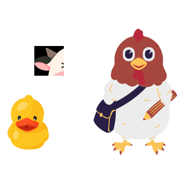

# Giới thiệu về dự án của ZootoPi

Hí anh em, chúng tớ là  **ZootoPi**. Dự án là sự kết hợp của anh **Gà**, em **Bò**, và bé **Củ Cải** với mong muốn chia sẻ những kiến thức mà trong quá trình anh em chúng tớ bắt đầu hành trình code dạo. 

Như slogan của website, chúng tớ làm cái blog đơn giản là **thích gì viết** =)). Ý là ... viết về những gì chúng tớ thấy thú vị xoay quanh nghề nghiệp của chúng tớ, đương nhiên sẽ không giới hạn ở các bài viết hướng dẫn, mà còn là những chia sẻ kinh nghiệm bản thân từ dự án thực tế cũng như học lỏm được từ 500 anh em đồng nghiệp :laughing::laughing::laughing:. Ngoài ra, chúng tớ cũng sẽ review 1 số khoá học online hay ho cũng như chia sẻ funny side projects...

Hãy ủng hộ chúng tớ nhé!!!!
