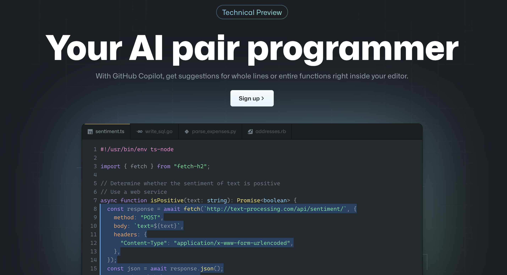
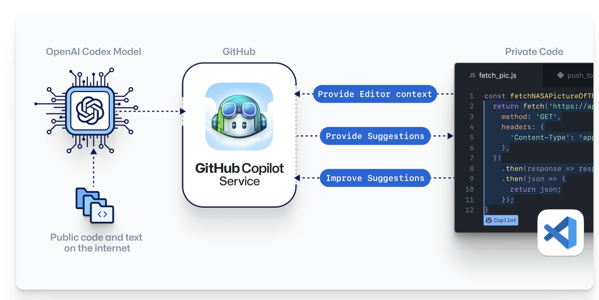

# Github Copilot

Nếu bạn hay theo dõi và cập nhật những tin tức về công nghệ và lập trình thì hẳn bạn đã biết về một công cụ lập trình AI mới mang tên Copilot vừa được GitHub chính thức trình làng trong thời gian vừa qua. Nếu bạn chưa biết thì đừng lo lắng vì trong blog này, ZootoPi sẽ giới thiệu cho các bạn về [Copilot](https://copilot.github.com/), người bạn đồng hành hứa hẹn sẽ hỗ trợ anh em code cực kì bá đạo.

  

    <iframe src="https://www.youtube.com/embed/jCCbCPVXcpQ?autoplay=1" title="YouTube video player" frameBorder="0" allow="accelerometer; autoplay; clipboard-write; encrypted-media; gyroscope; picture-in-picture; fullscreen" allowFullScreen></iframe>
  

<!--truncate-->

## 1. Copilot là gì?

Theo trang chủ của Github, Copilot có khả năng tạo ra những dòng code chất lượng trên một loạt ngôn ngữ lập trình bằng những gợi ý ngay bên trong trình soạn thảo của bạn. Hiện tại, bản Technical Preview mới có Python, JavaScript, TypeScript, Ruby và Go và mới sử dụng được trên Visual Code. Tuy nhiên, ZootoPi tin rằng phiên bản hoàn chỉnh sẻ đáp ứng nhiều ngôn ngữ hơn cũng như trải nghiệm trên các IDE đa dạng hơn.

Phản ứng đầu tiên của ZootoPi khi nhìn thấy Github Copilot đó là ...

Tất nhiên đấy là trước khi ZootoPi có bất kỳ ý tưởng nào về cách thức hoạt động của nó.

## 2. Tính năng của Copilot

Như đã kể trên, Copilot tạo ra những dòng code chất lượng trên nhiều loạt ngôn ngữ bằng những gợi ý ngay bên trong trình soạn thảo của bạn.

Những gì bạn phải làm là:

- Viết mô tả logic bạn muốn ở comment và GitHub Copilot biến logic đó thành những dòng code.
- Cung cấp cho Copilot một vài ví dụ và để người anh em này tạo ra phần còn lại.
- Kiểm thử với unit test chưa bao giờ dễ dàng hơn vì đã có Copilot đề xuất các thử nghiệm phù hợp với code của bạn.
- Giải pháp Copilot gợi ý đa dạng và bạn toàn quyền lựa chọn phiên bản phù hợp nhất.

Cho dù bạn đang tiếp cận một ngôn ngữ hoặc framework mới hay chỉ đơn giản là học viết code, đã có Copilot đồng hành cùng các anh em trên mọi mặt trận.

## 3. Cách thức hoạt động của Copilot

Copilot có đưa ra 1 hình ảnh để cho ta biết cách hoạt động khi ta nhập comments hoặc 1 số từ để định nghĩa functions (hàm) và sau đó 1 loạt mã xuất hiện. Ta có thể tiếp tục chấp nhận gợi ý mà nó đưa ra hoặc ta có thể sửa đổi 1 số gợi ý để đúng ý mình hơn.

ZootoPi gọi cơ chế của Copilot là "**_Viết comments đi và Copilot sẽ gợi ý code cho bạn_**". Chấp nhận hay sửa đổi, quyền lợi đều nằm trong tay bạn.

Vậy những mã nguồn mà Copilot gợi ý ở đây được lấy từ đâu? Nó đến từ chính Github! Khi họ tạo ra mô hình học máy này, họ đã huấn luyện trên hàng triệu kho mã nguồn mở từ Github.

## 3. Ưu điểm và nhược điểm của Copilot

| Ưu điểm                           | Nhược điểm                                        |
| --------------------------------- | ------------------------------------------------- |
| Tự động hoàn thành mã nguồn.      | Chất lượng mã Copilot đề xuất.                    |
| Tự động điền các đoạn mã lặp lại. | Vấn đề bản quyền.                                 |
| Tạo các phương án thay thế.       | Chi phí sau technical preview.                    |
| Kiểm thử tốn ít công sức.         | Không giúp bạn trở thành một lập trình viên giỏi. |

Đón xem những trải nghiệm và phân tích cụ thể hơn về Copilot tại kênh [ZootoPi](https://youtu.be/jCCbCPVXcpQ).
