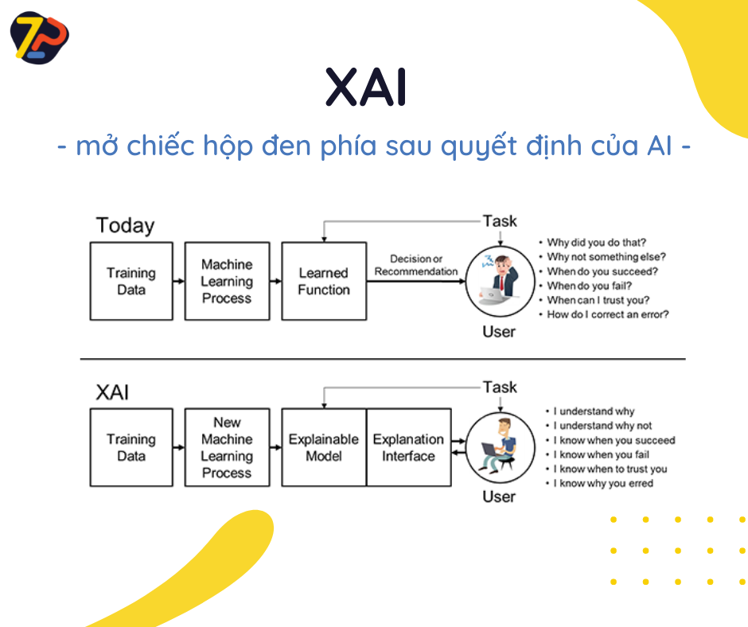

# 🔥XAI - Mở chiếc hộp đen phía sau quyết định của AI🔥

Sau 1 thời gian vắng bóng team ZootoPi chúng mình đã quay lại và hứa hẹn sẽ lợi hại hơn xưa. Mở đầu năm mới, hãy cùng chúng mình dành 1 phút để tìm hiểu về một trong những lĩnh vực không quá mới nhưng đang rất được quan tâm hiện nay - XAI (hay còn gọi là Explainable AI - Diễn giải AI).

Những năm gần đây, các thuật toán học máy (ML) và học sâu (DL) ngày càng được ứng dụng trong nhiều lĩnh vực từ y tế, kinh tế, đến tài chính. Các thuật toán liên tục được cải tiến phức tạp hơn để đạt được hiệu quả tối ưu trong hiệu suất cũng như độ chính xác. Tuy khả năng dự đoán mạnh mẽ hơn, các mô hình này vẫn được xem như các hộp đen (black boxes) với hàng loạt phân vân đến từ người dùng như: Làm sao để biết tại sao AI lại đưa ra quyết định này mà không phải quyết định khác? Khi nào thì mô hình dự đoán thành công? Khi nào thất bại? Khi nào có thể tin vào dự đoán của AI?

<!--truncate-->

Những câu hỏi trên cho ta thấy nhu cầu hiểu được lí do đằng sau 1 dự đoán từ mô hình AI ngày càng cần thiết. Song song với đó là việc giữ cân bằng giữa độ chính xác và khả năng giải thích của 1 mô hình AI - điều mà rất nhiều mô hình ML và DL chưa giải quyết được. Do đó, XAI ra đời để giúp các thuật toán trở nên minh bạch hơn và thay đổi các mô hình AI theo hướng lấy người dùng làm trung tâm (user-centricity). Điều này giúp mô hình AI dễ ứng dụng trong nhiều lĩnh vực khác nhau. Bên cạnh đó, XAI không chỉ giúp việc đánh giá độ tin cậy của 1 mô hình AI trở nên dễ dàng hơn mà còn giúp người dùng có thể tương tác và học hỏi qua lại với AI.

Các phần tiếp theo trong hành trình cùng ZootoPI tìm hiểu về XAI sẽ tiếp tục được lên sóng trong thời gian tới, bao gồm: các phương pháp diễn giải model ML/DL, đánh giá việc diễn giải model AI, và các thư viện hỗ trợ XAI. Các bạn hãy dành 1 phút mỗi tuần để đồng hành cùng chúng mình nhé!

Đón xem những trải nghiệm và phân tích cụ thể từ Zootopi tại:

- 👉Website: https://zootopi.dev/blog
- 👉Youtube: https://youtu.be/jCCbCPVXcpQ
- 👉Facebook: https://www.facebook.com/aizootopi
