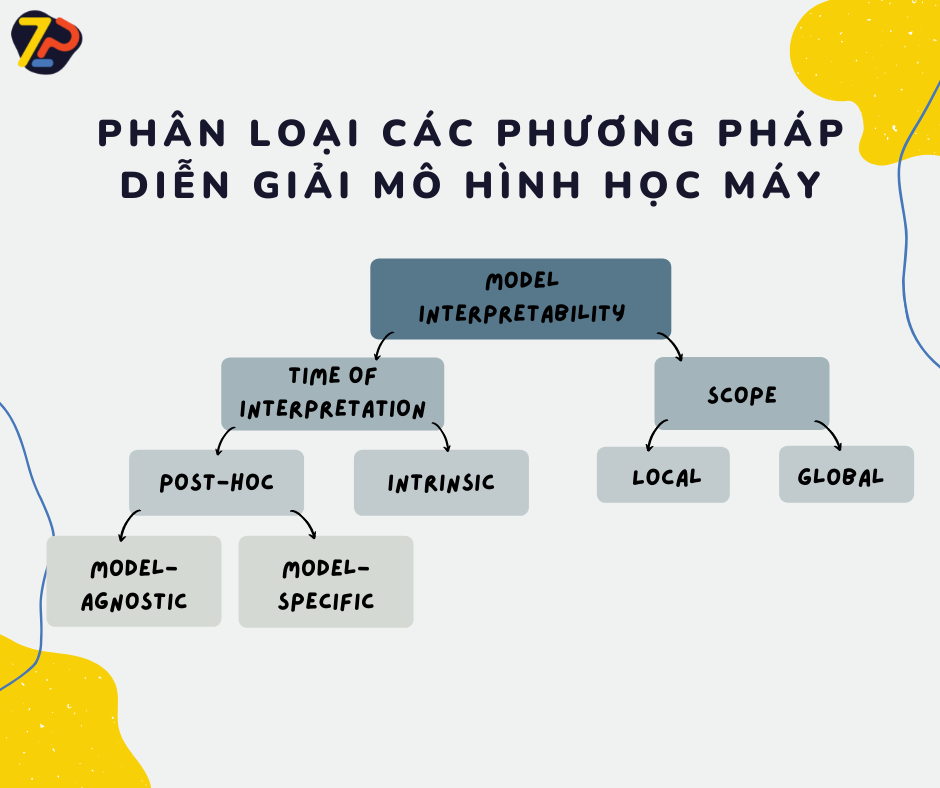

# 🔥XAI - Phân loại các phương pháp diễn giải mô hình học máy🔥

Tiếp nối hành trình tìm hiểu về XAI cùng ZootoPi, 1 phút hôm nay hãy cùng chúng mình phân loại các phương pháp diễn giải 1 mô hình học máy.  Cấu trúc của việc giải thích 1 mô hình học máy có thể được xác định bằng nhiều cách khác nhau dựa vào mục đích, thời điểm, hay tính ứng dụng, nhưng phần lớn đều có thể được phân chia theo 3 nhóm chính:

- Nội tại (intrinsic) hay hậu tại (post-hoc)?
- Mô hình bất khả tri (model-agnostic) hay Mô hình cụ thể (model-specific)?
- Cục bộ (local) hay toàn cục (global)?

<!--truncate-->

## 1. Nội tại (intrinsic) hay hậu tại (post-hoc)?

Phương pháp nội tại đề cập đến việc giới hạn độ phức tạp của mô hình. Khi các mô hình đủ đơn giản về cấu trúc, chúng ta có thể hiểu cách mô hình đưa ra dự đoán bằng việc nhìn vào chính mô hình. Ví dụ như các trọng số đã học của 1 mô hình hồi quy tuyến tính (linear regression) hoặc các đường phân chia đã được học với cây quyết định (decision tree) có thể được dùng để giải thích tại sao mô hình lại đưa ra các dự đoán.

- Một số mô hình nội tại phổ biến bao gồm: Linear Regression, Logistic Regression, GLM, GAM, Decision Tree, Decision Rules, RuleFit, KNN, Naive Bayes,...

Trong khi đó, các phương pháp hậu tại phân tích mô hình sau khi đã được đào tạo, ví dụ như việc hoán vị các đặc trưng quan trọng (permutation feature importance). Các phương pháp này gồm 2 nhánh nhỏ là mô hình bất khả tri (model-agnostic) và mô hình cụ thể (model-specific).

## 2. Mô hình bất khả tri (model-agnostic) hay Mô hình cụ thể (model-specific)?

Mô hình bất khả tri có thể được áp dụng cho bất kì mô hình học máy nào trong khi mô hình cụ thể chỉ có thể áp dụng cho 1 số loại mô hình nhất định. Ví dụ, nếu một phương pháp chỉ hoạt động với mạng neuron (Neural Network) thì nó sẽ được coi là dành riêng cho mô hình đó. Ngược lại, nếu 1 phương pháp giải thích coi mọi mô hình đã được đào tạo là hộp đen thì nó sẽ được coi là mô hình bất khả tri.

## 3. Cục bộ (local) hay toàn cục (global)?

Phương pháp giải thích cục bộ nhằm giải thích 1 điểm dữ liệu hoặc 1 dự đoán duy nhất trong khi phương pháp toàn cục cố gắng cung cấp lời giải thích toàn diện về cách mô hình hoạt động dựa trên toàn bộ dữ liệu và dự đoán. Các phương pháp cục bộ có thể biến thành kỹ thuật toàn cục thông qua việc tổng hợp các kết quả cục bộ.

- Một số ví dụ cho phương pháp cục bộ có thể kể đến Individual Conditional Expectation Curves, LIME, Scoped Rules (anchors), Counterfactual Explanations, Shapley values, SHAP, ...
- Một số phương pháp toàn cục phổ biến bao gồm Partial dependence plot, Accumulated local effect plots, Feature interaction (H-statistics), Functional decomposition, Permutation feature importance, Global surrogate models, Prototypes and criticisms, ...

Chi tiết về các phương pháp sẽ được chúng mình lên sóng trong thời gian tới, đừng quên follow hashtag #XAI #1phutaicungzootopi để không bỏ lỡ nhé!

Đón xem những trải nghiệm và phân tích cụ thể từ Zootopi tại:

- 👉Website: https://zootopi.dev/blog
- 👉Youtube: https://youtu.be/jCCbCPVXcpQ
- 👉Facebook: https://www.facebook.com/aizootopi
