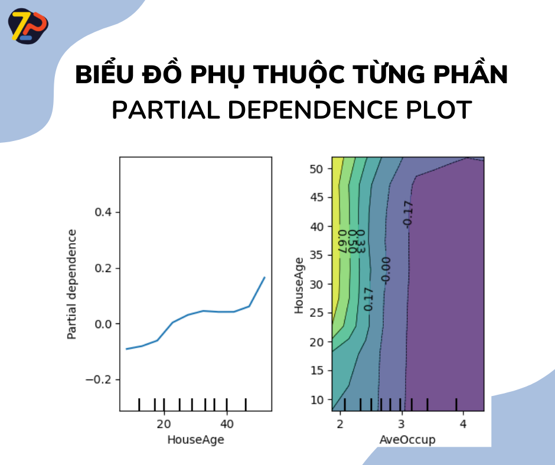

# 🔥XAI - Biểu đồ Phụ thuộc Từng phần (PDP)🔥

Khi xây dựng 1 mô hình học máy (ML) chắc hẳn chúng ta đều quen thuộc với việc sử dụng chỉ số quan trọng của các đặc trưng (feature importance) để lựa chọn đặc trưng cho mô hình. Chỉ số này giúp chúng ta biết điều gì quan trọng với mô hình, tuy nhiên, các bạn đã bao giờ thắc mắc những đặc trưng này liên quan như thế nào đến các dự đoán của mô hình?

Ví dụ trong bài toán dự đoán giá nhà, kinh độ và vĩ độ có ảnh hưởng như thế nào đến giá nhà? Những ngôi nhà có cùng kích thước ở các vị trí khác nhau liệu có giá khác nhau? Hay những ngôi nhà khác kích thước trên cùng khu vực liệu giá sẽ thay đổi như thế nào?

Partial Dependence Plot (PDP) hay còn gọi là Biểu đồ Phụ thuộc Từng phần sẽ giúp chúng ta trả lời những câu hỏi trên.

<!--truncate-->

Biểu đồ PDP cho thấy tác động cận biên (marginal effect) của 1 (hoặc một vài)  đặc trưng được chọn lọc đối với kết quả dự đoán của mô hình. Nói cách khác, chúng ta có thể hiểu sự phụ thuộc một phần (partial dependence) là kết quả dự đoán được mong đợi (expected target) dưới dạng một hàm của các đặc trưng đã được chọn lựa để đưa vào mô hình.

Một ví dụ có thể thấy ở hình dưới là sự ảnh hưởng của độ tuổi trung bình của nhà lên giá trị trung bình của ngôi nhà đó. Hay với những ngôi nhà có `AveOccup` (số lượng người cư trú trung bình) nhỏ hơn 2, thì giá nhà phụ thuộc khá lớn vào độ tuổi của căn nhà, trong khi nếu `AveOccup` lớn hơn 2, thì độ tuổi và giá nhà gần như không phụ thuộc.

Để giúp các bạn dễ hình dung hơn về Biểu đồ Phụ thuộc Từng Phần, chúng ta sẽ cùng nhau thực hành trên một mô hình đơn giản với bộ dữ liệu về giá nhà trung bình California Housing Dataset (trên Scikit-Learn). Tham khảo bài thực hành đơn giản tại bài viết [XAI - Thực hành với Biểu đồ Phụ thuộc Từng Phần](https://zootopi.dev/blog/2022/02/15/xai2-thuc-hanh/).

Các thư viện hỗ trợ tạo biểu đồ PDP bao gồm:

- Scikit-learn: Module sklearn.inspection cung cấp cho chúng mình hàm plot_partial_dependence() để tạo ra biểu đồ PDP một cách nhanh chóng. Tham khảo [https://scikit-learn.org/stable/modules/partial_dependence.html](https://scikit-learn.org/stable/modules/partial_dependence.html)  
- PDPbox: một thư viện hỗ trợ biểu diễn các đồ thị một cách nhanh chóng, bao gồm biểu đồ PDP. Tham khảo [https://github.com/SauceCat/PDPbox](https://github.com/SauceCat/PDPbox)

Một số nguồn hữu ích về biểu đồ PDP:

- [https://towardsdatascience.com/explainable-ai-xai-methods-part-1-partial-dependence-plot-pdp-349441901a3d](https://towardsdatascience.com/explainable-ai-xai-methods-part-1-partial-dependence-plot-pdp-349441901a3d)
- [https://scikit-learn.org/stable/modules/partial_dependence.html](https://scikit-learn.org/stable/modules/partial_dependence.html)

Chi tiết về các phương pháp sẽ được chúng mình lên sóng trong thời gian tới, đừng quên follow hashtag #XAI #1phutaicungzootopi để không bỏ lỡ nhé!

Đón xem những trải nghiệm và phân tích cụ thể từ Zootopi tại:

- 👉Website: https://zootopi.dev/blog
- 👉Youtube: https://youtu.be/jCCbCPVXcpQ
- 👉Facebook: https://www.facebook.com/aizootopi
