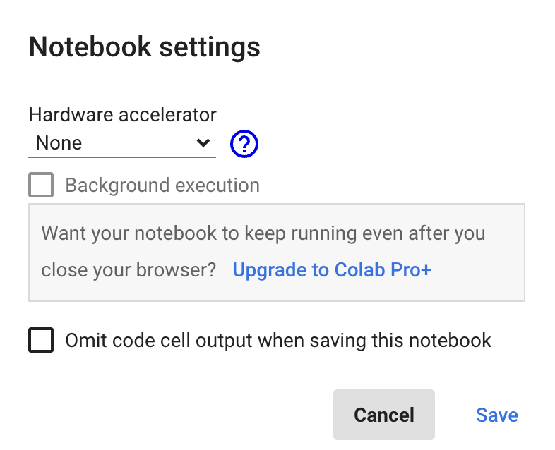
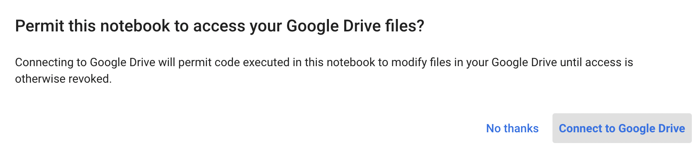
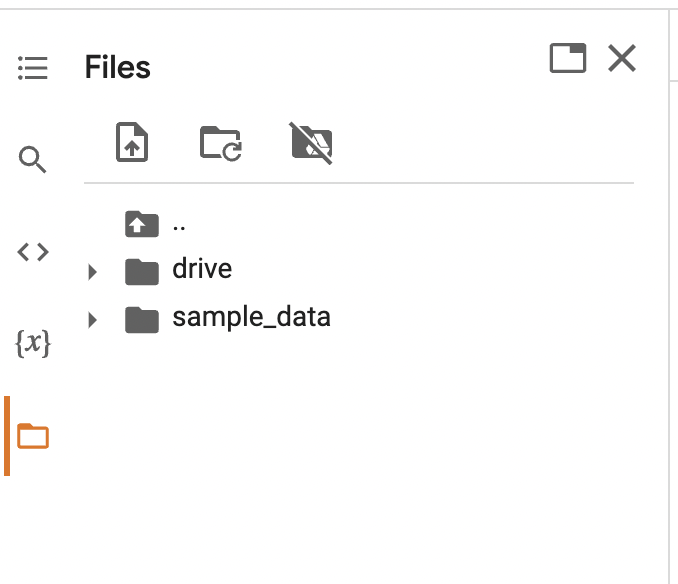
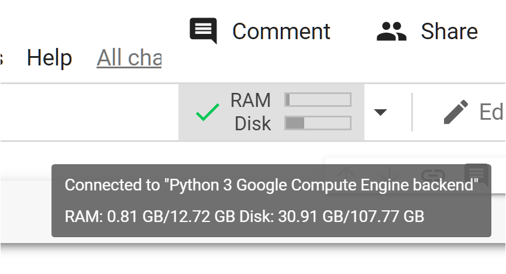
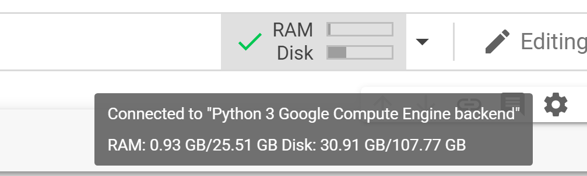
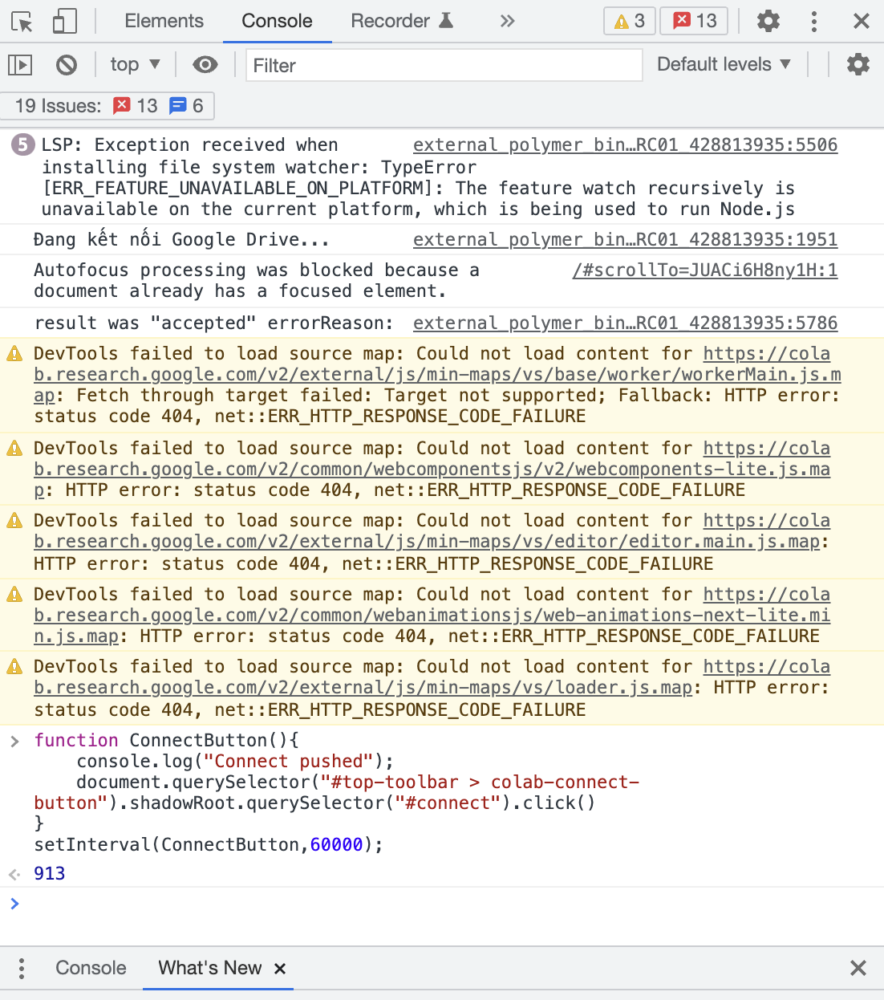

# 🔥Hack the Colab - 4 mẹo giúp bạn tận dụng tối đa Google Colab🔥

Google Colaboratory (hay còn gọi là "Colab") là một nền tảng miễn phí của Google cho phép chúng ta có thể viết và thực thi Python trong trình duyệt một cách nhanh gọn và tiện lợi. Đặc biệt, Colab hỗ trợ liên kết với tài khoản Google và cung cấp quyền truy cập hoàn toàn miễn phí vào GPU và TPU mà không yêu cầu cấu hình phức tạp trên máy cá nhân cũng như dễ dàng chia sẻ mã nguồn với cộng đồng.

Dưới đây là 1 số mẹo để các bạn có thể tận dụng tối đa Colab bản miễn phí khi viết và thực thi đoạn mã Python thông qua trình duyệt phục vụ cho công việc phân tích dữ liệu, xây dựng mô hình và giáo dục. Để khởi tạo một notebook, các bạn truy cập vào đường link sau: [colab.research.google.com](https://colab.research.google.com/).

 

<!--truncate-->
## Mẹo số 1: Sử dụng GPU, TPU trong 1 nốt nhạc

Colab luôn để mặc định phần cứng là CPU. Tuy nhiên, bạn có thể dễ dàng bật hỗ trợ GPU hay thậm chí là TPU cho các tác vụ đòi hỏi tính toán nhiều như xây dựng các mô hình Học sâu.

Để làm được điều này, bạn nhấp vào `Edit`, chọn `Notebook settings`. Khi đó, 1 cửa sổ con sẽ hiện lên như sau:



Khi đó, ta trỏ vào phần `Hardware accelerator` và chọn kiểu phần cứng mong muốn. Thông thường, Colab sẽ cho ta 3 lựa chọn: None (CPU), GPU, và TPU.

Ta dễ dàng kiểm tra xem GPU đã được kích hoạt chưa bằng đoạn mã sau:

```python
import tensorflow as tf
tf.test.gpu_device_name()
```

Hiển thị chi tiết GPU với mức sử dụng thông qua câu lệnh:

```python
!nvidia-smi
```

Hiển thị chi tiết về CPU thông qua câu lệnh:

```python
!cat /proc/cpuinfo
```

## Mẹo số 2: Kết nối Google Drive với Colab, chuyện nhỏ

Đây là 1 tính năng vô cùng hữu ích để chúng ta có quyền truy cập vào các tệp trên Google Drive của mình cũng như lưu các mô hình và dữ liệu của bạn tại đây. Để làm như vậy, chỉ cần nhập đoạn mã sau:

```python
from google.colab import drive
drive.mount('/content/gdrive')
```

Nếu bạn quên đoạn mã này thì đừng lo, bởi vì bạn chỉ cần chọn biểu tượng `Mount Drive` trong mục `Files` bên tay trái của Colab. Khi đó, 1 cửa sổ con sẽ hiện ra và hỏi mình có muốn để notebook truy cập vào các tệp trong Google Drive không, ta chọn `Connect to Google Drive`.



Colab sẽ kết nối với Google Drive của các bạn và thư mục `drive/` sẽ hiện thị trong mục `Files`.



## Mẹo số 3: Github và Colab là đôi bạn thân

Để có thể đọc được mã nguồn từ các file jupyter notebook lưu trên Github, ta có thể tải notebook đó xuống máy tính cá nhân rồi lại tải lên Google Drive để mở bằng Colab.


Nghe thôi đã thấy cồng kềnh rồi. Đừng lo, Zootopi sẽ giúp bạn biến những thao tác cồng kềnh đó thành 1 bước cực kì đơn giản. Để đọc được jupyter notebook trên Github thẳng vào Colab, các bạn chỉ cần biến đổi tên miền từ `github.com` thành `githubtocolab.com` như ví dụ dưới đây là xong!


<!-- ## Mẹo số 4: Tăng RAM, chỉ là chuyện nhỏ -->

<!-- Khi kết nối với tài nguyên trên Colab, mặc định Colab sẽ cung cấp cho chúng ta khoảng 13 GB RAM miễn phí. Điều đó khá ấn tượng và hấp dẫn, nhưng để có thể xây dựng các mô hình học sâu chuyên sâu thì đôi khi con số này vẫn chỉ là muối bỏ bể.



Dưới đây là một thủ thuật rất đơn giản để bạn có thể gần như tăng gấp đôi dung lượng RAM trong Colab của mình. Đầu tiên, bạn chạy đoạn mã Python sau trong ô mã của Colab:

```python
i = []
while(True):
    i.append('a')
```

Đoạn mã này tạo ra 1 list rỗng `i` và nối các giá trị `a` vào `i` mãi mãi, dẫn tới Colab bị tràn RAM. Khi xảy ra sự cố này, Colab sẽ hỏi bạn có muốn thêm RAM hay không?

Chọn `Get more RAM` và nhấp nút `Yes`. Voilà! Bây giờ bạn có khoảng 25GB RAM tùy ý sử dụng!

 -->

## Mẹo số 4: Tạm biệt nỗi lo ngắt kết nối Colab

Đây có lẽ vấn đề nhức nhối mà Zootopi khá chắc rằng nhiều bạn đã từng gặp phải khi làm việc với Colab. Khi đang chờ mô hình huấn luyện trên Colab, Zootopi thả lỏng nghỉ ngơi và nhâm nhi cốc trà sữa trân châu đường đen chờ kết quả huấn luyện thì BÙM! Google Colab đã ngắt kết nối notebook và toàn bộ quá trình huấn luyện mô hình đã dừng lại.


Tất nhiên, sau đó Zootopi phát hiện ra rằng Colab sẽ ngắt kết nối file notebook nếu ta để nó không hoạt động trong hơn 30 phút. Nhưng kể từ hôm nay, bạn sẽ không bao giờ phải đối mặt với vấn đề này bởi Zootopi đã tìm ra được 1 giải pháp cho vấn đề này.

Tất cả những gì chúng ta cần làm là nhấp chuột phải chọn `Inspect` và nhập đoạn mã Javascript sau vào phần `Console`:

```javascript
function ConnectButton(){
    console.log("Connect pushed"); 
    document.querySelector("#top-toolbar > colab-connect-button").shadowRoot.querySelector("#connect").click() 
}
setInterval(ConnectButton,60000);
```

Khi đó, phần `Console` sẽ hiện thị như sau:



Đoạn mã nhỏ này tạo ra một cú nhấp chuột vào màn hình Colab sau mỗi 60 giây (tương ứng 60.000 mili giây ta cài đặt trong phần mã). Do đó, dù bạn không thao tác gì thì Colab vẫn sẽ nghĩ rằng sổ ghi chép đang hoạt động và bạn không phải lo lắng về việc bị ngắt kết nối nữa!

Chúc các bạn tận dụng hiểu quả Google Colab! Đón xem những trải nghiệm và phân tích cụ thể từ Zootopi tại:

- 👉Website: https://zootopi.dev/blog
- 👉Youtube: https://youtu.be/jCCbCPVXcpQ
- 👉Facebook: https://www.facebook.com/aizootopi
