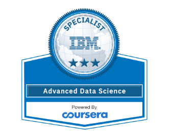

# Advanced Data Science with IBM Specialization

## 1. Giới thiệu

Advanced Data Science with IBM Specialization (Khoá học chuyên ngành về Khoa học Dữ liệu nâng cao) là 1 trong những khoá học phù hợp với những bạn đã có nền tảng về khoa học dữ liệu cũng như kỹ năng lập trình cơ bản trong python, SQL cơ bản... và muốn tìm hiểu sâu hơn về xử lý dữ liệu lớn song song, khám phá và trực quan hóa dữ liệu cũng như học máy và học sâu ở mức nâng cao.

Về mặt lý thuyết, khoá học sẽ giúp bạn hiểu các cơ sở toán học đằng sau tất cả các thuật toán học máy và học sâu. Từ đó, bạn có thể áp dụng những kiến thức này vào trong thực tế dự án, đánh giá cách chúng tác động đến hiệu suất và khả năng mở rộng của mô hình cũng như giúp bạn đưa ra những quyết định đúng đắn về kiến ​​trúc.

Về mặt thực hành và ứng dụng, khoá học này sẽ giúp các bạn nắm được tổng quan chu trình tổng hợp dữ liệu, học máy và học sâu từ đầu đến cuối thông qua các công nghệ nổi bật và được sử dụng rộng rãi nhất như Apache Spark, scikit-learning, SparkML, SystemML, TensorFlow, Keras, PyTorch, DeepLearning4J, Apache CouchDB và MQTT.

## 2. Nội dung khoá học

|Truy cập vào khoá học|Tham khảo bài giải|
|-|-|
|[Advanced DS with IBM Specialization](https://www.coursera.org/specializations/advanced-data-science-ibm)|[GafBof Solution](https://github.com/GafBof/advanced_data_science_ibm)|

Khoá học bao gồm 4 khoá nhỏ:
- Khoá 1: [Fundamentals of Scalable Data Science](https://www.coursera.org/learn/ds)
- Khoá 2: [Advanced Machine Learning and Signal Processing](https://www.coursera.org/learn/advanced-machine-learning-signal-processing)
- Khoá 3: [Applied AI with DeepLearning](https://www.coursera.org/learn/ai)
- Khoá 4: [Advanced Data Science Capstone](https://www.coursera.org/learn/advanced-data-science-capstone)

## 3. Đánh giá về khoá học

Trên thang Cơ bản - Trung cấp - Nâng cao, GafBof đánh giá đây là 1 khoá học Nâng Cao. Những bạn chưa có nền tảng về lập trình cơ bản hay khoa học dữ liệu nên học trước khoá [IBM Data Science Professional Certificate](https://www.coursera.org/professional-certificates/ibm-data-science) để dễ dàng tiếp thu kiến thức trong khoá học này.

Tuỳ vào tốc độ và trải nghiệm học của mỗi người, cùng 1 khoá học thời gian học sẽ có những khác biệt. Chứng chỉ trên Coursera có 1 lợi thế đó là thời gian linh hoạt nên bạn hoàn toàn có thể tuỳ chỉnh lộ trình học phù hợp với bạn nhất.

Dưới đây là 1 số tổng hợp về thông tin các khoá con giúp dễ dàng nắm được lộ trình học và tiện sắp xếp thời gian.

### 3.1 Khoá 1:

- Kiến thức:
    - Giới thiệu các biện pháp thống kê cơ bản, các đặc điểm dữ liệu, cũng như xu hướng, độ lệch hoặc sự không nhất quán và các ngoại lệ tiềm ẩn trong dữ liệu.
    - Xác định kỹ thuật nào hữu ích để làm việc với dữ liệu lớn.
    - Làm quen với các công cụ và thư viện trực quan hoá để nâng cao hiệu quả phân tích dữ liệu lớn với phân vùng và phân tích song song và trực quan hóa dữ liệu ở một số định dạng 2D và 3D.
- Công cụ:
    - Jupyter notebooks (IBM Watson Studio bản miễn phí).
    - ApacheSpark (IBM Watson Studio bản miễn phí).
    - Python.
- Thời gian: 20 tiếng (4-6 tiếng/tuần).

### 3.2 Khoá 2:

- Kiến thức:
    - Tiếp cận kiến thức về Mô hình Học máy có Giám sát và Không Giám sát.
    - Tìm hiểu về các nguyên tắc cơ bản của Đại số tuyến tính để hiểu cách hoạt động của các chế độ học máy.
    - Làm quen với các Frameworks phổ biến nhất cho python Scikit-Learn và SparkML.
    - Học cách tinh chỉnh tham số/ siêu tham số để tối ưu hoá mô hình.
- Công cụ:
    - Các công cụ trong Khoá 1.
    - Frameworks: Scikit-Learn, SparkML.
- Thời gian: 27 tiếng (4-6 tiếng/tuần).

### 3.3 Khoá 3:

- Kiến thức:

  - Tiếp cận kiến thức về các mô hình Học sâu được sử dụng trong Xử lý ngôn ngữ tự nhiên, Thị giác máy tính, Phân tích chuỗi thời gian và nhiều ngành khác.
  - Tìm hiểu về các nguyên tắc cơ bản của Đại số tuyến tính và Mạng nơron.
  - Giới thiệu các Framework DeepLearning phổ biến nhất như Keras, TensorFlow, PyTorch, DeepLearning4J và Apache SystemML.
  - Học cách mở rộng quy mô của những bộ não nhân tạo đó bằng Kubernetes, Apache Spark và GPU.

- Công cụ:
  - Các công cụ trong Khoá 1 và 2.
  - Frameworks:Keras, TensorFlow, PyTorch, DeepLearning4J và Apache SystemML.
- Thời gian: 24 tiếng (4-6 tiếng/tuần).

### 3.4 Khoá 4:

- Kiến thức:
  - Thực hành capstone project để đánh giá kiến thức đã học được trong 3 khoá trên.
- Thời gian: 9 tiếng

Chúc các bạn học tập vui vẻ ^^!
