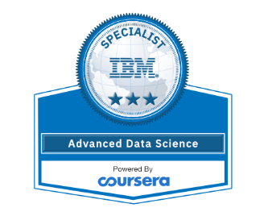

# Khoá học chuyên sâu về Khoa học Dữ liệu từ IBM

:::info 💻 Tham khảo bài giải của ZootoPi
Đang học khoá này và gặp khó khăn? Bạn có thể tham khảo **[bài giải chi tiết của ZootoPi trên GitHub](https://github.com/ZootoPi/advanced_data_science_ibm)**. 

Chúng mình đã giải và giải thích các bài tập trong khoá học để bạn có thể tham khảo khi cần. Tuy nhiên, nên tự làm trước, chỉ tham khảo khi thực sự cần thiết để đảm bảo bạn thực sự hiểu và nắm vững kiến thức.
:::

## 🎯 Ai nên học khoá này?

Nếu bạn đã có nền tảng về khoa học dữ liệu và kỹ năng lập trình Python, SQL cơ bản, và muốn đi sâu hơn vào xử lý dữ liệu lớn, học máy và học sâu ở mức nâng cao, thì **Advanced Data Science with IBM Specialization** có thể là lựa chọn phù hợp.



## 📖 Giới thiệu

Khoá học này tập trung vào hai khía cạnh chính:

**Về lý thuyết:** Khoá học giúp bạn hiểu các cơ sở toán học đằng sau các thuật toán học máy và học sâu. Kiến thức này giúp bạn đánh giá cách các thuật toán tác động đến hiệu suất và khả năng mở rộng của mô hình, từ đó đưa ra quyết định về kiến trúc phù hợp.

**Về thực hành:** Bạn sẽ được làm quen với chu trình xử lý dữ liệu, học máy và học sâu từ đầu đến cuối thông qua các công nghệ như Apache Spark, scikit-learn, SparkML, SystemML, TensorFlow, Keras, PyTorch, DeepLearning4J, Apache CouchDB và MQTT.

## 🎓 Bạn sẽ học được gì?

Sau khi hoàn thành khoá học này, bạn sẽ có thể:

- Xử lý và phân tích dữ liệu lớn với Apache Spark
- Xây dựng và tối ưu hóa mô hình Machine Learning
- Áp dụng Deep Learning vào các bài toán thực tế (NLP, Computer Vision, Time Series)
- Hiểu sâu về toán học đằng sau các thuật toán ML/DL
- Sử dụng các framework: TensorFlow, PyTorch, Keras, SparkML
- Triển khai mô hình ở quy mô lớn với Kubernetes và GPU

## 📋 Yêu cầu tiên quyết

Trước khi bắt đầu, bạn nên có:

- Kiến thức Python cơ bản (variables, functions, loops, data structures)
- Hiểu cơ bản về SQL
- Nền tảng về Data Science (EDA, basic ML concepts)
- Kinh nghiệm với Jupyter Notebooks

**Lưu ý:** Nếu bạn chưa có nền tảng về lập trình cơ bản hay khoa học dữ liệu, nên học trước khoá [IBM Data Science Professional Certificate](https://www.coursera.org/professional-certificates/ibm-data-science) để dễ dàng tiếp thu kiến thức trong khoá học này.

## 📚 Nội dung khoá học

**[Đăng ký khoá học trên Coursera](https://www.coursera.org/specializations/advanced-data-science-ibm)**

Khoá học bao gồm 4 khoá nhỏ, tổng cộng khoảng 80 giờ học:

1. **Khoá 1:** [Fundamentals of Scalable Data Science](https://www.coursera.org/learn/ds) - 20 giờ
2. **Khoá 2:** [Advanced Machine Learning and Signal Processing](https://www.coursera.org/learn/advanced-machine-learning-signal-processing) - 27 giờ
3. **Khoá 3:** [Applied AI with DeepLearning](https://www.coursera.org/learn/ai) - 24 giờ
4. **Khoá 4:** [Advanced Data Science Capstone](https://www.coursera.org/learn/advanced-data-science-capstone) - 9 giờ

## 📈 Lộ trình học đề xuất

Dựa trên thời gian ước tính, bạn có thể sắp xếp như sau:

```
Tuần 1-2: Khoá 1 - Fundamentals (20 giờ)
    ↓
Tuần 3-5: Khoá 2 - Advanced ML (27 giờ)
    ↓
Tuần 6-8: Khoá 3 - Deep Learning (24 giờ)
    ↓
Tuần 9: Khoá 4 - Capstone Project (9 giờ)
    ↓
🎉 Hoàn thành chứng chỉ!
```

**Lưu ý:** Thời gian học có thể khác nhau tùy vào tốc độ và kinh nghiệm của mỗi người. Coursera cho phép bạn học theo tốc độ của riêng mình, nên bạn có thể điều chỉnh lộ trình phù hợp.

## 📖 Chi tiết từng khoá học

### Khoá 1: Fundamentals of Scalable Data Science

**Thời gian:** 20 giờ (4-6 giờ/tuần)  
**Độ khó:** ⭐⭐⭐ Nâng cao

#### Nội dung chính:

- **Thống kê và phân tích dữ liệu:**
  - Các biện pháp thống kê cơ bản
  - Phân tích đặc điểm dữ liệu, xu hướng, độ lệch
  - Phát hiện sự không nhất quán và các ngoại lệ tiềm ẩn

- **Xử lý dữ liệu lớn:**
  - Kỹ thuật làm việc với Big Data
  - Phân vùng và phân tích song song
  - Trực quan hóa dữ liệu ở định dạng 2D và 3D

#### Công cụ sử dụng:

- Jupyter Notebooks (IBM Watson Studio - bản miễn phí)
- Apache Spark (IBM Watson Studio - bản miễn phí)
- Python

[👉 Xem chi tiết khoá 1](https://www.coursera.org/learn/ds)

### Khoá 2: Advanced Machine Learning and Signal Processing

**Thời gian:** 27 giờ (4-6 giờ/tuần)  
**Độ khó:** ⭐⭐⭐ Nâng cao

#### Nội dung chính:

- **Machine Learning:**
  - Mô hình Học máy có Giám sát và Không Giám sát
  - Đại số tuyến tính cơ bản để hiểu cách hoạt động của các thuật toán
  - Tinh chỉnh tham số và siêu tham số để tối ưu hóa mô hình

- **Frameworks:**
  - Scikit-Learn cho Python
  - SparkML cho xử lý dữ liệu lớn

#### Công cụ sử dụng:

- Tất cả công cụ từ Khoá 1
- Scikit-Learn
- SparkML

[👉 Xem chi tiết khoá 2](https://www.coursera.org/learn/advanced-machine-learning-signal-processing)

### Khoá 3: Applied AI with DeepLearning

**Thời gian:** 24 giờ (4-6 giờ/tuần)  
**Độ khó:** ⭐⭐⭐ Nâng cao

#### Nội dung chính:

- **Deep Learning:**
  - Các mô hình Học sâu cho Xử lý ngôn ngữ tự nhiên (NLP)
  - Thị giác máy tính (Computer Vision)
  - Phân tích chuỗi thời gian (Time Series)
  - Đại số tuyến tính và Mạng nơron

- **Frameworks Deep Learning:**
  - Keras, TensorFlow, PyTorch
  - DeepLearning4J, Apache SystemML

- **Triển khai ở quy mô lớn:**
  - Kubernetes
  - Apache Spark
  - GPU computing

#### Công cụ sử dụng:

- Tất cả công cụ từ Khoá 1 và 2
- Keras, TensorFlow, PyTorch
- DeepLearning4J, Apache SystemML

[👉 Xem chi tiết khoá 3](https://www.coursera.org/learn/ai)

### Khoá 4: Advanced Data Science Capstone

**Thời gian:** 9 giờ  
**Độ khó:** ⭐⭐⭐ Nâng cao

#### Nội dung chính:

- **Capstone Project:**
  - Tổng hợp và áp dụng tất cả kiến thức từ 3 khoá trước
  - Xây dựng một dự án hoàn chỉnh từ đầu đến cuối
  - Đánh giá và trình bày kết quả

Đây là cơ hội để bạn thực hành và củng cố lại những gì đã học trong 3 khoá trước.

[👉 Xem chi tiết khoá 4](https://www.coursera.org/learn/advanced-data-science-capstone)

## 💡 Một số lưu ý khi học

### Về độ khó

Trên thang Cơ bản - Trung cấp - Nâng cao, đây là khoá học ở mức **Nâng cao**. Nếu bạn chưa có nền tảng vững, có thể sẽ gặp khó khăn. Nên cân nhắc học trước khoá [IBM Data Science Professional Certificate](https://www.coursera.org/professional-certificates/ibm-data-science) nếu cần.

### Về thời gian

Thời gian học có thể khác nhau tùy vào:
- Tốc độ học của mỗi người
- Kinh nghiệm trước đó với các công cụ
- Mức độ chi tiết bạn muốn đi sâu

Coursera cho phép bạn học theo tốc độ của riêng mình, nên bạn có thể điều chỉnh lộ trình phù hợp.

### Tips học hiệu quả

- **Ghi chép:** Tạo notebook riêng để ghi lại các khái niệm quan trọng
- **Thực hành:** Không chỉ xem video, hãy code lại từ đầu để hiểu sâu hơn
- **Tham khảo bài giải:** Nếu gặp khó khăn, có thể tham khảo [bài giải của ZootoPi](https://github.com/ZootoPi/advanced_data_science_ibm)
- **Đọc thêm:** Tham khảo documentation chính thức của các framework được dạy
- **Quản lý thời gian:** Dành 4-6 giờ/tuần một cách đều đặn sẽ hiệu quả hơn là học dồn

## ❓ Câu hỏi thường gặp

<details>
<summary>Tôi có cần kiến thức nền tảng không?</summary>

Có, bạn nên có kiến thức cơ bản về Python, SQL và Data Science. Nếu chưa có, nên học trước khoá [IBM Data Science Professional Certificate](https://www.coursera.org/professional-certificates/ibm-data-science) để có nền tảng vững chắc.
</details>

<details>
<summary>Khoá học có miễn phí không?</summary>

Bạn có thể audit khoá học miễn phí để xem nội dung, nhưng để nhận chứng chỉ và làm assignments, bạn cần trả phí. Coursera có chương trình financial aid cho những ai gặp khó khăn về tài chính.
</details>

<details>
<summary>Tôi có thể học theo tốc độ của riêng mình không?</summary>

Có, Coursera cho phép bạn học theo tốc độ của riêng mình. Bạn có thể hoàn thành nhanh hơn hoặc chậm hơn so với thời gian ước tính.
</details>

<details>
<summary>Khoá học có phù hợp cho người mới bắt đầu không?</summary>

Không, đây là khoá học nâng cao. Nếu bạn mới bắt đầu, nên học trước khoá [IBM Data Science Professional Certificate](https://www.coursera.org/professional-certificates/ibm-data-science) hoặc các khoá học cơ bản khác.
</details>

## 📚 Tài liệu tham khảo thêm

Nếu muốn tìm hiểu sâu hơn về các công cụ được dạy trong khoá học:

- [Apache Spark Documentation](https://spark.apache.org/docs/latest/)
- [TensorFlow Guide](https://www.tensorflow.org/guide)
- [PyTorch Tutorials](https://pytorch.org/tutorials/)
- [Scikit-learn User Guide](https://scikit-learn.org/stable/user_guide.html)
- [Keras Documentation](https://keras.io/)

## 🎬 Bắt đầu học

Nếu bạn đã sẵn sàng, có thể bắt đầu tại:

- **[Đăng ký khoá học trên Coursera](https://www.coursera.org/specializations/advanced-data-science-ibm)**

:::tip 💡 Gợi ý
Khi học, nếu gặp khó khăn với các bài tập, bạn có thể tham khảo **[bài giải của ZootoPi](https://github.com/ZootoPi/advanced_data_science_ibm)**. Tuy nhiên, nên tự làm trước, chỉ tham khảo khi thực sự cần thiết để đảm bảo bạn thực sự hiểu và nắm vững kiến thức.
:::

Chúc các bạn học tập hiệu quả!
