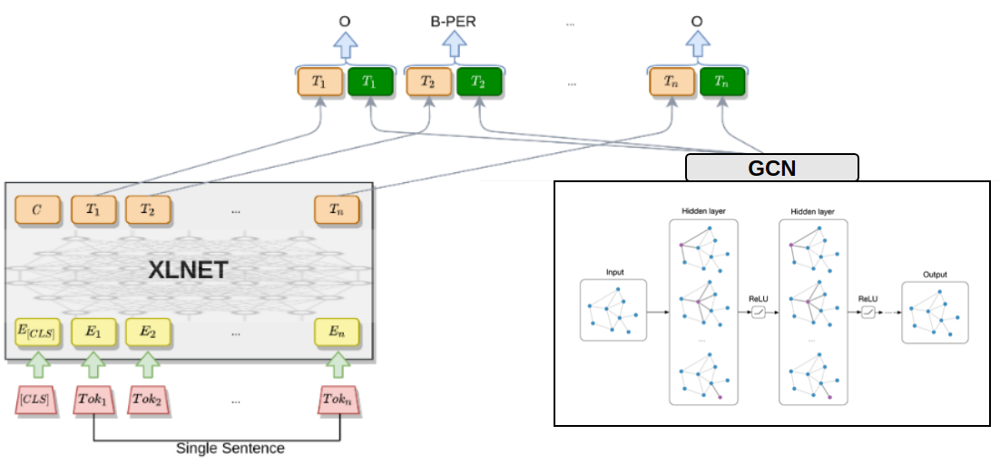
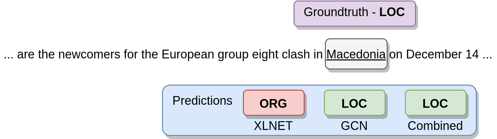
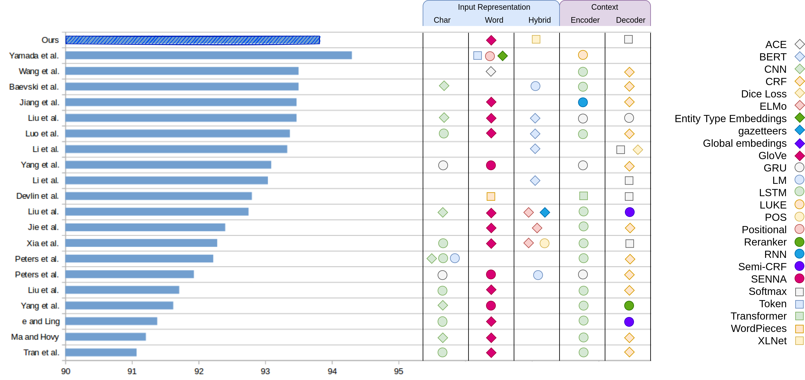

# 01. Nhận dạng thực thể kết hợp đặc trưng ngữ cảnh và toàn cục

## 1. Giới thiệu

Nhận dạng thực thể (NER) là một kỹ thuật trích xuất thông tin nhằm xác định vị trí và phân loại các thực thể được đặt tên trong tài liệu thành các danh mục được xác định trước. Tuy nhiên, đây vẫn là một nhiệm vụ khó khăn vì các thực thể được đặt tên (NE) có nhiều dạng và chúng phụ thuộc vào ngữ cảnh. Nghiên cứu này đề xuất sự kết hợp giữa các đặc trưng theo ngữ cảnh từ XLNet và các đặc trưng toàn cục từ Graph Convolution Network (GCN) để nâng cao hiệu suất NER. Các thử nghiệm được thực hiện trên tập dữ liệu CoNLL 2003 cho thấy lợi ích của sự kết hợp trên khi so sánh với các kết quả khi sử dụng các đặc trưng trên độc lập.

## 2. Mô hình

Ta nối các đặc trưng toàn cục từ GCN và theo ngữ cảnh từ XLNet lại và đưa chúng đi qua một lớp Tuyến tính. Đây là cách đơn giản nhất để đánh giá được tác động của 2 loại đặc trưng này đối với tác vụ NER. Kiến trúc tổng quan của phương pháp được thể hiện ở hình dưới đây:

Thử nghiệm được triển khai trên GPU 2070 Super và GPU TitanX với 56 CPU, RAM 128 GB. Kết quả thử nghiệm được đánh giá thông qua 3 chỉ số đánh giá: Precision, Recall, và F1-score.

Tham khảo bài báo [Named Entity Recognition Architecture Combining Contextual and Global Features](https://arxiv.org/pdf/2112.08033.pdf) để hiểu chi tiết hơn về kiến trúc mô hình được đưa ra. Để triển khai lại, tham khảo mã nguồn tại [ner-combining-contextual-and-global-features](https://github.com/honghanhh/ner-combining-contextual-and-global-features).

## 3. Kết quả nghiên cứu

### 3.1. Hiệu suất giữa kiến trúc chung so với kiến trúc độc lập

| Đặc trưng               | F1-score(%) |
| ----------------------- | ----------- |
| Đặc trưng toàn cục      | 88.63       |
| Đặc trưng theo ngữ cảnh | 93.28       |
| Kết hợp 2 đặc trưng     | **93.82**   |

> Ví dụ về kết quả dự đoán:
> 

### 3.2. Đánh giá hiệu suất từng loại thực thể

| Loại thực thể | Precision(%) | Recall(%) | F1-score(%) |
| ------------- | ------------ | --------- | ----------- |
| LOC           | 94.15        | 93.53     | 93.83       |
| MISC          | 81.33        | 81.89     | 81.62       |
| ORG           | 88.97        | 92.29     | 90.60       |
| PER           | 96.67        | 97.09     | 96.88       |

### 3.3. So sánh kết quả nghiên cứu với các phương pháp đương thời

## 4. Tham khảo

Hanh, Tran Thi Hong, et al. "[Named Entity Recognition Architecture Combining Contextual and Global Features](https://link.springer.com/chapter/10.1007/978-3-030-91669-5_21)." International Conference on Asian Digital Libraries. Springer, Cham, 2021.
