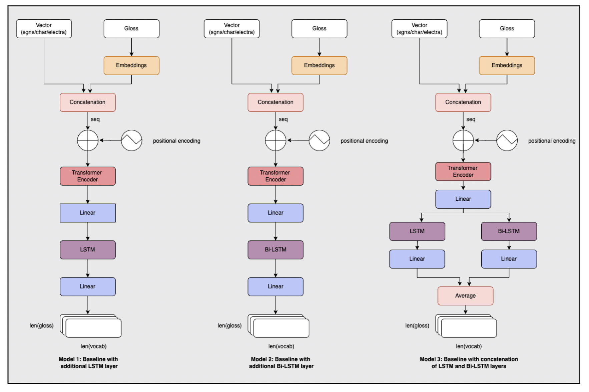

# Nghịch đảo từ điển sử dụng mô hình đơn ngữ và ngôn ngữ chéo

## 1. Giới thiệu

Từ điển nghịch đảo (reverse dictionary) là một tác vụ biến đổi chuỗi chú thích, diễn giải thành vectơ từ phù hợp về mặt ngữ nghĩa. Đây là một tác vụ rất hữu ích trong các ứng dụng thực tế như giải quyết vấn đề đầu môi, giúp người mới học ngôn ngữ, v.v. Trong phần này, chúng ta đánh giá hiệu suất mô hình Transformer kết hợp với LSTM ở 3 chế độ: đơn ngữ, đa ngữ và ngôn ngữ chéo. Các thử nghiệm này được thực thi trên tập dữ liệu CODWOE gồm 5 ngôn ngữ: tiếng Anh, tiếng Pháp, tiếng Ý, tiếng Tây Ban Nha và tiếng Nga.

## 2. Mô hình

Chúng ta bắt đầu bằng cách thử nghiệm với mô hình Transformer và coi đây như một mô hình nền rồi thêm một lớp LSTM (Mô hình 1), một lớp BiLSTM (Mô hình 2), và kết hợp dự đoán từ hai lớp được đề cập này (Mô hình 3) với 3 chế độ: đơn ngữ, đa ngữ, ngôn ngữ chéo. Tổng thể kiến trúc được trình bày trong hình dưới đây.

Thử nghiệm sử dụng Pytorch và được triển khai trên Google Colab. Kết quả thử nghiệm được đánh giá thông qua 3 chỉ số đánh giá: MSE, Cosine similarity, Cosine ranking.

## 3. Kết quả nghiên cứu

Kết quả thử nghiệm và đánh giá tham khảo thêm tại bài báo [JSI at SemEval-2022 Task 1: CODWOE-Reverse Dictionary: Monolingual and cross-lingual approaches](https://aclanthology.org/2022.semeval-1.12.pdf). Để triển khai lại, tham khảo mã nguồn tại [codwoe2021](https://github.com/honghanhh/codwoe2021).

## 4. Tham khảo

Tran, T.H.H., Martinc, M., Purver, M. and Pollak, S., 2022, July. [JSI at SemEval-2022 Task 1: CODWOE-Reverse Dictionary: Monolingual and cross-lingual approaches](https://aclanthology.org/2022.semeval-1.12.pdf). In Proceedings of the 16th International Workshop on Semantic Evaluation (SemEval-2022) (pp. 101-106)
