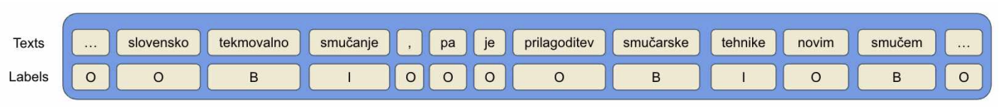
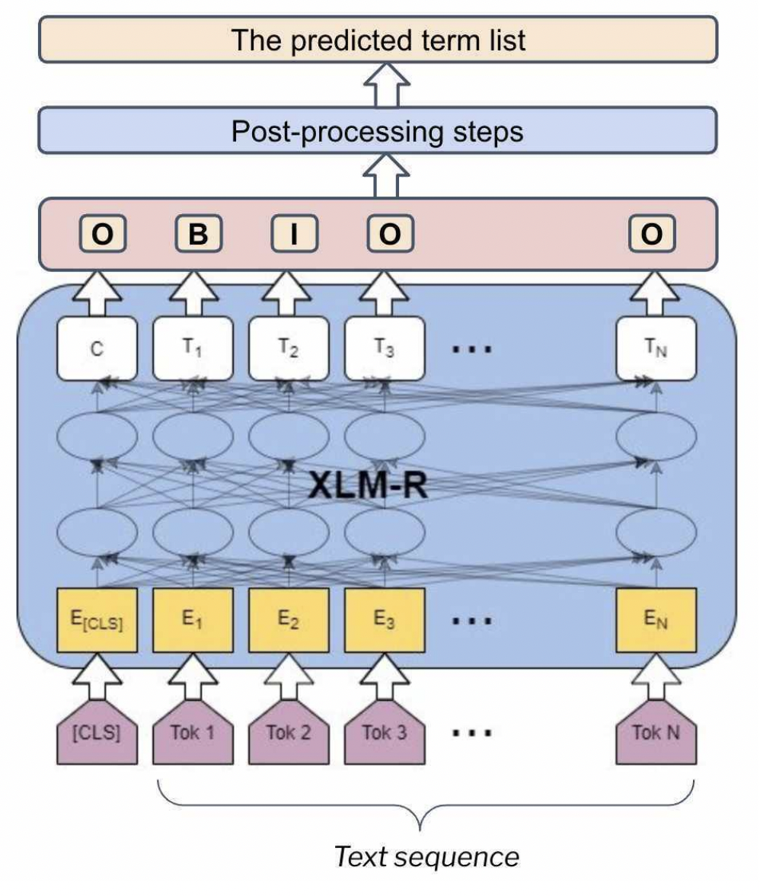
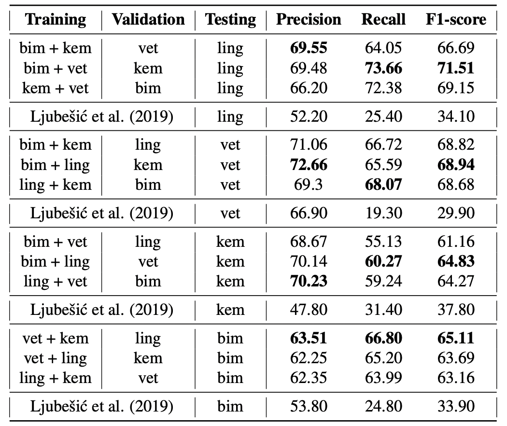

# Trích xuất thuật ngữ Slovenia với XLM-Roberta

## 1. Giới thiệu

Trích xuất thuật ngữ (ATE) là một tác vụ nghiên cứu phổ biến nhằm giúp giảm thiểu thời gian và công sức xác định các cụm từ thuật ngữ các lĩnh vực khác nhau bằng cách lọc ra một danh sách các cụm từ tiềm năng từ kho dữ liệu. Trong bài này, chúng tôi thử nghiệm với mô hình huấn luyện trước đa ngôn ngữ XLM-RoBERTa để đánh giá hiệu suất trích xuất. Các thử nghiệm được thực thi trên kho dữ liệu RSDO5, một tập dữ liệu tiếng Slovenia chứa các văn bản từ bốn lĩnh vực, bao gồm Cơ sinh học, Hóa học, Thú y, và Ngôn ngữ học.

## 2. Mô hình

Ta coi trích xuất thuật ngữ như một tác vụ mà mô hình sẽ trả về nhãn cho từng token trong một chuỗi văn bản. Cơ chế gắn nhãn (I-O-B) được sử dụng với B là viết tắt của từ bắt đầu thuật ngữ, I là viết tắt của từ bên trong thuật ngữ, và O là viết tắt của từ không phải là một phần của thuật ngữ (xem ví dụ trong Hình dưới đây).

Trong các thử nghiệm của mình, ta sử dụng XLM-R, mô hình đa ngôn ngữ được huấn luyện trước để tận dụng tri ​​thức chung mà mô hình thu được trong quá trình huấn luyện trước trên kho dữ liệu đa ngôn ngữ khổng lồ. Tổng thể kiến trúc được trình bày trong hình dưới đây.

 

Ta chia tập dữ liệu thành 3 phần (huấn luyện - đánh giá - kiểm thử) và thử nghiệm học chuyển giao tri ​​thức từ lĩnh vực này sang lĩnh vực khác. Do đó, mô hình được tỉnh chỉnh với 2 lĩnh vực (ví dụ: Cơ sinh học, Hóa học), đánh giá trên lĩnh vực thứ ba (ví dụ: Thú y) và kiểm thử trên lĩnh vực còn lại (ví dụ: Ngôn ngữ học). Điều này cho phép ta đánh giá khả năng chuyển giao tri ​​thức của mô hình. Kết quả thử nghiệm được đánh giá thông qua 3 chỉ số đánh giá: Precision, Recall, F1-score.

## 3. Kết quả nghiên cứu

Kết quả thử nghiệm được trình bày trong bảng dưới đây. Phương pháp của chúng ta có hiệu suất nhất quán với tất cả các cách kết hợp lĩnh vực khác nhau. Mô hình hoạt động tốt hơn trong việc trích xuất các thuật ngữ từ lĩnh vực Ngôn ngữ học và Thú y so với từ Cơ sinh học và Hóa học. Cách tiếp cận này vượt trội hơn so với mô hình đương thời áp dụng trên cùng tập dữ liệu.

 

Kết quả thử nghiệm và phân tích chi tiết tham khảo thêm tại bài báo [A Transformer-based Sequence-labeling Approach to the Slovenian Cross-domain Automatic Term Extraction](https://nl.ijs.si/jtdh22/pdf/JTDH2022_Tran-et-al_A-Transformer-based-Sequence-labeling-Approach-to-the-Slovenian-Cross-domain-Automatic-Term-Extraction.pdf). Để triển khai lại, tham khảo mã nguồn tại [sdjt-ate](https://github.com/honghanhh/sdjt-ate).

## 4. Tham khảo

Tran, T.H.H., Martinc, M., Repar, A., Doucet, A. and Pollak, S., [A Transformer-based Sequence-labeling Approach to the Slovenian Cross-domain Automatic Term Extraction](https://nl.ijs.si/jtdh22/pdf/JTDH2022_Tran-et-al_A-Transformer-based-Sequence-labeling-Approach-to-the-Slovenian-Cross-domain-Automatic-Term-Extraction.pdf). In Proceedings of the 22nd International Conference on Natural Language Processing (JTDH 2022), 2022.
