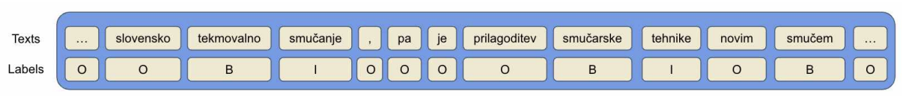

# Học chuyển giao đa ngôn ngữ có lợi cho trích xuất thuật ngữ chéo ngành không?

## 1. Giới thiệu

(Đang cập nhật)

<!-- Trích xuất thuật ngữ (ATE) là một tác vụ nghiên cứu phổ biến nhằm giúp giảm thiểu thời gian và công sức xác định các cụm từ thuật ngữ các lĩnh vực khác nhau bằng cách lọc ra một danh sách các cụm từ tiềm năng từ kho dữ liệu. Trong bài này, chúng tôi thử nghiệm với mô hình huấn luyện trước đa ngôn ngữ XLM-RoBERTa để đánh giá hiệu suất trích xuất. Các thử nghiệm được thực thi trên kho dữ liệu RSDO5, một tập dữ liệu tiếng Slovenia chứa các văn bản từ bốn lĩnh vực, bao gồm Cơ sinh học, Hóa học, Thú y, và Ngôn ngữ học. -->

## 2. Mô hình

(Đang cập nhật)

<!-- 

 
 -->

## 3. Kết quả nghiên cứu

(Đang cập nhật)
<!-- 
 
 -->

Kết quả thử nghiệm và phân tích chi tiết tham khảo thêm tại bài báo [Can Cross-Domain Term Extraction Benefit from Cross-lingual Transfer?](https://link.springer.com/chapter/10.1007/978-3-031-18840-4_26). Để triển khai lại, tham khảo mã nguồn tại [ate-2022](https://github.com/honghanhh/ate-2022).

## 4. Tham khảo

Tran, H.T.H., Martinc, M., Doucet, A., Pollak, S. (2022). [Can Cross-Domain Term Extraction Benefit from Cross-lingual Transfer?](https://link.springer.com/chapter/10.1007/978-3-031-18840-4_26). In: Pascal, P., Ienco, D. (eds) Discovery Science. DS 2022. Lecture Notes in Computer Science(), vol 13601. Springer, Cham. https://doi.org/10.1007/978-3-031-18840-4_26
