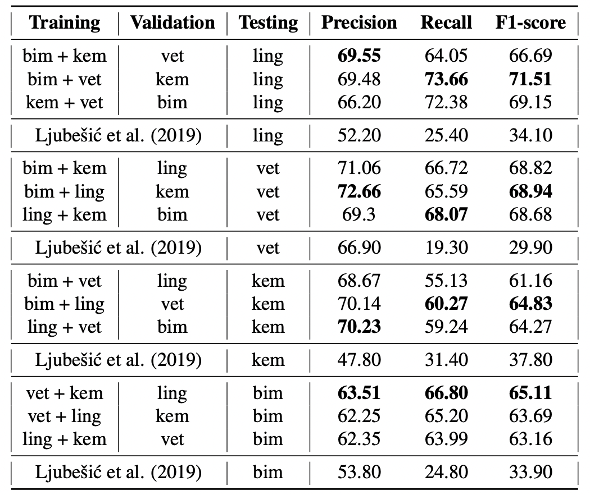

# Học chuyển giao đa ngôn ngữ có lợi cho trích xuất thuật ngữ chéo ngành không?

## 1. Giới thiệu

(Đang cập nhật)

## 2. Mô hình

(Đang cập nhật)

(Đang cập nhật)

 
 -->

## 3. Kết quả nghiên cứu

(Đang cập nhật)
<!-- 
 
 -->

Kết quả thử nghiệm và phân tích chi tiết tham khảo thêm tại bài báo [Can Cross-Domain Term Extraction Benefit from Cross-lingual Transfer?](https://link.springer.com/chapter/10.1007/978-3-031-18840-4_26). Để triển khai lại, tham khảo mã nguồn tại [ate-2022](https://github.com/honghanhh/ate-2022).

## 4. Tham khảo

Tran, H.T.H., Martinc, M., Doucet, A., Pollak, S. (2022). [Can Cross-Domain Term Extraction Benefit from Cross-lingual Transfer?](https://link.springer.com/chapter/10.1007/978-3-031-18840-4_26). In: Pascal, P., Ienco, D. (eds) Discovery Science. DS 2022. Lecture Notes in Computer Science(), vol 13601. Springer, Cham. https://doi.org/10.1007/978-3-031-18840-4_26
