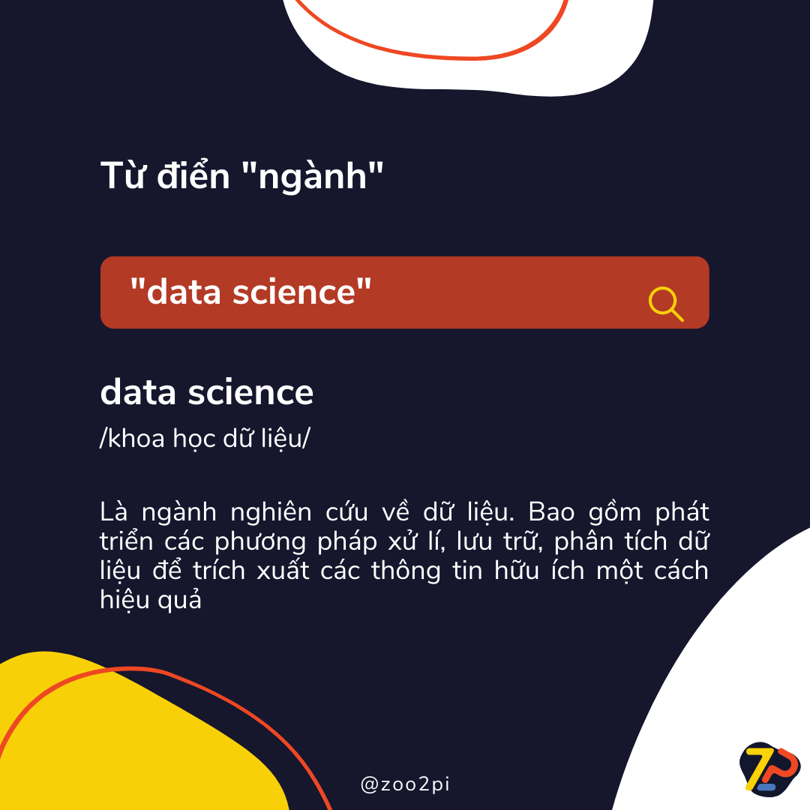

# Bài 1: Khoa học dữ liệu là gì?

## 1. Khoa học dữ liệu là gì?

Khoa học dữ liệu là lĩnh vực nghiên cứu về dữ liệu kết hợp của nhiều chuyên ngành, bao gồm thống kê, khoa học máy tính, công nghệ thông tin, trí tuệ nhân tạo, và kiến thức chuyên môn trong các lĩnh vực cụ thể để phân tích khối lượng lớn dữ liệu.

Thuật ngữ này lần đầu xuất hiện vào khoảng thập niên 60, trong vai trò là tên gọi khác của thống kê. Đến cuối thập niên 90, các chuyên gia khoa học máy tính mới chính thức hóa thuật ngữ này và định nghĩa Khoa học dữ liệu như một ngành nghiên cứu về dữ liệu bao gồm thiết kế, thu thập, phát triển các phương pháp xử lý, lưu trữ và phân tích dữ liệu để trích xuất các thông tin hữu ích một cách hiệu quả. Vẫn phải mất thêm một thập niên nữa thì thuật ngữ này mới được sử dụng phổ biến ngoài giới học thuật.

Vậy thì Khoa học dữ liệu đóng vai trò gì và giúp ích gì cho chúng ta trong nghiên cứu dữ liệu?

## 2. Vai trò của Khoa học dữ liệu

Khoa học dữ liệu giúp cho các nhà Khoa học dữ liệu  đặt ra và trả lời những câu hỏi như sự kiện gì đã xảy ra, tại sao nó xảy ra, sự kiện gì sẽ xảy ra và có thể sử dụng kết quả thu được cho mục đích gì. Với mục tiêu sử dụng để nghiên cứu dữ liệu, Khoa học dữ liệu có thể được đúc kết thành 4 phương pháp chính như sau:

|Phương pháp|Mô tả|Đặc trưng|
|---|---|---|
|Phân tích mô tả (Descriptive)|Xem xét dữ liệu để thu thập thông tin chuyên sâu về những sự kiện đã hoặc đang xảy ra|Trực quan hoá dữ liệu|
|Phân tích chẩn đoán (Diagnostic)|Phân tích chuyên sâu hoặc chi tiết dữ liệu để nắm được nguyên nhân khiến một sự kiện xảy ra|Khám phá, khai thác, và đối chiếu dữ liệu|
|Phân tích dự đoán (Predictive)|Sử dụng dữ liệu lịch sử để đưa ra các dự báo chính xác về mẫu dữ liệu có thể xảy ra trong tương lai|Xây dựng mô hình dự đoán, học máy|
|Phân tích đề xuất (Prescriptive)|Dự đoán sự kiện gì sẽ xảy ra, phân tích tác động tiềm năng và đề xuất phương án hành động tối ưu|Phân tích đồ thị, mô phỏng, xử lý sự kiện phức tạp, và công cụ đề xuất từ học máy|

Để giúp các bạn dễ hình dung hơn về 4 phương pháp này, chúng ta sẽ cũng nhau đi qua một ví dụ thực tế cách vận hành dịch vụ đặt vé của một hãng hàng không.

### 2.1. Phân tích mô tả (Descriptive)

Như chúng ta đã biết, khi đặt vé máy bay, hãng hàng không có thể lưu lại dữ liệu như số lượng vé được đặt mỗi ngày. Thông tin tưởng chừng như đơn giản này lại mang rất nhiều ý nghĩa thông qua phân tích mô tả. Phân tích mô tả sẽ chỉ ra mức tăng giảm đột biến trong số lượng vé được đặt và các tháng hoạt động hiệu quả cao của dịch vụ này như tháng nào. Các nhà Khoa học dữ liệu có thể thể hiện thông tin này thông qua trực quan hóa dữ liệu, chẳng hạn như bằng biểu đồ tròn, biểu đồ cột, biểu đồ đường, bảng hoặc văn bản thuyết minh.

### 2.2. Phân tích chẩn đoán (Diagnostic)

Trong khi đó, phân tích chẩn đoán sẽ giúp hãng bay từ dịch vụ đặt vé máy bay truy sâu vào một tháng hoạt động đặc biệt hiệu quả để hiểu rõ hơn về mức tăng đột biến trong số lượng vé được đặt. Điều này có thể dẫn tới việc phát hiện ra những hành vi tiềm năng, ví dụ như nhiều khách hàng ghé thăm một thành phố nhất định để tham dự một sự kiện thể thao hàng tháng. Để làm được điều này, các kỹ thuật như truy vấn, khám phá, khai thác, và đối chiếu dữ liệu sẽ được áp dụng. Chúng ta sẽ đi sâu vào các kỹ thuật này trong những phần sau.

### 2.3. Phân tích dự đoán (Predictive)

Từ những phân tích từ hai mức độ trên, đội ngũ phòng vé có thể tận dụng Khoa học dữ liệu để dự đoán hành vi đặt vé trong năm tới vào thời điểm đầu mỗi năm. Chương trình hoặc thuật toán máy tính có thể xem xét dữ liệu trong quá khứ và dự đoán mức tăng đột biến trong số lượng vé được đặt cho các điểm đến nhất định trong các tháng tiềm năng (mùa du lịch, sự kiện đặc biệt, v.v.). Khi đã dự đoán được nhu cầu du lịch trong tương lai của khách hàng, công ty sẽ có thể bắt đầu chạy chiến dịch quảng cáo phù hợp nhắm mục tiêu cho các điểm đó từ trước một vài tháng. Điều này sẽ giúp hãng bay tăng được doanh thu và đạt được mục tiêu kinh doanh.

### 2.4. Phân tích đề xuất (Prescriptive)

Cuối cùng và là cấp độ cao nhất của Khoa học dữ liệu, đó là phân tích đề xuất. Áp dụng cho dịch vụ vé máy bay, phân tích đề xuất có thể xem xét các chiến dịch tiếp thị trước đây để tăng tối đa lợi thế của mức tăng đột biến sắp tới về số lượng vé được đặt. Nhà Khoa học dữ liệu có thể dự đoán kết quả đặt vé cho các mức chi tiêu tiếp thị khác nhau trên những kênh tiếp thị đa dạng. Những dự báo này sẽ giúp hãng bay và phòng vé tự tin hơn khi đưa ra các quyết định tiếp thị.

## 3. Tổng kết

Vâỵ là trong phần này, chúng ta đã bước đầu làm quen với khái niệm Khoa học dữ liệu cũng như vai trò của Khoa học dữ liệu thông qua 4 phương pháp chính. Trong phần tiếp theo, chúng ta sẽ tìm hiểu về các quy trình hoạt động của Khoa học dữ liệu khi áp dụng vào các bài toán doanh nghiệp.

Chúc các bạn học tập vui vẻ!

Một số tài liệu tham khảo:

- [What is Data Science?](https://aws.amazon.com/what-is/data-science/)
- [Practical Statistics for Data Scientists: 50 Essential Concepts](https://www.amazon.com/Practical-Statistics-Data-Scientists-Essential/dp/1491952962)
- [Data Science on AWS: Implementing End-to-End, Continuous AI and Machine Learning Pipelines](https://www.amazon.com/Data-Science-AWS-End-End/dp/1492079391)
- [Data Science for Business: What You Need to Know about Data Mining and Data-Analytic Thinking](https://www.amazon.com/Data-Science-Business-Analytic-Thinking/dp/1449361323)
