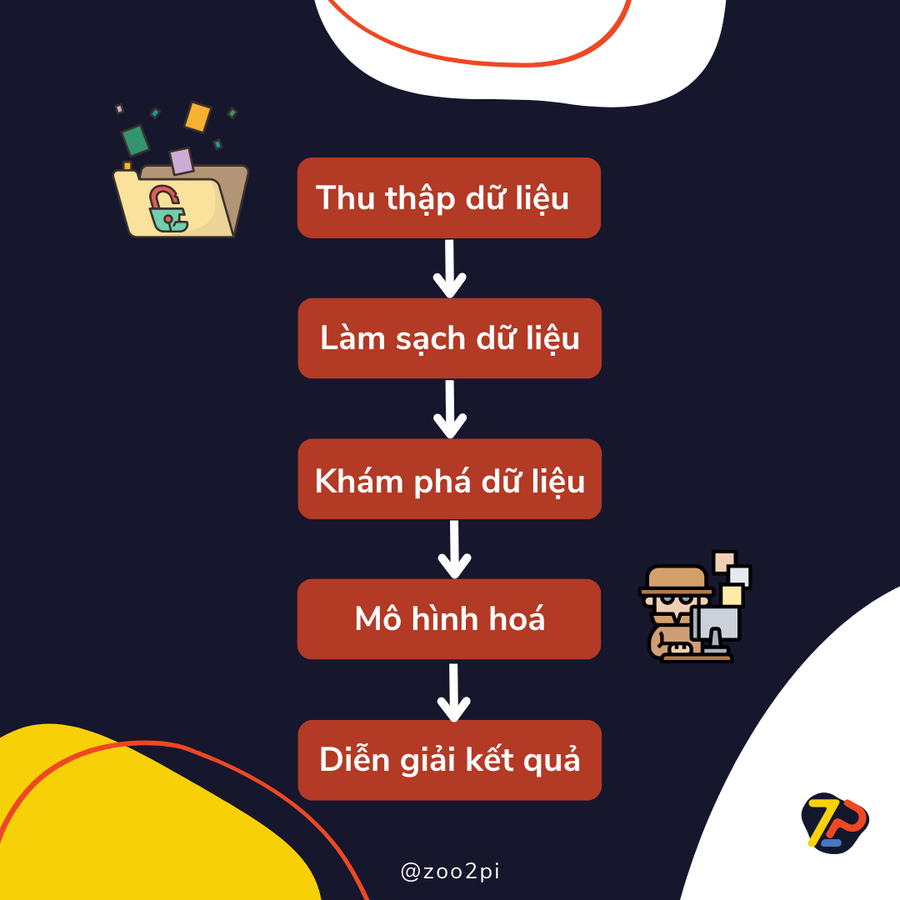

# Bài 2: Quy trình Khoa học dữ liệu

## 1. Giới thiệu

Trong bài trước, chúng ta đã cùng nhau tìm hiểu Khoa học dữ liệu là gì cũng như bốn vai trò của Khoa học dữ liệu được áp dụng trong các bài toán doanh nghiệp với một ví dụ minh hoạ thực tế gần gũi. Vậy thì để có thể giải quyết vấn đề với Khoa học dữ liệu, chúng ta sẽ cần làm những gì? Hãy cùng Zootopi tìm hiểu quy trình tổng quan của Khoa học dữ liệu cũng như phân biệt những lĩnh vực dữ liệu dễ gây nhầm lẫn với nhau như Khoa học dữ liệu, phân tích dữ liệu, phân tích kinh doanh, kỹ thuật dữ liệu trong bài viết này nhé!

## 2. Quy trình tổng quan Khoa học dữ liệu

Quy trình Khoa học dữ liệu thường được bắt đầu bởi một vấn đề kinh doanh. Ở bước này, nhà khoa học dữ liệu sẽ làm việc với các bên liên quan (trong và ngoài doanh nghiệp tuỳ vào phạm vi dự án) để tìm hiểu nhu cầu của doanh nghiệp là gì. Một khi vấn đề đã được xác định, nhà khoa học dữ liệu sẽ giải quyết nó bằng cách sử dụng quy trình Khoa học dữ liệu OSEMN, gồm 5 bước chính:

* **O**btain: Thu thập dữ liệu
* **S**crub: Làm sạch dữ liệu
* **E**xplore: Khám phá dữ liệu
* **M**odel: Xây dựng mô hình
* I**N**terpret results: Diễn giải kết quả

Thứ tự các bước trong quy trình này được thể hiện trong hình dưới đây.

### 2.1. Thu thập dữ liệu

Bước đầu tiên trong quy trình Khoa học dữ liệu là thu thập dữ liệu. Dữ liệu có thể có sẵn từ trước, vừa mới được thu thập hoặc có thể dễ dàng truy cập trên Internet. Và đôi khi dữ liệu chúng ta cần không chỉ đến từ một nguồn duy nhất mà là sự kết hợp, tổng hợp từ nhiều nguồn khác nhau, ví dụ từ cơ sở dữ liệu nội bộ hoặc bên ngoài, phần mềm CRM của công ty, nhật ký máy chủ web, mạng xã hội hoặc mua dữ liệu từ các nguồn bên thứ ba đáng tin cậy. Nhiệm vụ của các nhà khoa học dữ liệu sau khi xác định được vấn đề cần giải quyết là tìm kiếm, thu thập, và trích xuất những dữ liệu phù hợp.

### 2.2. Làm sạch dữ liệu

Những dữ liệu chúng ta thu thập được trong bước đầu tiên thường được gọi là dữ liệu thô. Dữ liệu thô thường không đáp ứng được các yêu cầu của các thuật toán được sử dụng trong phân tích và học máy, ví dụ như dữ liệu bị thiếu, dữ liệu bị lặp lại, dữ liệu không đúng định dạng, dữ liệu không đồng nhất, v.v. Do đó, bước tiếp theo trong quy trình ta cần thức hiện, đó là làm sạch dữ liệu. Đây là bước quan trọng nhất trong quy trình Khoa học dữ liệu giúp chúng ta chuẩn hoá dữ liệu theo một định dạng được định trước để chúng ta dễ dàng khám phá và tìm ra những hành vi ẩn thú vị có thể giúp ích cho doanh nghiệp. Chúng ta sẽ đi sâu vào các bước trong quá trình làm sạch dữ liệu và bắt tay thực hiện làm sạch dữ liệu với Python trong các phần sau.

### 2.3. Khám phá dữ liệu

Bước tiếp theo trong quy trình Khoa học dữ liệu là khám phá dữ liệu. Đây là thao tác phân tích sơ bộ dữ liệu giúp chúng ta hiểu sâu sắc hơn về dữ liệu ta đã thu thập được, những mẫu dữ liệu nào thú vị có thể được nghiên cứu hoặc tận dụng, những thông tin nào có thể giúp ích cho doanh nghiệp, những thông tin nào có thể được sử dụng để xây dựng mô hình học máy, v.v. Từ đó, nhà Khoa học dữ liệu có thể lập kế hoạch kỹ hơn cho các chiến lược mô hình hóa dữ liệu bước tiếp theo. Các công cụ như Pandas, NumPy để phân tích dữ liệu, và Matplotlib, Seaborn, Plotly, v.v. để trực quan hóa và khám phá dữ liệu thường được sử dụng trong giai đoạn này. Tương tự như bước làm sạch dữ liệu, chúng ta sẽ đi sâu vào các phương pháp khám phá dữ liệu hiệu quả thông các công cụ phân tích và trực quan hóa dữ liệu sử dụng Python trong các phần sau.

### 2.4. Xây dựng mô hình

Xây dựng mô hình là bước áp chót trong quy trình Khoa học dữ liệu. Đây là giai đoạn chúng ta sử dụng các thuật toán học máy và học sâu để xây dựng mô hình dự đoán, phân loại, phân cụm, v.v. từ dữ liệu. Các thuật toán này có thể được chia thành hai mảng chính dựa theo đặc điểm dữ liệu huấn luyện, đó là học có giám sát (dữ liệu có nhãn) và học phi giám sát (dữ liệu không có nhãn). Nếu học có giám sát thường được sử dụng để xây dựng mô hình dự đoán, phân loại, v.v. thì học phi giám sát lại thường được dùng để xây dựng mô hình phân cụm, giảm chiều dữ liệu, v.v. Các thuật toán từ các hai nhóm này dễ dàng được triển khai trong các thư viện như Scikit-learn, Tensorflow, Keras, Pytorch v.v. Trong các phần sau, chúng ta sẽ đi sâu vào các thuật toán học máy thông qua các ví dụ thực tế sử dụng Python kết hợp các thư viện trên.

### 2.5. Diễn giải kết quả

Kết quả được thu được từ mô hình dữ liệu được diễn giải bởi các nhà khoa học dữ liệu (có thể hợp tác cùng các chuyên gia phân tích và doanh nghiệp) để đưa ra các khuyến nghị hành động. Các kết quả này thường được diễn giải bằng cách sử dụng các đồ thị và biểu đồ để thể hiện những xu hướng và dự đoán, từ đó nhà Khoa học dữ liệu có thể ra các khuyến nghị hành động hợp lý và giúp doanh nghiệp triển khai một cách hữu hiệu.

## 3. Khoa học dữ liệu khác gì những lĩnh vực dữ liệu khác

Nhắc tới dữ liệu, không quá ngạc nhiên khi các bạn có thể bị choáng ngợp bởi rất nhiều thuật ngữ xoay quanh các tác vụ và phương pháp xoay quanh dữ liệu như Khoa học dữ liệu, phân tích dữ liệu, phân tích kinh doanh, kỹ thuật dữ liệu, v.v. Liệu rằng, các thuật ngữ này có cùng ám chỉ một lĩnh vực? Các bạn có thể phân biệt được các thuật ngữ này và hiểu được sự khác nhau giữa chúng? Hãy cùng tìm hiểu nhé!

### 3.1. Khoa học dữ liệu và phân tích dữ liệu

Mặc dù hai thuật ngữ này có thể sử dụng thay thế cho nhau, phân tích dữ liệu là một nhánh phụ của khoa học dữ liệu. Để hiểu hơn sự khác biệt này, chúng ta cùng xem qua bảng so sánh dưới đây.

| Khoa học dữ liệu | Phân tích dữ liệu |
| --- | --- |
| Tập trung vào bức tranh toàn cảnh hơn về dữ liệu của tổ chức. | Tập trung vào phân tích dữ liệu. |
|Thiết kế phương thức lưu trữ và tạo ra các phương pháp và công cụ mới để xử lý dữ liệu.| Chủ yếu là việc sử dụng các công cụ và phương pháp đã có sẵn để phân tích diễn dải dữ liệu hiện có.|
| Bao hàm mọi khía cạnh của xử lý dữ liệu, từ thu thập dữ liệu đến lập mô hình rồi rút ra thông tin chuyên sâu.| Chủ yếu liên quan tới thống kê, toán học và phân tích thống kê.|

Tại hầu hết môi trường làm việc, các nhà Khoa học dữ liệu và nhà phân tích dữ liệu phối hợp cùng nhau để đạt các mục tiêu kinh doanh chung.

### 3.2 Khoa học dữ liệu và và phân tích kinh doanh

Dù không phải là những thuật ngữ tương đương, Khoa học dữ liệu và phân tích kinh doanh có một số điểm chung. Cả hai đều tập trung vào việc thu thập dữ liệu, xử lý dữ liệu và phân tích dữ liệu để đưa ra các quyết định kinh doanh thông minh. Dù vậy, điểm khác biệt chính giữa hai lĩnh vực này là việc sử dụng công nghệ trong từng lĩnh vực.

| Khoa học dữ liệu | Phân tích kinh doanh|
| --- | --- |
|Xây dựng công cụ cung cấp giải pháp cho vấn để sử dụng công nghệ (áp dụng những kỹ thuật học máy để tạo ra mô hình và phát triển thuật toán mới).| Xác định các trường hợp kinh doanh, thu thập thông tin từ những bên liên quan hoặc xác thực các giải pháp.|

Cũng giống như phân tích dữ liệu, các nhà phân tích kinh doanh cũng có thể phối hợp với các nhà Khoa học dữ liệu trong cùng nhóm biến những kết quả từ nhà Khoa học dữ liệu thành diễn giải theo cách mà toàn thể doanh nghiệp có thể hiểu.

### 3.3. Khoa học dữ liệu và và kỹ thuật dữ liệu

Các kỹ sư dữ liệu xây dựng và duy trì các hệ thống cho phép nhà Khoa học dữ liệu truy cập và diễn giải dữ liệu. Các kỹ sư dữ liệu cũng có thể làm việc với các nhà Khoa học dữ liệu để xây dựng các công cụ mới để xử lý dữ liệu.

| Khoa học dữ liệu | Kỹ thuật dữ liệu|
| --- | --- |
|Sử dụng dữ liệu mà kỹ sư dữ liệu đã xử lý để xây dựng và huấn luyện các mô hình dự đoán.| Tập trung vào việc tạo các mô hình dữ liệu, xây dựng đường ống dữ liệu và giám sát quy trình trích xuất, chuyển đổi, tải (ETL).|

Các nhà khoa học dữ liệu sử dụng dữ liệu mà kỹ sư dữ liệu đã xử lý để xây dựng và huấn luyện các mô hình dự đoán. Sau đó, họ có thể giao kết quả cho các nhà phân tích để đưa ra quyết định tiếp theo.

## 4. Tổng kết

Vâỵ là trong phần này, chúng ta đã nắm được quy trình tổng quát từ đầu đến cuối với một bài toán Khoa học dữ liệu cũng như hiểu được sự khác biệt giữa mảng này so với các lĩnh vực dữ liệu khác như phân tích dữ liệu, phân tích kinh doanh, kỹ thuật dữ liệu. Trong phần tiếp theo, chúng ta sẽ cũng nhau tiếp cận tới những khái niệm liên quan tới thành phân quan trọng nhất trong lĩnh vực này, đó chính là dữ liệu.

Chúc các bạn học tập vui vẻ!

Một số tài liệu tham khảo:

- [What is Data Science?](https://aws.amazon.com/what-is/data-science/)
- [Practical Statistics for Data Scientists: 50 Essential Concepts](https://www.amazon.com/Practical-Statistics-Data-Scientists-Essential/dp/1491952962)
- [Data Science on AWS: Implementing End-to-End, Continuous AI and Machine Learning Pipelines](https://www.amazon.com/Data-Science-AWS-End-End/dp/1492079391)
- [Data Science for Business: What You Need to Know about Data Mining and Data-Analytic Thinking](https://www.amazon.com/Data-Science-Business-Analytic-Thinking/dp/1449361323)
