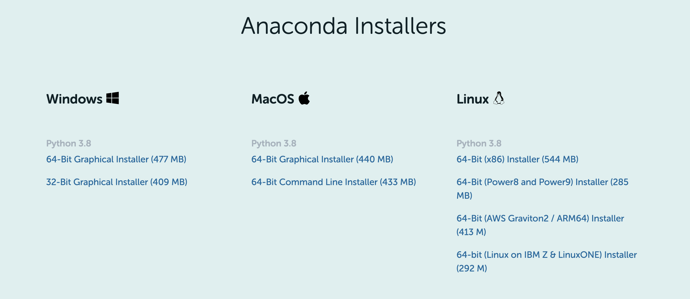

# Bài 0: Làm quen với Anaconda

## I. Giới thiệu

Anaconda là 1 nền tảng mã nguồn mở về Khoa học dữ liệu (Data Science - DS) trên Python thông dụng nhất hiện nay. Với hơn 25 triệu người dùng (theo thống kê tại trang chủ), Anaconda là giải pháp nhanh nhất và dễ nhất để các bạn có thể tìm hiểu DS với Python hoặc R trên Windows, Linux và Mac OS X. Và ngày hôm nay, **ZootoPi** xin phép được khai bút chuỗi series <ins> **Khoa học dữ liệu cho người mới bắt đầu** </ins> bằng những công cụ thiết yếu dành cho nhà khoa học dữ liệu (Data Scientist), bắt đầu với Anaconda.

Các bạn có thể tải Anaconda tương ứng với hệ điều hành các bạn sử dụng tại [đây](https://www.anaconda.com/products/individual) 



Các bạn có thể tham khảo thêm các link dưới đây để cài đặt tương ứng với hệ điều hành bạn đang sử dụng:

- MacOS: click vào [đây](https://docs.anaconda.com/anaconda/install/mac-os/).
- Windows: click vào [đây](https://docs.anaconda.com/anaconda/install/windows/).
- Ubuntu: click vào [đây](https://docs.anaconda.com/anaconda/install/linux/).

## II. Conda, Miniconda, Anaconda

Với các bạn mới bắt đầu, khi tìm hiểu các tài liệu về `Anaconda` sẽ rất dễ gặp những cụm từ như `Conda`, `Miniconda`, thậm chí khi thi thoảng còn gặp những câu lệnh update đi liền nhau như sau:

```
conda update conda
conda update anaconda
```

Vậy thì `Conda`, `Miniconda`, `Anaconda` khác nhau như thế nào?

Hiểu 1 cách đơn giản, `Conda` là 1 tay quản lí môi trường (environments) và quản lý gói (packages). Nói nôm na, chúng ta sử dụng `Conda` như 1 công cụ dòng lệnh, đồng thời như 1 gói Python.

Như vậy, Miniconda và Anaconda có thể được biểu diễn như sau:

```
Miniconda = Python + conda

Anaconda = Python + conda + gói meta anaconda
```

Sự khác biệt giữa Anaconda và Miniconda nằm ở `gói meta anaconda` . Sở dĩ gọi là gói meta vì nó chứa khoảng 160 gói Python khác thuận tiện để sử dụng hàng ngày trong khoa học dữ liệu. Đây cũng là 1 trong những lí do mà mình muốn giới thiệu Anaconda đầu tiên cho các bạn bắt đầu tìm hiểu về Khoa học dữ liệu.

## III. Tạo môi trường ảo

- Tạo 1 môi trường ảo:

```
conda create -n zootopi python=3.8
```

Ở đây, **_-n_** là viết tắt của **_-name_**, **_zootopi_** là tên của môi trường. Các bạn có thể đổi tên môi trường tuỳ vào mục đích của môi trường, tạo cho dự án nào, lưu ý là tên môi trường phải viết liền không dấu. Để chọn phiên bản Python, ta sử dụng **_python=_**. Hiện nay, Python đã có hỗ trợ đến phiên bản 3.9. Tuy nhiên, để đảm bảo tính ổn định của phiên bản, mình khuyến khích các bạn dùng lùi xuống 1 đến 2 version (e.g Python 3.8 hoặc Python 3.7).

```console
(base) ➜  ~ conda create -n zootopi python=3.8
Collecting package metadata (current_repodata.json): done
Solving environment: done


==> WARNING: A newer version of conda exists. <==
  current version: 4.9.2
  latest version: 4.10.1

Please update conda by running

    $ conda update -n base -c defaults conda


## Package Plan ##

  environment location: /home/t/anaconda3/envs/zootopi

  added / updated specs:
    - python=3.8

...
```

- Kích hoạt môi trường

```
conda activate zootopi
```

```console
(base) ➜  ~ conda activate zootopi
(zootopi) ➜  ~ python
Python 3.8.5 (default, Sep  4 2020, 07:30:14)
[GCC 7.3.0] :: Anaconda, Inc. on linux
Type "help", "copyright", "credits" or "license" for more information.
>>>
```

Vậy là chúng ta đã tạo ra 1 môi trường ảo để bắt đầu dự án rồi. Các bạn có thể tham khảo thêm 1 số câu lệnh và cú pháp phổ biến tại [đây](https://docs.conda.io/projects/conda/en/4.6.0/_downloads/52a95608c49671267e40c689e0bc00ca/conda-cheatsheet.pdf).

Trong bài viết tiếp theo, ZootoPi sẽ tiếp tục giới thiệu đến các bạn về `JupyterLab` và `Jupyter Notebook`? Vậy 2 khái niệm này là gì? Sử dụng `JupyterLab` và `Jupyter Notebook` như thế nào để có thể làm việc hiệu quả? ZootoPi xin phép hẹn bạn trong bài viết tiếp theo!
