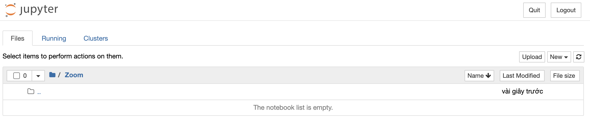
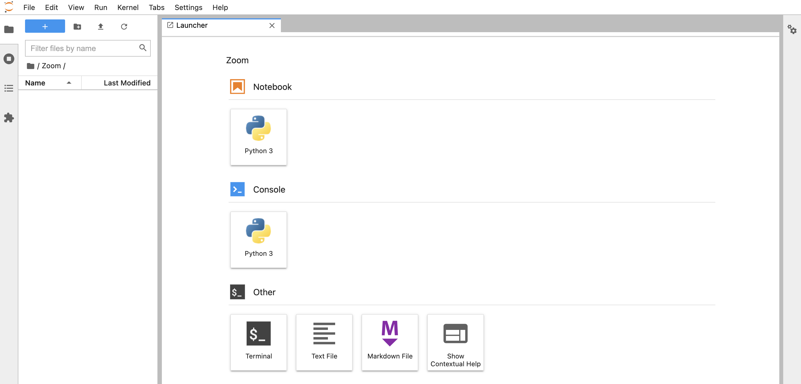

# Jupyter

## 1. Giới thiệu

Trong bài viết trước, GafBof đã giới thiệu về Anaconda, một mã nguồn mở giúp ta tạo ra những môi trường ảo với trình quản lí gói conda tiện lợi cho việc truy xuất và cài đặt các thư viện bên trong. Sau khi có môi trường rồi, ta sẽ cần có công cụ để viết, chạy mã nguồn cũng như gỡ lỗi chương trình. Và trong bài viết này, GafBof xin giới thiệu họ nhà Jupyter với Jupyter Notebook và Jupyter Lab.

### 1.1 Jupyter

Jupyter là một nền tảng tính toán khoa học mã nguồn mở, với khả năng nổi bật cho phép tương tác trực tiếp với từng dòng code, hỗ trợ hơn 40 ngôn ngữ lập trình. Cái tên Jupyter bắt nguồn từ cách chơi chữ kết hợp từ 3 ngôn ngữ lập trình **Ju**lia, **Pyt**hon, và **R** ( `Jupyter = Julia + Python + R`). Bên cạnh đó, Jupyter cũng là một công cụ hoàn toàn miễn phí, được tạo ra với mục đích nhắm đến khoa học dữ liệu và giáo dục, giúp mọi người cùng học lập trình dễ dàng hơn (cụ thể ở đây là Python). Jupyter có tính tương tác nên có thể sử dụng làm môi trường chạy thử và giảng dạy.

### 1.2 Jupyter Notebook

Jupyter Notebook (trước 2014 được biết với cái tên IPython Notebook) là một ứng dụng mã nguồn mở cho phép ta đưa cả mã nguồn Python và các thành phần văn bản phức tạp như hình ảnh, công thức, video, biểu thức... vào trong cùng một file giúp cho việc trình bày trở lên dễ hiểu, giống như một file trình chiếu nhưng lại có thể thực hiện chạy code tương tác trên đó, cốt lõi của việc này chính là Markdown. Điều này giúp cho Jupyter Notebook được ưa chuộng trong việc phân tích dữ liệu, trực quan hóa dữ, xử lý và xây dựng mô hình trên dữ liệu v.v.



### 1.3 Jupyter Lab

JupyterLab là môi trường phát triển tương tác dựa trên web dành cho notebook, mã và dữ liệu của Jupyter. Nó có cấu trúc mô-đun giúp ta có thể viết các plugin bổ sung các thành phần mới, tích hợp với các thành phần hiện có, và mở một số notebook hoặc tệp (ví dụ: HTML, Markdowns, v.v.) dưới dạng các tab trong cùng một cửa sổ cũng như cung cấp nhiều trải nghiệm giống như khi làm việc với các IDE. Điểm cộng của JupyterLab là sử linh hoạt, cho phép cấu hình và sắp xếp giao diện người dùng để hỗ trợ các quy trình trong khoa học dữ liệu, máy tính khoa học và máy học.



## 2. Cài đặt

Để có thể sử dụng Jupyter Notebook và JupyterLab, cách đơn giản nhất là cài phần mềm Anaconda. Bạn có thể tham khảo và làm theo hướng dẫn của bài viết trước tại [đây](./01.anaconda.md) để hoàn tất việc cài đặt.

Sau khi cài đặt xong Anaconda, ta có thể cài Jupyter Notebook và Jupyter Lab trong hoặc sau khi tạo ra môi trường ảo của dự án.

- Cài đặt đồng thời khi tạo ra môi trường ảo:

```console
(base) ➜  ~ conda create -n gafbof python=3.8 jupyter jupyterlab
```

hoặc

- Cài đặt khi đã có sẵn môi trường ảo:

```console
(gafbof) ➜  ~ pip install jupyter
(gafbof) ➜  ~ pip install jupyterlab
```

Sau khi cài đặt xong, ta kích hoạt công cụ bằng câu lệnh sau:

- Với Jupyter Notebook:

```console
(gafbof) ➜  ~ jupyter notebook
```

- Với Jupyter Lab:

```console
(gafbof) ➜  ~ jupyter notebook
```

Khi đó giao diện của công cụ sẽ hiện lên trên web browser của trình duyệt web bạn sử dụng (Chrome, Firefox, v.v) với đường dẫn tới:

- Jupyter Notebook: `http://localhost:8888/tree`
- Jupyter Lab: `http://localhost:8888/lab`

Trong bài viết tiếp theo, GafBof sẽ đi sâu hơn vào cách sử dụng các bạn về `JupyterLab` và `Jupyter Notebook` cũng như đưa ra những so sánh trực quan về tính năng khi làm việc với 2 công cụ này. GafBof xin phép hẹn bạn trong bài viết tiếp theo!
