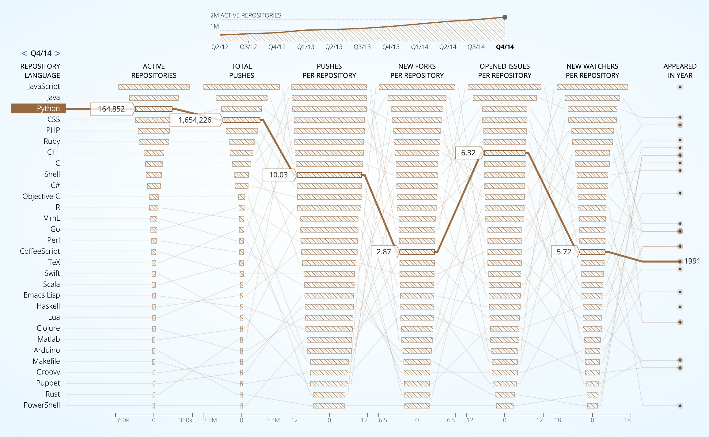

# Bài 2: Giới thiệu về PYTHON 


## I. GIỚI THIỆU

### 1. Tổng quan

Theo thống kê của Wiki, tính đến đến tháng 10/2010, trên thế giới có khoảng hơn 700 ngôn ngữ lập trình (xem danh sách các ngôn ngữ lập trình tại [đây](https://vi.wikipedia.org/wiki/Danh_s%C3%A1ch_c%C3%A1c_ng%C3%B4n_ng%E1%BB%AF_l%E1%BA%ADp_tr%C3%ACnh)). Theo thống kê của [FOLDOC](http://foldoc.org/), 1 trang từ điển tin học trực tuyến miễn phí, con số này đã lên 1000 vào tháng 9/2020, 1 con số đáng kinh ngạc.


> *Độ phổ biến của 1 số ngôn ngữ lập trình được sử dụng trên các kho lưu trữ trên GitHub tính đến tháng 4/2014 theo [Githut](https://githut.info/).*

Cũng giống như ngôn ngữ nói, ngôn ngữ lập trình cũng tuân theo 1 hệ thống phân cấp bao gồm 2 loại chính.

- ***Ngôn ngữ bậc thấp***: Cú pháp cực kỳ gần với ngôn ngữ máy nên rất khó sử dụng, tuy nhiên lại cung cấp nhiều chức năng hơn và cho phép ta tạo ra chương trình chi tiết và hiệu quả hơn rất nhiều, thích hợp để viết các chương trình liên quan đến kiến trúc và phần cứng của máy tính. Các ngôn ngữ này có thể được chia thành hai loại: ngôn ngữ máy và hợp ngữ.

- ***Ngôn ngữ bậc cao***: Cú pháp gẫn gũi với ngôn ngữ của con người hơn, tương tự như ngôn ngữ tiếng Anh nên dễ hiểu và thân thiện với người dùng hơn, xử lý lỗi nhanh hơn, thích hợp để phát triển phần mềm, xử lý dữ liệu... Một số ngôn ngữ bậc cao nổi tiếng nhất có thể kể đến C, C ++, Java và Python. 

### 2. Ngôn ngữ lập trình Python

Một số điểm nổi bật:
- Được phát triển từ 1980s và chính thức phát hành vào năm 1991 bởi `Guido van Rossum`.
- Là ngôn ngữ lập trình `bậc cao` - `high level`: người dùng lập trình bằng ngôn ngữ dễ hiểu và dễ sử dụng, sau đó máy tính sẽ chuyển các đoạn mã thành ngôn ngữ máy tính.
- Là ngôn ngữ `thông dịch`-`intepreted`: code được viết ra sẽ được chuyển thể trực tiếp thành ngôn ngữ máy tính và chạy trực tiếp cùng 1 lúc. Điều này khiến việc sử dụng Python dễ dàng hơn so với các ngôn ngữ `biên dịch`-`compiled` - code được chuyển thể thành ngôn ngữ máy tính trước rồi mới có thể chạy.
- Là ngôn ngữ `đa năng`-`generally purposed`: có thể sử dụng cho nhiều mục đích khác nhau.
- Là ngôn ngữ `dynamic type`: không cần khai báo trước kiểu dữ liệu của biến, có thể ghi đè trực tiếp kiểu dữ liệu của biến.
- Là ngôn ngữ `tuần tự`-`procedural` đồng thời `hướng đối tượng`-`object-oriented`.
- Phiên bản ổn định hiện tại là phiên bản `3.8.10`.

Python được sử dụng như một công cụ hoàn hảo cho các tác vụ tính toán khoa học, bao gồm phân tích và trực quan hóa các bộ dữ liệu lớn nhờ hệ sinh thái lớn và hoạt động của các gói bên thứ ba như: 
- [NumPy](https://numpy.org/) 
- [Pandas](https://pandas.pydata.org/) 
- [Matplotlib](https://matplotlib.org/), [Seaborn](https://seaborn.pydata.org/)
- [Scikit-Learn](https://scikit-learn.org/stable/)

### 3. Tôn chỉ Python (The Zen of Python)

> 1. Beautiful is better than ugly >> Thà đẹp hơn xấu

> 2. Explicit is better than implicit >> Thà rõ ràng hơn là ngấm ngầm

> 3. Simple is better than complex >> Thà đơn giản hơn phức hợp

> 4. Complex is better than complicated >> Thà phức hợp hơn phức tạp

> 5. Readability counts >> Dễ đọc là 1 điểm cộng

#### Perl

> There is more than one way to do it.

#### Python

> There is more than one way to do it. But, there should be one - and preferable one - obvious way to do it.

Tham khảo [PEP 8](https://www.python.org/dev/peps/pep-0008/)


### 4. Vì sao nên dùng Python

In ra `Hello, World!` với các ngôn ngữ:

#### C ++
```C++
#include <iostream.h>
 
int main()
{
    std::cout << "Hello, world!";
    return 0;
}
```

### C#
```C#
using System;
class Program
{
    public static void Main(string[] args)
    {
        Console.WriteLine("Hello, world!");
    }
}
```

### Java
```Java
class HelloWorld {
    public static void main(String[] args) {
        System.out.println("Hello, World!"); 
    }
}
```

### Python
```Python
print("Hello, World!");
```

Nguồn tài liệu:
- Thư viện để phân tích dữ liệu: Pandas, Numpy, Matplotlib.
- Python thuần tuý: Euler project, Python Module of the week.
- Web với Python: Flask.
- Automate với Python: Sách Automate the boring stuff with Python.

Để bắt đầu bài học với Python, chúng ta sẽ cùng nhau thực thi chương trình đầu tiên `print('Hello, world')`. Lưu ý, ta có thể nhấn tổ hợp phím `Shift Return` (MacOS) hoặc `Shift Enter` (Windows, Ubuntu) để thực thi câu lệnh trong cell code.


```python
print('Hello, world!')
```

    Hello, world!


Dòng chú thích (Comments) là các câu giải thích đoạn mã để con người có thể đọc được. Nó cung cấp một số thông tin hoặc giải thích về những gì mỗi phần của một chương trình thực hiện. Dòng chú thích bị trình biên dịch và thông dịch bỏ qua.

Python hỗ trợ chú thích một dòng:


```python
# Print Hello, World! on the screen
print("Hello, World!")
```

    Hello, World!


```python
print("Hello, World!") # Print Hello, World! on the screen
```

    Hello, World!


Để chú thích nhiều dòng, bạn có thể chèn `'''` hoặc `"""`cho mỗi dòng:


```python
'''
Use print() function
to print Hello, World! on the screen
'''
print("Hello, World!")
```

    Hello, World!


Ok, bây giờ chúng ta sẽ cũng nhau tìm hiểu sâu hơn về các thành phần cơ bản trong Python nha.

## II. CÁC THÀNH PHẦN CƠ BẢN TRONG PYTHON 

### 1. Biến (Variables)

Khái niệm biến chắc hẳn không còn xa lạ gì với các bạn từ những ngày cấp 2, cấp 3. Khi ta làm các bài toán đại số, các bạn luôn phải chạm mặt các biến như là biến x, y,... Trong lập trình, biến là tên của một vùng trong bộ nhớ RAM, được sử dụng để lưu trữ thông tin. Khi một biến được khai báo, một vùng trong bộ nhớ sẽ dành cho các biến.

Tại sao chúng ta cần sử dụng biến?


```python
5233255324824524012138 * 523209168801482034  # nhân hai số
```


    2738087168627369076568435079514204928692


```python
2738087168627369076568435079514204928692 + 3140713 # lấy kết quả phép tính trên tiếp tục thực hiện cộng hai số
```


    2738087168627369076568435079514208069405


Từ ví dụ trên, ta có thể thấy rằng những con số với nhiều chữ số gây khó khăn trong việc sử dụng vì chúng có quá nhiều chữ số, đôi lúc chúng ta cũng có thể vô tình gây sai lệnh giá trị. Để tránh điều này xảy ra, ta có thể nhờ tới sự giúp đỡ của các biến để lưu trữ dữ liệu và lấy ra để tính toán được thuận tiện và chính xác hơn.

#### 1.1 Khởi tạo biến 

Để khai báo biến trong Python thì mọi người sử dụng cú pháp `tên_biến = giá_trị`, trong đó:
- `tên_biến`: tên của biến mà các bạn muốn đặt. 
- `giá_trị` : giá trị của biến mà bạn muốn gán.
- `=`: phép gán.


```python
x = 5233255324824524012138 # gán giá trị 5233255324824524012138 cho biến x
y = 523209168801482034 # gán giá trị 523209168801482034 cho biến y
z = 3140713 # gán giá trị 3140713 cho biến z
x * y + z
```


    2738087168627369076568435079514208069405


Dễ thấy cùng 1 kết quả tương tự, dùng biến giúp ta dễ dàng tính toán, giảm thiểu tỉ lệ sai lệnh giá trị hơn khi không sử dụng tới biến. Ta có thể khai báo mỗi biến 1 dòng như trên hoặc khai báo chúng trên cùng 1 dòng.


```python
x , y , z = 5233255324824524012138, 523209168801482034, 3140713
x * y + z
```


    2738087168627369076568435079514208069405


Một số lưu ý khi đặt tên biến:
- Tên của biến có thể bắt đầu với các kí tự hoặc dấu `_` nhưng không được bắt đầu bằng số.
- Tên biến phân biệt chữ hoa chữ thường: `Num`, `NUM`,`num` là 3 tên biến khác nhau.
- Tên biến không được trùng với các từ khóa của Python.

#### 1.2 Các kiểu dữ liệu

Với Python, khi ta khai báo một biến thì kiểu dữ liệu của biến sẽ tự động được nhận biết. Vì vậy, ta cũng không phải quá vất vả khi khai báo 1 biến. Mặc định, Python có các kiểu dữ liệu cơ bản sau:

|Kiểu dữ liệu|Ý nghĩa|Ví dụ|
|-|-|-|
|`int`|Kiểu số nguyên (không có chứa dấu chấm thập phân)|`11`, `-15`|
|`float`|Kiểu số thực (có chứa dấu chấm thập phân)|`3.14`, `4.02`|
|`complex`|Kiểu số phức|`1 + 2j`, `3 - 4j`|
|`str`|Kiểu chuỗi|`'MCI'`,`'Python'`|
|`bool`|Kiểu luận lý|`TRUE`, `FALSE`|

#### 1.3 Kiểm tra kiểu dữ liệu của biến

Để kiểm tra kiểu dữ liệu giá trị của một biến đã khởi tạo, ta sử dụng hàm `type()`
- Cú pháp: `type(tên_biến)`


```python
type(x) # số nguyên
```


    int


```python
float_number = 3.14 # số thực
type(float_number)
```


    float


```python
# type = 0 # Không nên gán như thế này
```

#### 1.4 Ép kiểu dữ liệu
Python hỗ trợ chuyển đổi kiểu dữ liệu của một biến x (casting) qua 1 số hàm cơ bản sau:

|Cú pháp| Ý nghĩa|
|-|-|
|`float(x)`| chuyển đổi sang kiểu số thực|
|`int(x)`  | chuyển đổi sang kiểu số|
|`str(x)`  | chuyển đổi sang dạng chuỗi|
|`complex(x)`| chuyển đổi sang kiểu phức hợp|
|`tuple(x)`| chuyển đổi sang kiểu Tuple|
|`dict(x)` | chuyển đổi sang kiểu Dictionary|
|`hex(x)`  | chuyển đổi sang hệ 16|
|`oct(x)`  | chuyển đổi sang hệ 8|
|`chr(x)`  | chuyển đổi sang dạng ký tự|

Ví dụ:


```python
x = 3.14
int(x)
```


    3


```python
complex(x)
```


    (3.14+0j)


```python
str(x)
```


    '3.14'


### 2. Toán tử số học

|Phép toán|Biểu thức|Ý nghĩa |
|-|-|-|
|+|`x + y`|Phép cộng|
|-|`x - y`|Phép trừ|
|*|`x * y`|Phép nhân|
|/|`x / y`|Phép chia|
|%|`x % y`|Phép chia lấy phần dư|
|//|`x // y`|Phép chia làm tròn xuống|
|**|`x ** y`|Phép mũ|

Ví dụ:


```python
x, y  = 11, 3
```


```python
print(' x + y =',x + y, 
      '\n x - y =',x - y,
      '\n x * y =',x * y,
      '\n x / y =',x / y ,
      '\n x % y =',x % y, 
      '\n x // y =',x // y,
      '\n x ** y = ',x ** y,
      '\n x ** (1/2) =',x ** (1/2))
```

     x + y = 14 
     x - y = 8 
     x * y = 33 
     x / y = 3.6666666666666665 
     x % y = 2 
     x // y = 3 
     x ** y =  1331 
     x ** (1/2) = 3.3166247903554


Ngoài ra, ta có thể tận dụng thư viện `math` để tính toán


```python
import math
print(math.ceil(3.14)) # làm tròn lên
print(math.floor(3.14)) # làm tròn xuống
```

    4
    3


```python
round(3.54)
```


    4


### 3. Toán tử luận lý

Để thực hiện các phép toán luận lý trong python, ta có thể sử dụng các toán tử luận lý dưới đây:

|Toán tử|Biểu thức|Ý nghĩa|
|-|-|-|
|AND|`X and Y`|True nếu cả X và Y đều đúng|
|OR |`X or Y`|True nếu ít nhất một trong hai vế X hoặc Y đúng|
|NOT|`not X`|True nếu X sai và False nếu X đúng|
|XOR|`bool(Y) ^ bool(Y)`|True nếu X và Y cùng giá trị và False nếu ngược lại|

Phép toán luận lý sẽ kiểm tra hai vế của toán tử là đúng hay sai và kết hợp chúng lại để đưa ra kết quả. Kết quả của phép toán luận lý là kiểu boolean trong Python với hai giá trị là True (đúng) hoặc False (sai).


```python
True and False
```


    False


```python
True or False
```


    True


```python
True and not False or (True and False)
```


    True


### 4. Toán tử điều kiện

|Toán tử| Biểu thức| Ý nghĩa|
|-|-|-|
|<| `x < y` |So sánh giá trị x có nhỏ hơn y hay không|
|>| `x > y `|So sánh giá trị x có lớn hơn y hay không|
|<=|`x <= y`|So sánh giá trị x có nhỏ hơn hoặc bằng y hay không|
|>=|`x >= y`|So sánh giá trị x có lớn hơn hoặc bằng y hay không|
|==|`x == y`|So sánh giá trị x có bằng y hay không|
|!=|`x != y`|So sánh giá trị x có khác y hay không|

Tương tự toán tử luận lý, kết quả của phép toán điều kiện là kiểu boolean với hai giá trị là True (đúng) hoặc False (sai).

Lưu ý trong Python, dấu `=` sử dụng cho phép gán, dấu `==` sử dụng cho phép so sánh.


```python
3 > 5
```


    False


```python
1 != 2
```


    True


```python
(5 == 6) or (9 >= 2) and (8 != 3)
```


    True


### 5. Cấu trúc dữ liệu

Cấu trúc dữ liệu (data structures) và giải thuật (algorithms) được xem là 2 yếu tố quan trọng nhất trong lập trình, đúng như câu nói nổi tiếng của Niklaus Wirth:

`Programs = Data Structures + Algorithms`

Như tên gọi của mình, cấu trúc dữ liệu cho phép ta tổ chức, sắp xếp, quản lý và lưu trữ dữ liệu sao cho đảm bảo việc truy cập dễ dàng hơn và sửa đổi hiệu quả hơn. Trong thực tế, cấu trúc dữ liệu có thể chia thành 2 nhánh: được định nghĩa sẵn chỉ lôi ra dùng thôi (built-in) và định nghĩa bởi người dùng (user-defined).


Trong nôi dụng bài viết này, chúng ta sẽ đi sâu vào 4 cấu trúc dữ liệu: List, Dictionary, Tuple, và Set.

|Cấu trúc dữ liệu| Cú pháp | Đặc điểm|
|-|-|-|
|List|`[]`,`list()`|có index, có thứ tự, có thể thay đổi|
|Dictionary|`{key:value}`|không trùng lặp|
|Tuple|`()`,`tuple()`|có index, có thứ tự, không thể thay đổi|
|Set|`{}`,`set`|không index, không trùng lặp, có thứ tự , có thể thay đổi|

#### 5.1 List

List là một danh sách các phần tử dữ liệu phân cách bởi dấu phẩy và được bao ngoài bởi dấu ngoặc vuông `[]`, có thể chứa 1 hoặc nhiều kiểu dữ liệu khác nhau từ 1 số cho đến 1 chuỗi được lưu theo 1 cách tuần tự.

##### 5.1.0 Khai báo list

- Cú pháp: `[value1, value2, ...]`

Mỗi phần tử trong list đều được gán 1 vị trí, gọi là chỉ số index. Giá trị index bắt đầu từ 0 và tiếp tục cho đến phần tử cuối cùng được gọi là index dương (theo chiều từ trái qua phải). Ngoài ra, ta có thể sử dụng index phủ định bắt đầu từ -1 cho phép bạn truy cập các phần tử từ cuối cùng đến đầu tiên (theo chiều từ phải qua trái). 


```python
li = [1 , 2, "Python", 3.14] 
#     0   1    2         3    -> index từ trái sang phải
#    -4  -3   -2        -1    -> index từ phải sang trái 
li
```


    [1, 2, 'Python', 3.14]


```python
len(li)
```


    4


##### 5.1.1 Truy xuất phần tử trong list

Như đề cập ở trên, mỗi phần tử trong List sẽ có một vị trí nhất định tương ứng với một con số index, bắt đầu từ số 0 và tăng dần từ trái qua phải. Chúng ta có thể truy xuất đến các phần tử trong danh sách với cú pháp: `tên_list[index]`


```python
li[0]
```


    1


```python
li[1:3]
```


    [2, 'Python']


Mỗi phần tử bên trong list cũng có thể là 1 list con, khi đó mỗi list con cũng có 1 index duy nhất.


```python
li1 = [1, [1,2,3], 3.14, 'Hn']
li1[1]
```


    [1, 2, 3]


```python
li1[1][0]
```


    1


```python
li[0] = 3.14
li
```


    [3.14, 2, 'Python', 3.14]


##### 5.1.2 Các hàm cơ bản với List

Để biết có những hàm có sẵn nào hỗ trợ cho cấu trúc dữ liệu list, ta sử dụng câu lệnh dưới đây:


```python
[method for method in dir(li) if not method.startswith('_')]
```


    ['append',
     'clear',
     'copy',
     'count',
     'extend',
     'index',
     'insert',
     'pop',
     'remove',
     'reverse',
     'sort']


Các hàm này được chia thành 2 loại:
- Gán giá trị trực tiếp vào biến và không trả về cái gì
- Trả về giá trị và cần gán giá trị đó vào 1 biến mới

Dưới đây là 1 số ví dụ về các hàm kể trên:

|Tên hàm|Ý nghĩa|Trả về giá trị|
|-|-|-|
|`append()`|Thêm một phần tử vào vị trí cuối cùng trong list|Không|
|`clear()`|Xóa sạch các phần tử trong list|Không|
|`copy()`|Sao chép toàn bộ list|Có|
|`count()`|Đếm số lần một phần tử xuất hiện trong list|Có|
|`extend()`|Kết hợp list với một list khác|Không|
|`index()`|Trả về vị trí phần tử trong list|Có|
|`insert()`|Chèn một phần tử vào list tại vị trí cho trước|Không|
|`pop()`|Loại bỏ phần tử ở vị trí index cho trước trong list|Không|
|`remove()`|Loại bỏ một phần tử khỏi list|Không|
|`reverse()`|Đảo ngược thứ tự các phần tử trong list|Không|
|`sort()`|Sắp xếp các phần tử trong list|Không|


```python
li.append(10)
li
```


    [3.14, 2, 'Python', 3.14, 10]


```python
li.clear()
li
```


    []


```python
li = [1, 2, 'Hanoi', 2.14, 'c']
li.copy()
```


    [1, 2, 'Hanoi', 2.14, 'c']


```python
li.count('Hanoi')
```


    1


```python
li.extend([1,2,3])
li
```


    [1, 2, 'Hanoi', 2.14, 'c', 1, 2, 3]


```python
li.index(3)
```


    7


```python
li.insert(10,0)
li
```


    [1, 2, 'Hanoi', 2.14, 'c', 1, 2, 3, 0]


```python
li.pop(1)
li
```


    [1, 'Hanoi', 2.14, 'c', 1, 2, 3, 0]


```python
li.remove(0)
li
```


    [1, 'Hanoi', 2.14, 'c', 1, 2, 3]


```python
li = [1, 9, 2,0]
li.sort()
li
```


    [0, 1, 2, 9]


```python
li.reverse()
li
```


    [9, 2, 1, 0]


Đố vui:
- Hàm `extend()` và hàm `append()` khác gì nhau?
- Hàm `remove()` and `pop()` khác gì nhau?

#### 5.2 Tuple

Tuple là 1 cấu trúc dữ liệu gần tương tự như list trong Python, tuy nhiên tuple là 1 danh sách bất biến, không thể thay đổi nội dung. Tuple có tốc độ xử lý nhanh hơn list, do tuple được lưu trữ một khối bộ nhớ xác định còn list thì thường xuyên phải thay đổi không gian lưu trữ. Chính vì vậy, với những dữ liệu dạng hằng số, dữ liệu không thay đổi theo thời gian, tuple là 1 sự lựa chọn hoàn hảo. Ngoài ra, tuple còn được sử dụng làm khóa trong dictionary, một cấu trúc dữ liệu ta sẽ được tìm hiểu trong phần sau.

##### 5.2.0 Khai báo tuple

- Cú pháp: `(value1, value2, ...)`


```python
tup = (1, 2, 3.14, 'Vietnam')
tup
```


    (1, 2, 3.14, 'Vietnam')


##### 5.2.1 Các hàm cơ bản trong tuple

|Tên hàm|Ý nghĩa|Trả về giá trị|
|-|-|-|
|`count()`|Đếm số lần một phần tử xuất hiện trong tuple|Có|
|`index()`|Trả về vị trí phần tử trong tuple|Có|


```python
[method for method in dir(tup) if not method.startswith('_')]
```


    ['count', 'index']


```python
tup.count(3.14)
```


    1


```python
tup.index(2)
```


    1


#### 5.3 Set

Set là danh sách không theo thứ tự các phần tử không trùng nhau nằm trong hai dấu ngoặc nhọn `{}` hoặc được khởi tạo bằng `set()`. Set có hỗ trợ các tính toán tổ hợp như là phép toán giao, phép toán hợp, phép đối xứng, phép loại trừ...

##### 5.3.0 Khai báo set

- Cú pháp: `{value1, value2, ...}`


```python
s = {1, 1, 1, 2, 3}
s
```


    {1, 2, 3}


```python
s.difference()
```


    {1, 2, 3}


##### 5.3.1 Các hàm cơ bản trong set

|Tên hàm|Ý nghĩa|Trả về giá trị|
|-|-|-|
|`add()`|Thêm một phần tử vào vị trí cuối cùng trong set|Không|
|`clear()`|Xóa sạch các phần tử trong set|Không|
|`copy()`|Sao chép toàn bộ set|Có|
|`A.difference(B)`|Phép trừ sẽ trả về một tập hợp các giá trị chỉ có ở set A hoặc set B|Có|
|`A.difference_update(B)`|Xóa các thành phần tồn tại trong cả hai bộ của set A|Không|
|`discard()`|Xoá phần tử trong set|Có|
|`A.intersection(B)`|Phép giao giữa 2 set|Có|
|`A.intersection_update(B)`|Loại bỏ các thành phần không có trong cả 2 set|Không|
|`A.isdisjoint(B)`|Trả về True nếu 2 set là tập hợp rời rạc|Có|
|`A.issubset(B)`|Trả về True nếu tất cả các item của set A đều có trong set B, False nếu ngược lại|Có|
|`A.issuperset(B)`|Trả về True nếu tất cả các item của set B đều có trong set A, False nếu ngược lại|Có|
|`pop()`|Loại bỏ phần tử ở vị trí index cho trước|Không|
|`remove()`|Loại bỏ một phần tử |Không|
|`A.symmetric_difference(B)`|Phép đối xứng trả về tập hợp những giá trị có trong set A không có trong set B và ngược lại|Có|
|`A.symmetric_difference_update(B)`|Xóa các thành phần có trong cả hai nhóm và chèn các mục không có trong cả hai nhóm|Có|
|`A.union(B)`|Phép hợp của 2 set|Có|
|`update()`|Thêm phần tử|Không|


Để có thể nắm được ý nghĩa của các hàm trong set hay bất kì cấu trúc dữ liệu nào, ta có thể tận dụng `docstring` hoặc `help()`.


```python
[method for method in dir(s) if not method.startswith('_')]
```


    ['add',
     'clear',
     'copy',
     'difference',
     'difference_update',
     'discard',
     'intersection',
     'intersection_update',
     'isdisjoint',
     'issubset',
     'issuperset',
     'pop',
     'remove',
     'symmetric_difference',
     'symmetric_difference_update',
     'union',
     'update']


```python
s = {1, 1, 1, 2, 3}
s1 = {2,3,4,5}
```


```python
s.difference(s1)
```


    {1}


```python
s1.difference(s)
```


    {4, 5}


```python
s.intersection(s1)
```


    {2, 3}


```python
s.symmetric_difference(s1)
```


    {1, 4, 5}


#### 5.4 Dictionary

##### 5.4.0 Khai báo dictionary

Để khai báo một dictionary chúng ta dùng cặp dấu `{}` theo cú pháp sau:
- Cú pháp: `{key1:value1, key2:value2,...}`

Lưu ý:
- Các phần tử đều phải có key.
- Key chỉ có thể là số hoặc chuỗi.
- Key phải là duy nhất, nếu không nó sẽ nhận giá trị của phần tử có key được xuất hiện cuối cùng.
- Key khi đã được khai báo thì không thể đổi được tên.
- Key có phân biệt hoa thường.


```python
my_dict = {}
```


```python
my_dict1 = {'language1':'Java', 'language2':'Python', 'language3':'C++'}
my_dict1
```


    {'language1': 'Java', 'language2': 'Python', 'language3': 'C++'}


##### 5.4.1 Truy xuất các phần tử trong dictionary


```python
my_dict1['language1']
```


    'Java'


```python
my_dict1['language4'] = 'C' # dict_name[key] = value
```

Dictionary có thể lồng trong dictionary


```python
my_dict2 = {'name':'Zootpi',
           'info':{'age':1,
                  'sex':'unknown'}}
```


```python
my_dict2['info']['sex']
```


    'unknown'


##### 5.4.2 Các hàm cơ bản trong dictionary

|Tên hàm|Ý nghĩa|Trả về giá trị|
|-|-|-|
|`clear()`|Xóa sạch các phần tử|Không|
|`copy()`|Sao chép các phần tử|Có|
|`fromkeys()`|Tạo ra một dictionary với các khóa và giá trị được chỉ định|Có|
|`get()`|Trả về giá trị của khóa được chỉ định|Có|
|`items()`| Trả về danh sách chứa bộ giá trị cho mỗi cặp giá trị khóa|Có|
|`keys()`|Trả về danh sách chứa các key của dictionary|Có|
|`pop()`|Loại bỏ phần tử có key được chỉ định|Không|
|`popitem()`|Xóa cặp key-value được chèn cuối cùng|Không|
|`setdefault()`|Trả về giá trị của key được chỉ định. Nếu key không tồn tại: hãy chèn key, với giá trị được chỉ định|Không|
|`update()`|Cập nhật dictionary với các cặp key-value được chỉ định|Không|
|`values()`| Trả về danh sách tất cả các value trong từ điển |Có|


```python
[method for method in dir(my_dict1) if not method.startswith('_')]
```


    ['clear',
     'copy',
     'fromkeys',
     'get',
     'items',
     'keys',
     'pop',
     'popitem',
     'setdefault',
     'update',
     'values']


```python
x = ('key1', 'key2', 'key3')
y = 0
dict.fromkeys(x, y)
```


    {'key1': 0, 'key2': 0, 'key3': 0}


```python
my_dict1.get('language2')
```


    'Python'


```python
my_dict1.items()
```


    dict_items([('language1', 'Java'), ('language2', 'Python'), ('language3', 'C++'), ('language4', 'C')])


```python
my_dict1.keys()
```


    dict_keys(['language1', 'language2', 'language3', 'language4'])


```python
my_dict1.pop('language4')
```


    'C'


```python
my_dict1
```


    {'language1': 'Java', 'language2': 'Python', 'language3': 'C++'}


```python
my_dict1.popitem()
```


    ('language3', 'C++')


```python
my_dict1
```


    {'language1': 'Java', 'language2': 'Python'}


```python
my_dict1.setdefault('language3')
```


```python
my_dict1
```


    {'language1': 'Java', 'language2': 'Python', 'language3': None}


```python
my_dict1.update({'language3':'Ruby'})
```


```python
my_dict1
```


    {'language1': 'Java', 'language2': 'Python', 'language3': 'Ruby'}


```python
my_dict1.values()
```


    dict_values(['Java', 'Python', 'Ruby'])


Ở bài tiếp theo, chúng ta sẽ tìm hiểu về vòng lặp, câu điều kiện, cũng như cách viết 1 hàm trong Python.
