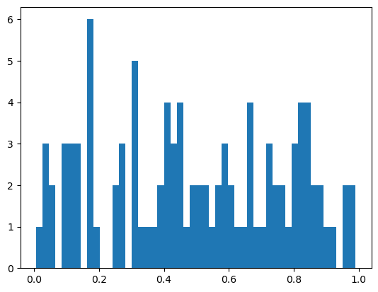

# Bài 4: Giới thiệu về NumPy


## I. GIỚI THIỆU

### 1. Numpy là gì? 

NumPy (Numerical Python) là một thư viện Python mã nguồn mở được sử dụng trong hầu hết các lĩnh vực khoa học và kỹ thuật. Đây là tiêu chuẩn chung để làm việc với dữ liệu số bằng Python và là tiêu chuẩn cốt lõi của hệ sinh thái Python và PyData. NumPy API được sử dụng rộng rãi trong Pandas, SciPy, Matplotlib, scikit-learning, scikit-image và hầu hết các gói Python khoa học và khoa học dữ liệu khác.

`NumPy = multidimensional array +  matrix data structures`

Thư viện NumPy chứa các cấu trúc dữ liệu ma trận và mảng đa chiều (bạn sẽ tìm thấy thêm thông tin về điều này trong các phần sau). NumPy có thể được sử dụng để thực hiện nhiều phép toán khác nhau trên mảng. Nó bổ sung các cấu trúc dữ liệu mạnh mẽ vào Python để đảm bảo tính toán hiệu quả với các mảng và ma trận, đồng thời nó cung cấp một thư viện khổng lồ các hàm toán học cấp cao hoạt động trên các mảng và ma trận này.

### 2. Cài đặt

Để cài đặt thư viện NumPy trong môi trường ảo trên terminal (MacOS/Ubuntu) hoặc Anaconda Prompt (Windows), ta có thể thực hiện bằng 1 trong 2 cách dưới đây:
- Cách 1: Cài đặt khi tạo môi trường ảo thông qua câu lệnh `conda create -n hanh python=3.7 numpy`
- Cách 2: Cài đặt sau khi tạo xong môi trường ảo thông qua 1 trong 2 câu lệnh sau:
    - `conda install numpy` 
    -  `pip install numpy`

Ngoài ra, ta cũng có thể cài đặt thư viện thẳng trong notebook bằng cách chạy 1 trong 2 câu lệnh sau trên cell code:
   - `!conda install numpy`
   - `!pip instal numpy`
    
Để tìm hiểu xem `conda` và `pip` khác nhau như thế nào, các bạn có thể tham khảo tại [đây](https://www.anaconda.com/blog/understanding-conda-and-pip).

### 3. Import thư viện

Để có thể sử dụng NumPy và các hàm của nó, ta cần chạy câu lệnh sau:

`import numpy as np`

Chúng ta rút ngắn tên thư viện thành `np` để thuận tiện cho việc đọc code với NumPy. Đây là một quy ước được áp dụng rộng rãi mà bạn nên tuân theo để bất kỳ ai làm việc với code của bạn có thể dễ dàng hiểu nó.


```python
import numpy as np
```

### 4. Vì sao nên sử dụng NumPy?

NumPy cung cấp cho bạn rất nhiều cách nhanh chóng và hiệu quả để tạo mảng (`array`) và thao tác dữ liệu số bên trong chúng. `list` có thể chứa các kiểu dữ liệu khác nhau, còn tất cả các phần tử trong `array` NumPy phải đồng nhất. Điều này cho phép các phép toán được thực hiện trên mảng sẽ cực kỳ kém hiệu quả nếu các mảng không đồng nhất. Cũng bởi vì thế, 1 `array` tiêu tốn ít bộ nhớ hơn, dẫn đến NumPy sử dụng ít bộ nhớ hơn nhiều để lưu trữ dữ liệu và nó cung cấp một cơ chế xác định các kiểu dữ liệu. Điều này cho phép mã được tối ưu hóa hơn nữa.

NumPy có 2 tính chất chính:

- **Vectorization**:


```python
[1, 2, 3] + [4, 5, 6] # Phép cộng 2 list là phép nối chuỗi phần tử
```


    [1, 2, 3, 4, 5, 6]


```python
import numpy as np
np.array([1,2,3]) + np.array([4,5,6]) 
```


    array([5, 7, 9])


- **Broadcasting**:

*Reference*: [What is Numpy?](https://numpy.org/doc/stable/user/whatisnumpy.html#whatisnumpy)

## II. THỰC HÀNH CÁC HÀM CƠ BẢN TRONG NUMPY

### 0. Ôn tập kiến thức về mảng đa chiều

Đôi khi bạn có thể nghe thấy 1 array được gọi là `ndarray`, viết tắt của `N-dimensional array`(mảng N-chiều). `N-dimensional array` chỉ đơn giản là 1 array với 1 hay nhiều chiều dữ liệu.


Khi làm việc với mảng đa chiều, ta sẽ gặp những thuật ngữ sau:
- Scalar: Mảng 0 chiều (0-D array)
- Vector: Mảng 1 chiều (1-D array)
- Matrix: Mảng 2 chiều (2-D array)
- Tensor: Mảng 3 chiều (3-D array)


### 1. Tạo 1 mảng (Create an array)
#### 1.1 Tạo 1 mảng 1 chiều

Để tạo ra 1 NumPy `array`, ta có thể tận dụng hàm `np.array()` và truyền một list cho nó. 


```python
arr = np.array([1,2,3]) # khởi tạo 1 array 
arr
```


    array([1, 2, 3])


```python
type(arr) # kiểm tra kiểu dữ liệu của biến arr
```


    numpy.ndarray


```python
def addition(arr1,arr2):
    '''
    Sum of 2 arrays.

    Parameters
    ----------
    arr1 : First array.
    arr2 : Second array.
    '''
    return arr1 + arr2
```


```python
addition(np.array([1,2]),np.array([2,6]))
```


    array([3, 8])


Tham khảo mã nguồn xây dựng nên thư viện này tại [NumPy github](https://github.com/numpy/numpy).

**Đố vui: Array khác list ở chỗ nào?**

**Đáp án**: `list` Python có thể chứa các kiểu dữ liệu khác nhau, còn tất cả các phần tử trong `array` NumPy phải đồng nhất.

Có hai quy tắc cơ bản cho mọi mảng trong NumPy.
- Mọi phần tử trong mảng phải có cùng kiểu và kích thước (same type and size).
- Nếu các phần tử của mảng cũng là mảng thì các mảng bên trong đó phải có cùng kiểu và số phần tử với nhau.


```python
# list có thể chứa các phần tử thuộc các kiểu dữ liệu khác nhau
li = [1,2,'H']
type(li[0]), type(li[1]), type(li[2])
```


    (int, int, str)


```python
# casting về string với kiểu dữ liệu là unicode string < 21 characters, casting int + float về float
arr = np.array([1,2,'H']) 
type(arr[0]), type(arr[1]), type(arr[2])
```


    (numpy.str_, numpy.str_, numpy.str_)


Từ ví dụ trên, ta có thể thấy NumPy không trả về lỗi, nhưng nó chuyển các số nguyên thành chuỗi để đáp ứng thuộc tính rằng mọi phần tử đều là cùng một loại. Loại ‘<U21’ là viết tắt của chuỗi unicode có 21 ký tự trở xuống.

Để biết chiều dữ liệu, ta có thể sử dụng 1 trong 3 cách sau:


```python
arr.shape # 1 chiều chứa 3 phần tử
```


    (3,)


```python
arr.ndim # 1 chiều
```


    1


```python
len(arr)
```


    3


#### 1.2 Tạo 1 mảng đa chiều
Chúng ta cũng có thể tạo một mảng hai chiều từ một list các list.


```python
arr_2d = np.array([[1,2,5],
                 [2,3,4]])
arr_2d
```


    array([[1, 2, 5],
           [2, 3, 4]])


```python
arr_2d.ndim, arr_2d.shape, len(arr_2d) # Kiểm tra chiều dữ liệu
```


    (2, (2, 3), 2)


Kết quả từ dòng lệnh trên có thể khiến bạn ngạc nhiên khi `arr_2d` có 2 chứ không phải 6 phần tử. Đó là bởi vì `arr_2d` có thể được hiểu là một mảng chứa hai mảng bên trong nó. Nếu bạn muốn lấy tổng số phần tử lồng nhau trong mảng, bạn có thể sử dụng thuộc tính `size` như dòng lệnh dưới đây.


```python
arr_2d.size
```


    6


Ngoài ra, nếu bạn muốn biết kiểu dữ liệu trong `array`, bạn có thể thử sử dụng hàm `type()` của Python như ví dụ trong phần 1.1, tuy nhiên câu lệnh này sẽ chỉ cho bạn biết rằng đối tượng là 1 `array` NumPy. Nếu bạn muốn xem mảng đang lưu trữ loại dữ liệu nào, bạn có thể sử dụng thuộc tính `.dtype`.


```python
type(arr_2d), arr_2d.dtype
```


    (numpy.ndarray, dtype('int64'))


#### 1.3 Một số hàm có sẵn hỗ trợ tạo mảng
Ngoài `np.array()`, ta có thể tạo 1 số array đặc thù với `np.zeros()`, `np.ones()`, `np.arange()`,`np.linspace()`

|Hàm|Ý nghĩa|
|-|-|
|`np.zeros()`|1 mảng chứa các giá trị 0|
|`np.ones()`|1 mảng chứa các giá trị 1|
|`np.full()`|1 mảng chứa các giá trị được gán theo `fill_value`|
|`np.arange()`|1 mảng chứa khoảng giá trị có khoảng cách đều nhau|
|`np.linspace`|1 mảng các giá trị có khoảng cách tuyến tính với nhau|


```python
np.zeros(shape = 3), np.zeros(shape = (3,2)), np.zeros(shape = (3,2,4))
```


    (array([0., 0., 0.]),
     array([[0., 0.],
            [0., 0.],
            [0., 0.]]),
     array([[[0., 0., 0., 0.],
             [0., 0., 0., 0.]],
     
            [[0., 0., 0., 0.],
             [0., 0., 0., 0.]],
     
            [[0., 0., 0., 0.],
             [0., 0., 0., 0.]]]))


```python
np.ones(shape = 3), np.ones(shape = (3,2)), np.ones(shape = (3,2,5))
```


    (array([1., 1., 1.]),
     array([[1., 1.],
            [1., 1.],
            [1., 1.]]),
     array([[[1., 1., 1., 1., 1.],
             [1., 1., 1., 1., 1.]],
     
            [[1., 1., 1., 1., 1.],
             [1., 1., 1., 1., 1.]],
     
            [[1., 1., 1., 1., 1.],
             [1., 1., 1., 1., 1.]]]))


```python
np.full(3, fill_value='cat') # truyền vào một shape và fill_value vào np.full()
```


    array(['cat', 'cat', 'cat'], dtype='<U3')


```python
np.arange(1, 10, 2, dtype='float') # tạo ra 1 matrix bất kì có khoảng cách bằng nhau
```


    array([1., 3., 5., 7., 9.])


```python
np.linspace(1,10,5, dtype='float') # tạo ra 1 matrix bất kì có khoảng cách bằng nhau
```


    array([ 1.  ,  3.25,  5.5 ,  7.75, 10.  ])


#### 1.4 Tạo mảng ngẫu nhiên

Trong NumPy, hàm `np.random` lấy ***ngẫu nhiên*** các giá trị trong 1 phân phối có ***quy luật***. 

Có một sự thật là trên đời chẳng có gì là ngẫu nhiên cả! Tất cả đều là những quy luật được ẩn giấu, chỉ là chúng ta có phát hiện hay hiểu được nó hay không mà thôi và trường hợp của  `np.random()` cũng vậy. Bản thân máy tính do con người tạo ra, nên những quy tắc hoạt động của nó đều dựa trên những gì mà con người thiết kế. Về bản chất, hàm `np.random()` là 1 mô phỏng (simulation) các kịch bản có thể xảy ra do con người sử dụng thuật toán để lập trình ra. Cũng có nghĩa là, con người làm có mục đích nên không thể coi là random, mà nó là **pseudo-random**!

Dưới đây là 1 ví dụ cách chúng ta có thể tạo ra 1 **pseudo-random**


```python
from datetime import datetime
x= datetime.now().microsecond #một phần triệu giây
rand = 2*x+3
rand
```


    1748591


Trong hàm `np.random`, chúng ta có 2 hàm con là `np.random.random()` và `np.random.normal()` tương ứng với 2 kiểu phân phối chúng ta đã quen thuộc khi học về xác suất thông kê, đó là:

- **Phân phối đồng nhất (Uniform Distribution)** là 1 dạng phân phối xác suất thống kê trong đó tất cả các kết quả đều có khả năng xảy ra như nhau, mỗi biến có cùng một xác suất để cho ra một kết quả. Ví dụ, việc tung đồng xu cũng có phân phối đồng nhất vì xác suất xuất hiện mặt ngửa hoặc mặt sấp trong một lần tung đồng xu là như nhau, với điều kiện đồng xu đó là đồng chất.   


- **Phân phối chuẩn/ Phân phối hình chuông (Normal Distribution)** quyết định bởi mean và standard deviation với những đặc điểm sau:
    - Hình chuông (ring-shaped)
    - Đối xứng thông qua mean
    - Đặc trưng bởi mean và standard deviation (độ phân tán)
    - Giá trị trung bình đại diện xu hướng trung tâm phân bố dữ liệu
    - Xu hướng trung tâm của bộ data (central tendency): mean = median = mode
        - Mean: giá trị trung bình 
        - Median: giá trị phổ biến nhất trong một tập dữ liệu (số trung vị)
        - Mode: giá trị có tần số xuất hiện cao nhất 


```python
#Tạo ra 1 mảng 3x3 theo phân phối đều với các giá trị nằm trong khoảng từ 0 đến 1
np.random.random((3, 3))
```


    array([[0.2732366 , 0.57810574, 0.66121708],
           [0.05618081, 0.18816189, 0.63645469],
           [0.26861496, 0.85687507, 0.54761703]])


```python
import matplotlib.pyplot as plt
plt.hist(np.random.random(100), bins = 50)
plt.show();
```


    

    


**Câu hỏi**: Vì sao hình trên không theo phân phối chuẩn?

**Đáp án**:


```python
plt.hist(np.random.random(1000000), bins = 50)
plt.show();
```


    

    


```python
# Tạo ra 1 mảng 3x3 theo phân phối chuẩn với mean = 0, standard deviation = 1
np.random.normal(0, 1, (3, 3))
```


    array([[-0.52211353,  0.88670169,  3.13249774],
           [-0.67565883,  1.57298885, -0.80391285],
           [-1.07727765,  0.3448225 , -0.47382779]])


```python
plt.hist(np.random.normal(0, 1, (10000, 1)))
plt.show();
```


    

    


```python
np.random.seed(0)  # seed for reproducibility -> trả về 1 giá trị như nhau

x1 = np.random.randint(10, size=6)  # mảng 1 chiều
x2 = np.random.randint(10, size=(3, 4))  # mảng 2 chiều
x3 = np.random.randint(10, size=(3, 4, 5))  # mảng 3 chiều
```

#### 1.5 Lưu và tải mảng 


```python
np.savetxt('test.txt',arr_2d) #save array
np.loadtxt('test.txt') #load array
```

### 2. Đổi chiều array 

Ta có thể sử dụng `np.newaxis` và `np.expand_dims` để tăng kích thước của mảng hiện có của bạn.


```python
arr = np.array([1, 2, 3, 4, 5, 6])
arr.ndim
```


    1


```python
arr1 = np.expand_dims(arr, axis=1)
arr1.ndim
```


    2


```python
arr2 = arr[np.newaxis, :]
arr2.ndim
```


    2


```python
arr.reshape(2,3)
```


    array([[1, 2, 3],
           [4, 5, 6]])


### 3. Index & Slicing


```python
arr = np.linspace(1,16,16).reshape(4,4) # tạo 1 mảng
arr
```


    array([[ 1.,  2.,  3.,  4.],
           [ 5.,  6.,  7.,  8.],
           [ 9., 10., 11., 12.],
           [13., 14., 15., 16.]])


**Đố vui**: Trả về giá trị 5 và giá trị 15 trong `arr`


```python
arr[[1,3],[0,3]]
```


    array([ 5., 16.])


### 4. Tính toán với NumPy
#### 4.1 Tính toán ma trận


```python
arr1 = np.array([[1,2],
                [2,3]])
arr2 = np.array([[10,10],
                [1,1]])
```


```python
arr1 + arr2, arr1 - arr2
```


    (array([[11, 12],
            [ 3,  4]]),
     array([[-9, -8],
            [ 1,  2]]))


```python
arr1 * arr2, arr1 / arr2, arr1 @ arr2 #element-wise vs matrix multiplication
```


    (array([[10, 20],
            [ 2,  3]]),
     array([[0.1, 0.2],
            [2. , 3. ]]),
     array([[12, 12],
            [23, 23]]))


```python
arr1 + 5
```


    array([[6, 7],
           [7, 8]])


#### 4.2 Xác xuất thông kê

NumPy hỗ trợ 1 số hàm cơ bản để ta tính toán thống kê dữ liệu bao gồm:
- `mean`, `median`
- `min`, `max`
- `std`
- `count_nonzero`, `unique`


```python
arr = np.linspace(1,12,12,dtype='int').reshape(3,4)
arr
```


    array([[ 1,  2,  3,  4],
           [ 5,  6,  7,  8],
           [ 9, 10, 11, 12]])


```python
np.mean(arr), np.median(arr)
```


    (6.5, 6.5)


```python
np.max(arr), np.min(arr), np.std(arr)
```


    (12, 1, 3.452052529534663)


```python
np.sum(arr), np.sum(arr, axis=0)
```


    (78, array([15, 18, 21, 24]))


```python
np.count_nonzero(arr)
```


    12


```python
np.unique(arr)
```


    array([ 1,  2,  3,  4,  5,  6,  7,  8,  9, 10, 11, 12])


```python
np.unique(arr, return_counts = True) # tần suất xuất hiện của mỗi phân tử unique
```


    (array([ 1,  2,  3,  4,  5,  6,  7,  8,  9, 10, 11, 12]),
     array([1, 1, 1, 1, 1, 1, 1, 1, 1, 1, 1, 1]))


Ngoài ra, ta có thể tận dùng hàm `where()` của NumPy như một phương pháp vector hóa để viết các câu lệnh if-else.


```python
arr = np.arange(10)
np.where(arr < 5, arr, 10*arr)
```


    array([ 0,  1,  2,  3,  4, 50, 60, 70, 80, 90])


```python
np.where(arr < 5, '<5', '>=5')
```


    array(['<5', '<5', '<5', '<5', '<5', '>=5', '>=5', '>=5', '>=5', '>=5'],
          dtype='<U3')


```python
np.where(arr < 5, '<5', np.where(arr == 5, '=5', '>5'))
```


    array(['<5', '<5', '<5', '<5', '<5', '=5', '>5', '>5', '>5', '>5'],
          dtype='<U2')


Trong bài học tiếp theo, chúng ta sẽ cùng nhau tìm hiểu về Pandas, 1 thư viện hỗ trợ mạnh mẽ xử lí và phân tích dữ liệu có cấu trúc.
