# Bài 7: Trực quan hoá dữ liệu với Matplotlib và Seaborn

## I. GIỚI THIỆU


Bất kì 1 thư viện nào sử dụng cho mục đích biểu diễn dữ liệu cũng sẽ theo anatomy sau. 


Đây cũng là những điểm mình cần biết khi vẽ đồ thị với các thư viện trong Python.

### 1. Thư viện Matplotlib 

Matplotlib (cụ thể trong bài học này ta quan tâm tới gói `Matplotlib.pyplot` hay được viết gọn là `plt`) là một gói Python được sử dụng cho đồ họa 2D.

Matplotlib có 2 objects chính:
- `Figure`: chứa nhiều axes
- `Axes`: nơi vẽ đồ thị, thực tế chính là cái đồ thị

Nói 1 cách dễ hiểu, `Figure` giống khung ảnh và 1 khung ảnh có thể không chứa hoặc chứa 1 đến nhiều bức ảnh, và `Axes` tương ứng với những bức ảnh trong cái khung ảnh.  

Các thành phần khác:
- `Title`: tên của đồ thị
- `X axis label`,`Y axis label`: 2 trục (ngang, đứng) của đồ thị
- `Major tick label`, `Minor tick label`: Tick chính chứa con số, tick nhỏ có thể hoặc không chứa con số
- `Legend`: Chú thích
- `Grid`: Lưới (dễ căn chỉnh)
- `Line plot`: Đồ thị đường
- `Scatter plot`: Đồ thị phân tán
- `Marker`: Những chấm tròn biểu diễn điểm dữ liệu trong đồ thị phân tán
- `Axis spine`: Đường ghi nhận ranh giới khu vực dữ liệu
- `Spine`: Đường kết nối các dấu ticks trên trục và ghi nhận ranh giới của khu vực dữ liệu.

**Tham khảo**: [Thư viện Matplotlib](https://matplotlib.org/stable/gallery/index.html)

### 2. Thư viện Seaborn

Seaborn là thư viện mở rộng được viết trên nền Matplotlib, từ đó kế thừa các chức năng biểu diễn dữ liệu từ Matplotlib. Vì vậy, những gì Seaborn làm được thì Matplotlib cũng làm được tuy nhiên không có chiều ngược lại, cũng có nghĩa là Seaborn không thể thay thế hoàn toàn được Matplotlib (Seaborn hiểu đơn giản là 1 đứa con được Matplotlib tạo ra).

**Tham khảo**: [Thư viện Seaborn](https://seaborn.pydata.org/examples/index.html)

Mỗi thư viện đều có những ưu điểm riêng: Nếu Seaborn sử dụng ít cú pháp hơn và có các chủ đề mặc định tuyệt đẹp thì Matplotlib dễ dàng tùy chỉnh hơn thông qua việc truy cập các lớp. Và trong bài viết này, chúng ta sẽ cùng nhau khám phá vẻ đẹp của 2 thư viện.

### 3. Cài đặt
- Cài đặt khi tạo môi trường ảo:

`conda create -n hanh python=3.7 matplotlib seaborn`

- Cài đặt sau khi tạo xong môi trường ảo: 

`conda install matplotlib` hoặc `pip install matplotlib`,

`conda install seaborn` hoặc `pip install seaborn`

### 4. Import 

```python
import matplotlib.pyplot as plt
import seaborn as sns
```

Để bắt đầu buổi học hôm nay, chúng ta sẽ import một số thư viện phục vụ cho buổi học:


```python
import pandas as pd
import numpy as np
import matplotlib.pyplot as plt
import seaborn as sns
```

## II. CÁC KIỂU TRỰC QUAN HOÁ DỮ LIỆU CƠ BẢN

### 1. Đồ thị đường

Biểu đồ đường được sử dụng để theo dõi những thay đổi trong khoảng thời gian ngắn và dài.

#### 1.1. Đồ thị 1 đường

#### **Thực hành**: Vẽ đồ thị hình sin của 100 điểm trong khoảng từ -10 đến 10.

**Gợi ý**: Cho trước giá trị x, y. Sử dụng hàm `plot()` để vẽ đồ thị đường dưới đây

```python
x = np.linspace(-10,10,100)
y = np.sin(x)
```
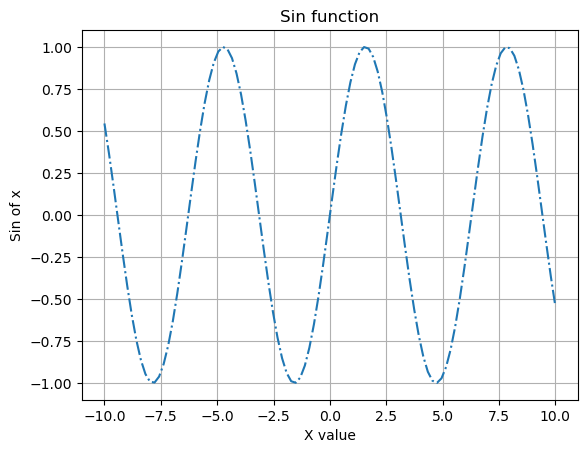
#### **Sử dụng Matplotlib**:


```python
x = np.linspace(-10,10,100)
y = np.sin(x)

# Mặc định plt.plot() là đồ thị đường
plt.plot(x,y,linestyle='-.') # linestyle để thay đổi đường biểu diễn, ví dụ: linestyle=(0,(3,1,1,1)) tương ứng linestyle='-.' 
plt.title('Sin function') # Tên của đồ thị
plt.xlabel('X value') # Tên trục hoàng
plt.ylabel('Sin of x') # Tên trục tung
plt.grid() # Tạo lưới
plt.show() # Hiển thị biểu đồ
```

Tham khảo 1 số cách thay đổi linestyle tại [đây](https://matplotlib.org/stable/_images/sphx_glr_linestyles_001.png).

#### **Sử dụng Seaborn**:


```python
df = pd.DataFrame({'x':x,'sin':y})
sns.lineplot(x=df['x'], y=df['sin'],linestyle='-.')
plt.grid()
plt.show()
```

#### 1.2 Đồ thị đa đường

#### **Thực hành**: Vẽ đồ thị hình sin và hình cos của 100 điểm trong khoảng từ -10 đến 10 trên cùng 1 đồ thị.

**Gợi ý**: Cho trước giá trị x, y. Sử dụng hàm `plot()` để vẽ đồ thị đường dưới đây:

```python
x = np.linspace(-10,10,100)
sin = np.sin(x)
cos = np.cos(x)
```

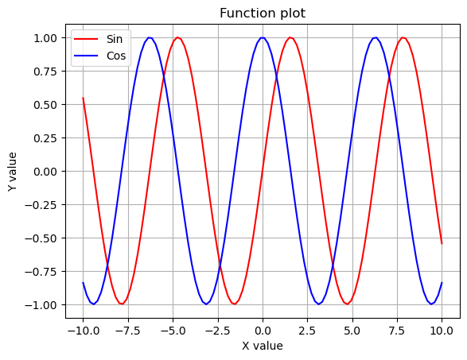


```python
x = np.linspace(-10,10,100)
sin = np.sin(x)
cos = np.cos(x)
df = pd.DataFrame({'x':x,'sin': sin, 'cos':cos})
```

**Cách 1**


```python
# truyền tham số c để thay đổi màu
plt.plot(x, sin, label = 'Sin', c='red') 
plt.plot(x, cos, label = 'Cos', c='blue')
plt.title('Function plot')
plt.xlabel('X value')
plt.ylabel('Y value')
plt.legend(loc='best') # có thể tinh chỉnh 4 góc
plt.grid()
plt.show()
```

**Cách 2**:
```python
ax.set_xlabel('X Label')
ax.set_ylabel('Y Label')
ax.set_title('Function plot')
```
có thể được viết gọn trong 1 dòng với hàm `set()` và truyền tham số tương ứng vào bên trong như sau:
```python
ax.set(xlabel='X_label', ylabel='Y_label', title='Function plot')
```


```python
ax = plt.axes() # định nghĩa nơi vẽ đồ thị
ax.plot(x,sin,label='Sin', c = 'red')
ax.plot(x,cos,label='Cos', c= 'blue')
ax.set(xlabel='X value', ylabel='Y value', title='Function plot')
ax.legend(loc='best')
ax.grid()
plt.show()
```

#### **Thực hành**: Vẽ đồ thị hình sin và hình cos của 100 điểm trong khoảng từ -10 đến 10 trên 2 đồ thị cạnh nhau như hình sau:
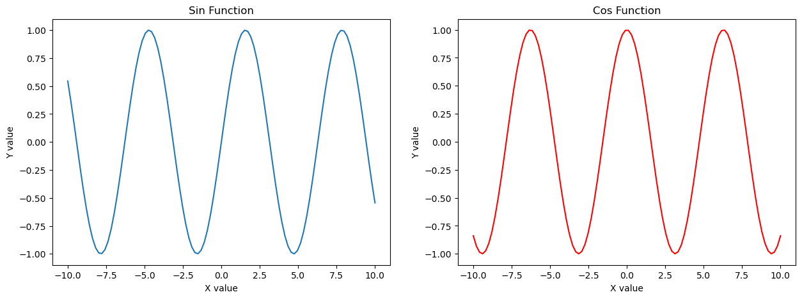

**Cách 1**


```python
plt.figure(figsize=(15,5)) # chiều dài 15, chiều rộng 5

plt.subplot(1,2,1) #1 hàng 2 cột ở axis 1
plt.plot(x,sin)
plt.title('Sin Function')
plt.xlabel('X value')
plt.ylabel('Y value')

plt.subplot(1,2,2)
plt.plot(x,cos,c='red')
plt.title('Cos Function')
plt.xlabel('X value')
plt.ylabel('Y value')
plt.show()
```

**Cách 2**


```python
plt.figure(figsize=(15,5)) 

ax1 = plt.subplot(1,2,1) 
ax2 = plt.subplot(1,2,2)

ax1.plot(x,sin)
ax2.plot(x,cos,c='red')

ax1.set(xlabel='X_label', ylabel='Y_label', title='Sin Function')
ax2.set(xlabel='X_label', ylabel='Y_label', title='Cos Function');

plt.show()
```

**Cách 3**


```python
fig, ax = plt.subplots(1,2, figsize=(15,5))
ax[0].plot(x,sin)
ax[1].plot(x,cos,c='red');
plt.show()
```

### 2. Đồ thị phân phối (Histogram/Distribution)

Hist/Dist plot đếm theo bins, bins được tính bằng cách lấy max và min rồi của dữ liệu rồi chia đều thành số bins mình muốn. Số bins càng lớn, chia khoảng càng nhỏ thì các chính xác!

Để giúp các bạn dễ dàng hình dung cách sử dụng các đồ thị vào bài toán dữ liệu thực tế, chúng ta sẽ cùng nhau thực hành các kiểu đồ thị trên tập dữ liệu `iris`.


```python
iris = sns.load_dataset('iris')
```

#### **Thực hành**: Vẽ đồ thị phân phối độ dài cánh hoa tương ứng cột `petal_length`.

#### **Sử dụng Matplotlib**:

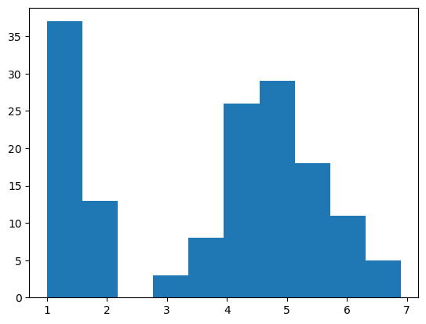


```python
plt.hist(iris['petal_length'], bins = 10)
plt.show()
```

#### **Sử dụng Seaborn**:

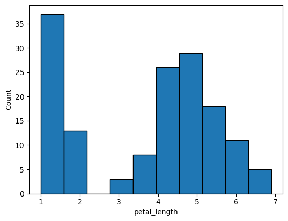


```python
sns.histplot(iris, x = 'petal_length', bins = 10)
plt.show()
```

Ngoài ra, ta có thể sử dụng hàm `distplot()` như ví dụ dưới đây:


```python
sns.displot(iris['petal_length'], bins = 10)
plt.show()
```

### 3. Đồ thị phân tán (Scatter plot)

Biểu đồ hay đồ thị phân tán là một đồ thị biểu hiện mối tương quan giữa nguyên nhân và kết quả hoặc giữa các yếu tố ảnh hưởng đến chất lượng.

#### **Thực hành**: Vẽ đồ thị phân tán cánh hoa và đài hoa.

#### **Sử dụng Matplotlib**:

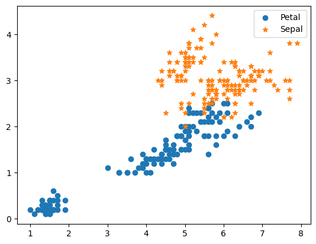


```python
plt.scatter(iris.petal_length, iris.petal_width, label='Petal')
plt.scatter(iris.sepal_length, iris.sepal_width, marker='*', label = 'Sepal')
plt.legend()
plt.show()
```

#### **Sử dụng Seaborn**:

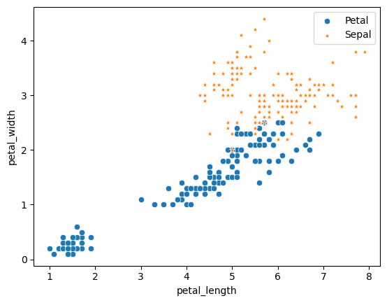


```python
sns.scatterplot(data=iris, x='petal_length', y='petal_width', label='Petal')
sns.scatterplot(data=iris, x='sepal_length', y='sepal_width', marker='*', label = 'Sepal')
plt.legend()
plt.show()
```

#### **Thực hành**: Vẽ đồ thị phân tán độ dài và độ rộng đài hoa tương ứng cột `petal_length`.

#### **Sử dụng Matplotlib**:

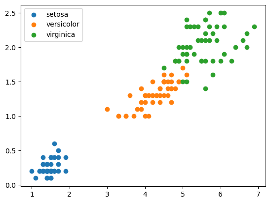


```python
plt.scatter(iris[iris['species'] == 'setosa'].petal_length, iris[iris['species'] == 'setosa'].petal_width, label='setosa')
plt.scatter(iris[iris['species'] == 'versicolor'].petal_length, iris[iris['species'] == 'versicolor'].petal_width, label='versicolor')
plt.scatter(iris[iris['species'] == 'virginica'].petal_length, iris[iris['species'] == 'virginica'].petal_width, label='virginica')
plt.legend()
plt.show()
```

#### **Sử dụng Seaborn**:

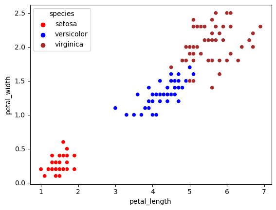


```python
sns.scatterplot(data=iris, x='petal_length', y='petal_width', hue='species', palette = ['red','blue','brown'])
plt.show()
```

### 4. Đồ thị hộp (Box plot)

#### **Thực hành**: Vẽ biểu đồ hộp độ dài đài hoa tương ứng cột `petal_length`.

#### **Sử dụng Matplotlib**:

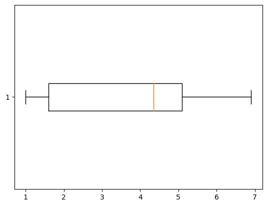


```python
plt.boxplot(iris.petal_length, vert=False)
plt.show()
```

#### **Sử dụng Seaborn**:

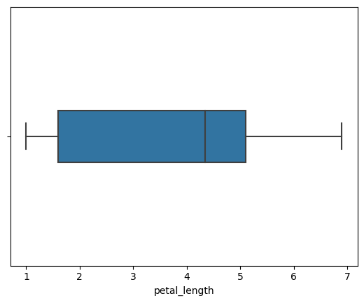


```python
sns.boxplot(data=iris,x='petal_length', width=0.2)
plt.show()
```

#### **Thực hành**: Vẽ biểu đồ hộp các cột dữ liệu trong `iris`.

#### **Sử dụng Matplotlib**:

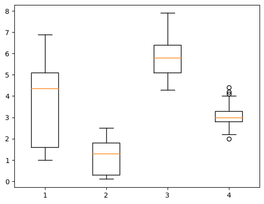


```python
plt.boxplot([iris.petal_length,iris.petal_width,iris.sepal_length,iris.sepal_width])
plt.show()
```

#### **Sử dụng Seaborn**:

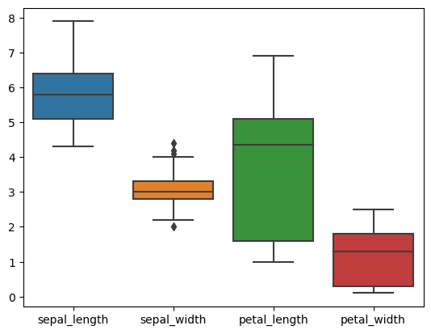


```python
sns.boxplot(data=iris, width=0.8)
plt.show()
```

Ngoài ra, chúng ta có 1 vài hàm biến thể nhằm trực quan hoá mô tả phân bố dữ liệu, tham khảo 1 số hàm plot dưới đây:

**Boxenplot**

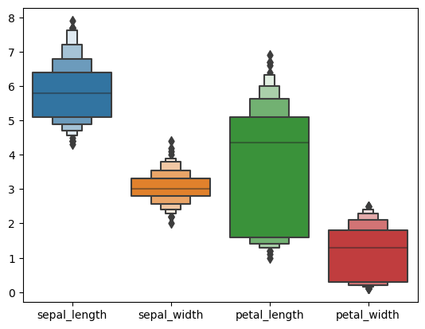


```python
sns.boxenplot(data=iris) #Thêm số lượng bins/điểm
plt.show()
```

**Violin plot**

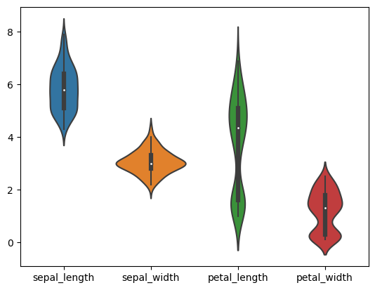


```python
sns.violinplot(data=iris) #Thêm phân bố bên ngoài
plt.show()
```

Từ những đồ thị hộp trên, ta có thể đưa ra 1 số phân tích, ví dụ như sau:
- Độ rộng cánh hoa (petal) và đài hoa (sepal) hẹp hơn độ dài 
- Độ rộng cánh hoa phân tán hơn độ rộng đài hoa 
- Các điểm dữ liệu tập trung trong khoảng percentile 50 nhiều hay ít 
- Có outlier ở độ rộng đài hoa
...

#### **Lưu ý: Một số thuật ngữ hay gặp**

- Decile: chia dữ liệu thành 10 phần bằng nhau.
- Percentile: phần trăm vị trí xếp hạng (25%, 50%, 75%)
- Quantile: xếp hạng giá trị trong bộ dữ liệu tại phần trăm percentile (i.e ở 50% có 50% số điểm dữ liệu lớn hơn và 50% số điểm dữ liệu bé hơn), thường chia dữ liệu thành 4 phần bằng nhau: [min-25%, 25%-50%, 50%-75%, 75%-max]


### 5. Biểu đồ tròn (Pie chart)


```python
tips = sns.load_dataset('tips')
```

#### **Thực hành**: Vẽ biểu đồ tròn thể hiện giới tính nam và nữ chiếm bao nhiêu phần trăm trong tổng hoá đơn.

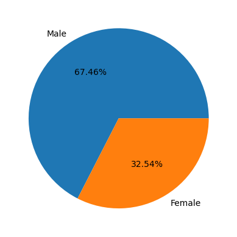

#### **Sử dụng Matplotlib**:


```python
sex = tips.groupby('sex').total_bill.sum()
plt.pie(sex, labels = sex.index, autopct='%.2f%%')
plt.show()
```

#### **Sử dụng Seaborn**:
Seaborn thì không hỗ trợ trực tiếp **pie chart**, ta có thể sử dụng **bar plot chart** thay thế.

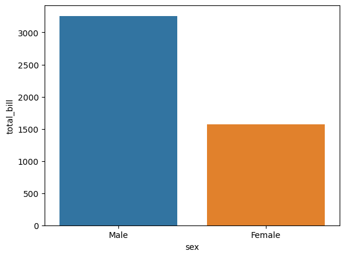


```python
sex1 = sex.reset_index() #chuyển về DataFrame
sns.barplot(data=sex1, x='sex', y='total_bill')
plt.show()
```

#### **Thực hành**: Vẽ biểu đồ tròn thể hiện giới phần trăm tổng hoá đơn tiêu thụ của nam theo ngày.

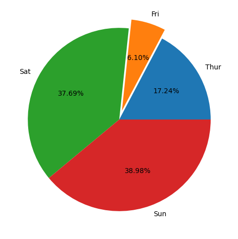

**Cách 1**


```python
male = tips[tips['sex'] == 'Male'].groupby('day').total_bill.sum()
plt.figure(figsize=(6,6))
plt.pie(male, labels = male.index, autopct='%.2f%%', explode=[0,0.1,0,0])
plt.show()
```

**Cách 2**


```python
male.plot(kind='pie', autopct='%.2f%%', explode=[0,0.1,0,0], figsize=(6,6))
plt.show()
```

#### **Bài tập về nhà**: Vẽ biểu đồ tròn thể hiện giới tính nam và nữ chiếm bao nhiêu phần trăm trong tổng hoá đơn phía bên trái và biểu đồ tròn thể hiện tổng hoá đơn tiêu thụ theo ngày phía bên phải như hình dưới đây.

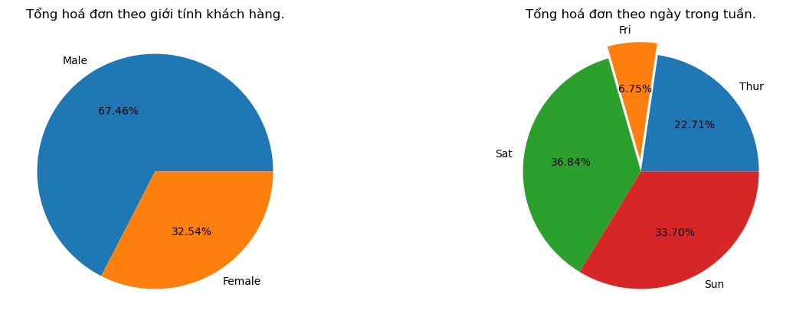

### 6. Một số biểu đồ tương quan phức hợp

#### 6.1 FacetGrid

#### **Thực hành**: Vẽ biểu đồ phân tán thể hiện mối tương quan giữa tổng hoá đơn và tiền tips như hình dưới đây.

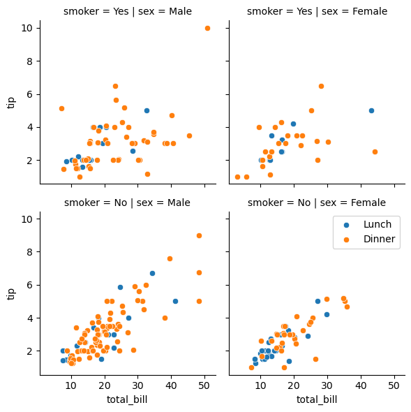


```python
g = sns.FacetGrid(data=tips,col='sex',row='smoker',hue='time') #hue cho mã màu, mã màu thay đổi dựa theo time
g.map(sns.scatterplot,'total_bill','tip') 
plt.legend()
plt.show()
```

#### 6.2 Swarm plot

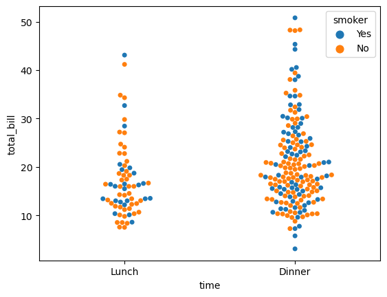


```python
sns.swarmplot(data=tips,x='time',y='total_bill',hue='smoker') #biến rời rạc vs biến liên tục
plt.show()
```

#### 6.3 Catplot


```python
sns.catplot(data=tips,x='time',y='total_bill',hue='smoker', kind='swarm');
plt.show()
```

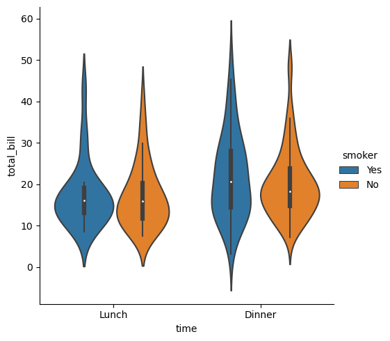


```python
sns.catplot(data=tips,x='time',y='total_bill',hue='smoker', kind='violin')
plt.show()
```

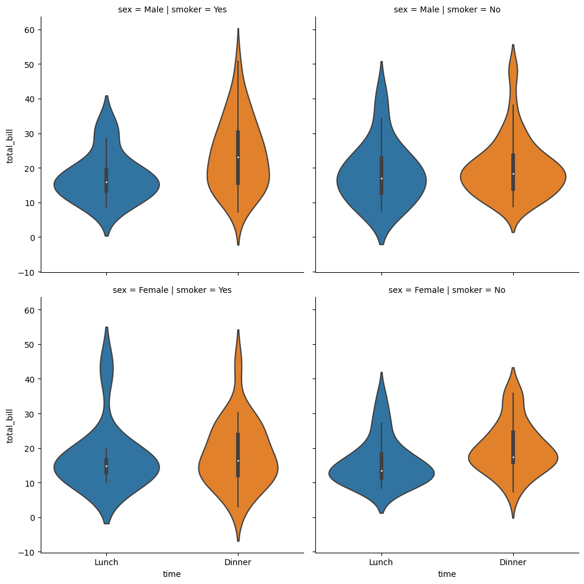


```python
sns.catplot(data=tips,x='time',y='total_bill',row='sex', col='smoker',kind='violin')
plt.show()
```

#### 6.4 Pairplot

Khi muốn nhìn tổng quan dữ liệu và mối tương quan giữa các chiều dữ liệu theo từng cặp với nhau, thì pair plots là lựa chọn vô cùng hoàn hảo. Ta có thể thử nghiệm đơn giản với các cột dữ liệu của tập `iris`.

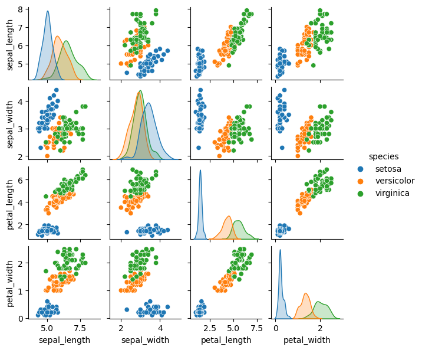


```python
sns.pairplot(iris, hue='species', height=1.5) 
plt.show()
```

Trong bài học tiếp theo, chúng ta sẽ cùng nhau tìm hiểu về Học máy, các bài toán trong Học máy và tiếp cận đến loại bài toán đầu tiên trong Học máy, đó là Học có giám sát.
