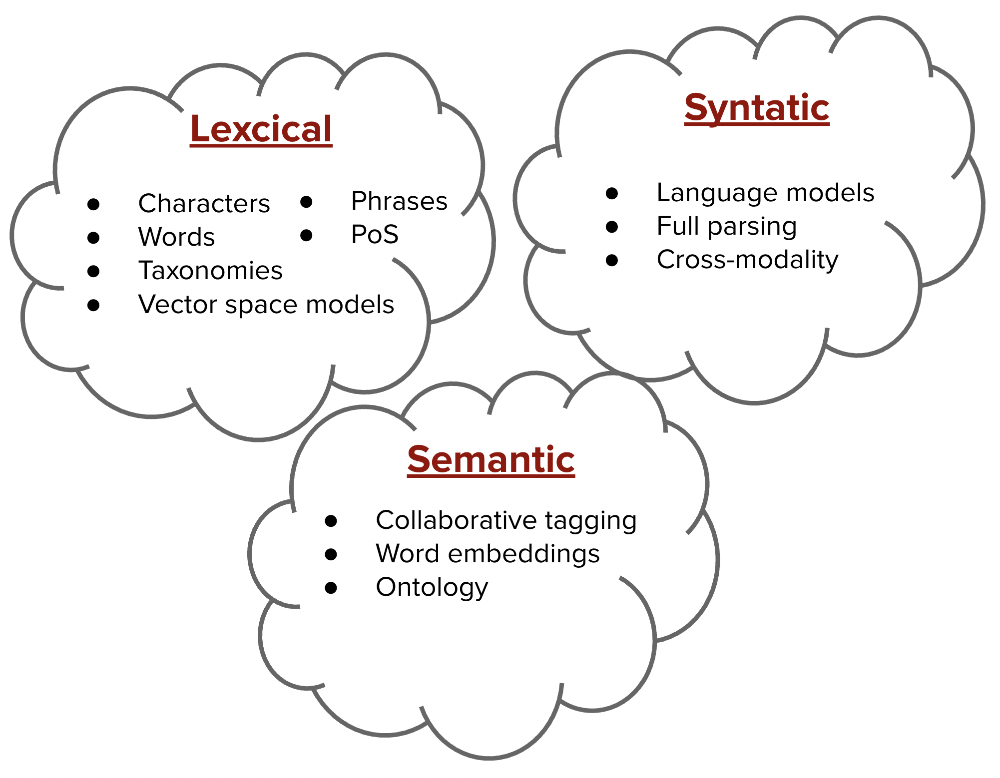

# Lời mở đầu

Ở trong chương Khai phá dữ liệu, chúng ta đã làm quen với các kiến thức cơ bản bao gồm:

- Giới thiệu về Khai phá dữ liệu
- Các kiểu và cấu trúc dữ liệu cơ bản
- Bài toán phân loại với Naive Bayes và Decision Tree
- Các thước đo cơ bản
- Khai phá luật kết hợp (Association Rule)
- Các thuật toán phân cụm

Chương này được xây dựng nhằm tiếp nối kiến thức trên, tuy nhiên chúng ta sẽ cùng nhau tìm hiểu tập trung vào 1 mảng con bên trong, đó là khai thác văn bản (Text Mining). Nội dung chương này bao gồm:

- Khái niệm xử lý ngôn ngữ tự nhiên
- Các kiểu biểu diễn văn bản, chia nhỏ thành ba nhóm chính: từ vựng (lexical), cú pháp (syntatic), và ngữ nghĩa (semantic).
- Một số bài toán hay trong xử lí ngôn ngữ tự nhiên.

Mỗi phần kiến thức sẽ bao gồm lí thuyết và ứng dụng trên các tập dữ liệu thực tế đế giúp bạn đọc có cái nhìn trực quan hơn.

Chúc các bạn học tập vui vẻ!
