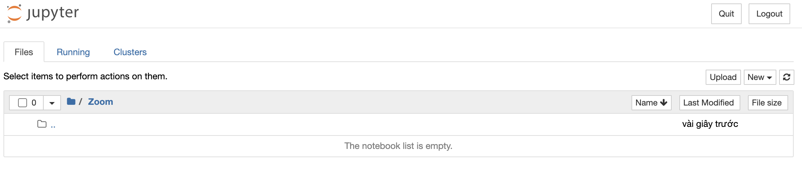
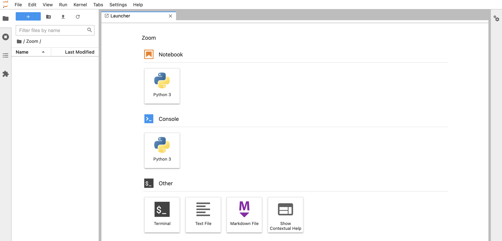

# Bài 0: Làm quen với Jupyter

## 🎯 Mục tiêu học tập

Sau khi hoàn thành bài này, bạn sẽ có thể:

- [ ] Hiểu được Jupyter là gì và các thành phần của nó
- [ ] Phân biệt được Jupyter Notebook và Jupyter Lab
- [ ] Cài đặt và khởi chạy Jupyter Notebook/Jupyter Lab
- [ ] Sử dụng Jupyter để viết và chạy code Python tương tác

## 📖 Giới thiệu

Trong bài viết trước, ZootoPi đã giới thiệu về Anaconda, một mã nguồn mở giúp ta tạo ra những môi trường ảo với trình quản lí gói conda tiện lợi cho việc truy xuất và cài đặt các thư viện bên trong. Sau khi có môi trường rồi, ta sẽ cần có công cụ để viết, chạy mã nguồn cũng như gỡ lỗi chương trình. Và trong bài viết này, ZootoPi xin giới thiệu họ nhà Jupyter với Jupyter Notebook và Jupyter Lab.

## 1. Giới thiệu

### 1.1. Jupyter

Jupyter là một nền tảng tính toán khoa học mã nguồn mở, với khả năng nổi bật cho phép tương tác trực tiếp với từng dòng code, hỗ trợ hơn 40 ngôn ngữ lập trình, trong đó tập trung vào 3 ngôn ngữ là Julia, Python và R.

- Là môi trường làm việc phổ biến nhất cho phân tích **Khoa học dữ liệu** bằng Python

  > `Jupyter Notebook >> Jupyter Lab`

- Các file Python gốc sẽ có đuôi `.py`. và file jupyter sẽ có đuôi là `.ipynb`.

- **Jupyter** cung cấp môi trường làm việc:
  1. Đa ngôn ngữ
     > `Jupyter = Julia + Python + R`
  2. Đa nền tảng: `Windows`,`Ubuntu`,`MacOS`
  3. Nền web
  4. Tích hợp hiển thị kết quả lập trình và trực quan hoá dữ liệu

Jupyter cũng là một công cụ hoàn toàn miễn phí, được tạo ra với mục đích nhắm đến khoa học dữ liệu và giáo dục, giúp mọi người cùng học lập trình dễ dàng hơn (cụ thể ở đây là Python). Jupyter có tính tương tác nên có thể sử dụng làm môi trường chạy thử và giảng dạy.

### 1.2. Jupyter Notebook

Jupyter Notebook (trước 2014 được biết với cái tên IPython Notebook) là một ứng dụng mã nguồn mở cho phép ta đưa cả mã nguồn Python và các thành phần văn bản phức tạp như hình ảnh, công thức, video, biểu thức... vào trong cùng một file giúp cho việc trình bày trở lên dễ hiểu, giống như một file trình chiếu nhưng lại có thể thực hiện chạy code tương tác trên đó, cốt lõi của việc này chính là Markdown. Điều này giúp cho Jupyter Notebook được ưa chuộng trong việc phân tích dữ liệu, trực quan hóa dữ, xử lý và xây dựng mô hình trên dữ liệu v.v.



### 1.3. Jupyter Lab

JupyterLab là môi trường phát triển tương tác dựa trên web dành cho notebook, mã và dữ liệu của Jupyter. Nó có cấu trúc mô-đun giúp ta có thể viết các plugin bổ sung các thành phần mới, tích hợp với các thành phần hiện có, và mở một số notebook hoặc tệp (ví dụ: HTML, Markdowns, v.v.) dưới dạng các tab trong cùng một cửa sổ cũng như cung cấp nhiều trải nghiệm giống như khi làm việc với các IDE. Điểm cộng của JupyterLab là sử dụng linh hoạt, cho phép cấu hình và sắp xếp giao diện người dùng để hỗ trợ các quy trình trong khoa học dữ liệu, máy tính khoa học và máy học.



## 2. Cài đặt

Để có thể sử dụng Jupyter Notebook và JupyterLab, cách đơn giản nhất là cài phần mềm Anaconda. Bạn có thể tham khảo và làm theo hướng dẫn của bài viết trước tại [đây](./01.anaconda.md) để hoàn tất việc cài đặt.

Sau khi cài đặt xong Anaconda, ta có thể cài Jupyter Notebook và Jupyter Lab trong hoặc sau khi tạo ra môi trường ảo của dự án.

- Cài đặt đồng thời khi tạo ra môi trường ảo:

```console
(base) ➜  ~ conda create -n zootopi python=3.8 jupyter jupyterlab
```

hoặc

- Cài đặt khi đã có sẵn môi trường ảo:

```console
(zootopi) ➜  ~ pip install jupyter
(zootopi) ➜  ~ pip install jupyterlab
```

Sau khi cài đặt xong, ta kích hoạt công cụ bằng câu lệnh sau:

- Với Jupyter Notebook:

```console
(zootopi) ➜  ~ jupyter notebook
```

- Với Jupyter Lab:

```console
(zootopi) ➜  ~ jupyter lab
```

Khi đó giao diện của công cụ sẽ hiện lên trên web browser của trình duyệt web bạn sử dụng (Chrome, Firefox, v.v) với đường dẫn tới:

- Jupyter Notebook: `http://localhost:8888/tree`
- Jupyter Lab: `http://localhost:8888/lab`

### So sánh Jupyter Notebook vs Jupyter Lab

| Tính năng             | Jupyter Notebook                 | Jupyter Lab         |
| --------------------- | -------------------------------- | ------------------- |
| **Giao diện**         | Đơn giản, tập trung vào notebook | Mô-đun, giống IDE   |
| **Nhiều tab**         | ❌                               | ✅                  |
| **File browser**      | Cơ bản                           | Nâng cao            |
| **Terminal tích hợp** | ❌                               | ✅                  |
| **Plugin/Extension**  | Hạn chế                          | Nhiều               |
| **Phù hợp cho**       | Người mới bắt đầu                | Người dùng nâng cao |

## ✅ Tóm tắt

Trong bài này, chúng ta đã tìm hiểu:

- **Jupyter**: Nền tảng tính toán khoa học mã nguồn mở, hỗ trợ 40+ ngôn ngữ
- **Jupyter Notebook**: Ứng dụng cho phép kết hợp code, văn bản, hình ảnh trong một file `.ipynb`
- **Jupyter Lab**: Môi trường phát triển tương tác dựa trên web, mạnh mẽ hơn Notebook
- **Cài đặt**:
  - Khi tạo môi trường: `conda create -n tên_môi_trường python=3.x jupyter jupyterlab`
  - Sau khi có môi trường: `pip install jupyter jupyterlab`
- **Khởi chạy**:
  - Jupyter Notebook: `jupyter notebook` → `http://localhost:8888/tree`
  - Jupyter Lab: `jupyter lab` → `http://localhost:8888/lab`

## 💡 Lưu ý quan trọng

- **File extension**: Jupyter sử dụng file `.ipynb` (IPython Notebook)
- **Tương tác**: Có thể chạy từng cell code riêng lẻ, rất hữu ích cho phân tích dữ liệu
- **Markdown**: Hỗ trợ Markdown để viết tài liệu cùng với code
- **Visualization**: Tích hợp hiển thị kết quả và biểu đồ trực tiếp trong notebook

## 🧪 Thực hành

Hãy thử tạo một notebook mới và chạy code Python:

1. Khởi chạy Jupyter Lab: `jupyter lab`
2. Tạo notebook mới: Click "New" → "Python 3"
3. Thử chạy code:
   ```python
   print("Hello, Jupyter!")
   import pandas as pd
   df = pd.DataFrame({'A': [1, 2, 3], 'B': [4, 5, 6]})
   df
   ```

## 📚 Tài liệu tham khảo

- [Jupyter Documentation](https://jupyter.org/documentation)
- [Jupyter Notebook Tutorial](https://jupyter-notebook.readthedocs.io/)
- [Jupyter Lab Documentation](https://jupyterlab.readthedocs.io/)

## ➡️ Bước tiếp theo

Trong bài viết tiếp theo, ZootoPi sẽ đi sâu hơn vào cách sử dụng `JupyterLab` và `Jupyter Notebook` cũng như đưa ra những so sánh trực quan về tính năng khi làm việc với 2 công cụ này. Sau đó, chúng ta sẽ bắt đầu với [Bài 1: Cài đặt Python](./03.install.ipynb)!

Chúc các bạn học tập vui vẻ!
