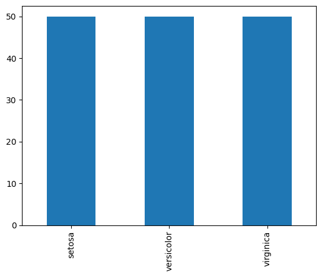
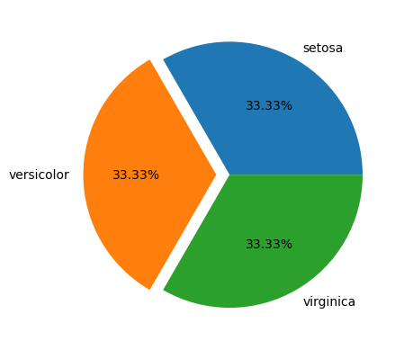
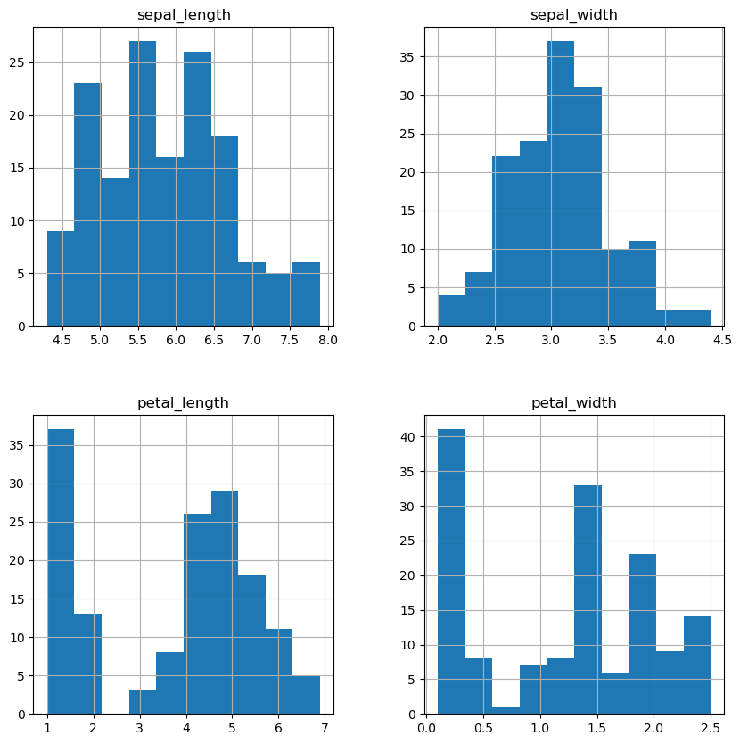
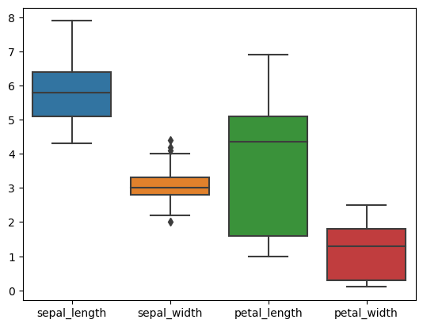
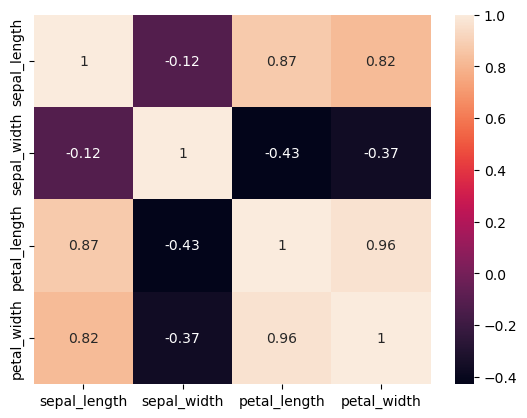
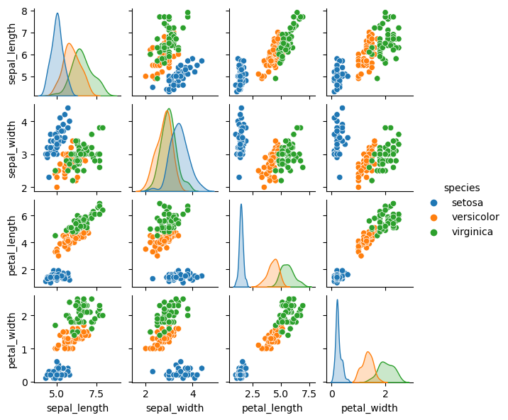

# Bài 9: Thực hành về Học máy

## I. QUY TRÌNH TỔNG QUAN

Một bài toán sử dụng học máy có thể chia thành 3 bước chính dưới đây:

- **Bước 1: Thu thập dữ liệu**. Dữ liệu được thu thập càng nhiều càng tốt. Đối với học máy có giám sát, dữ liệu thu thập phải chứa kết quả bạn muốn dự đoán và thông tin bổ sung (các thông tin đặc trưng) để từ đó đưa ra dự đoán. Ví dụ:
  - Đối với máy dò biển báo đường phố ("Có biển báo đường phố trong hình ảnh không?"), ta sẽ thu thập hình ảnh đường phố và gắn nhãn xem biển báo đường phố có hiển thị hay không.
  - Đối với ứng dụng dự đoán vỡ nợ tín dụng, ta cần dữ liệu trước đây về các khoản vay thực tế, thông tin về việc liệu khách hàng có bị vỡ nợ với các khoản vay của họ hay không và dữ liệu sẽ giúp bạn đưa ra dự đoán, chẳng hạn như thu nhập, các khoản nợ tín dụng trong quá khứ, v.v.
  - Đối với chương trình ước tính giá trị ngôi nhà tự động, bạn có thể thu thập dữ liệu từ các lần bán nhà trước đây và thông tin về bất động sản như kích thước, vị trí, v.v.

- **Bước 2: Huấn luyện mô hình**. Nhập các thông tin thu thập trên vào thuật toán máy học để tạo mô hình đáp ứng bài toán đưa ra, ví dụ: phát hiện biển báo, mô hình xếp hạng tín dụng, hoặc công cụ ước tính giá trị nhà.

- **Bước 3: Sử dụng mô hình dự đoán với dữ liệu mới**. Tích hợp mô hình vào một sản phẩm hoặc quy trình, chẳng hạn như ô tô tự lái, quy trình đăng ký tín dụng hoặc trang web thị trường bất động sản.

&lt;!-- Thời đại 4.0 có thể coi là thời kì đỉnh cao của dữ liệu khi dữ liệu sạch quý như vàng, dữ liệu thô như những viên ngọc quý chưa được mài dũa, tuy nhiên ta lại chưa có tài nguyên để khai thác. -->
Trong thực tế, dữ liệu chúng ta có đôi khi không phải từ 1 nguồn mà từ rất nhiều nguồn khác nhau tổng hợp về 1 nguồn rồi xử lý dữ liệu rồi mới có thể huấn luyện được. Dưới đây là 1 hình ảnh ví dụ tổng quan mở rộng quy trình 3 bước cơ bản phía trên.


Phần tiếp theo, ta sẽ cũng nhau thực hành làm quen với bài toán học máy có giám sát thông qua bài toán phân loại giống hoa Iris.

## II. THỰC HÀNH


Các bạn mới làm quen với Học máy có thể tham khảo lộ trình trong ảnh trên.

### 0. Cài đặt

Trong buổi học này thì mình sẽ làm quen và thực hành chủ yếu trên scikit-learn API, một thư viện phổ biến khi làm việc với học máy ở tầm sơ và trung cấp. Để cài đặt thư viện, ta sử dụng câu lệnh quen thuộc dưới đây.

```python
!pip install scikit-learn
```

Ta sẽ import 1 số thư viện cần thiết dưới đây để phục vụ cho bài thực hành.

```python
import pandas as pd
import numpy as np
import matplotlib.pyplot as plt
from sklearn.model_selection import train_test_split
import seaborn as sns
```

### 1. Bài toán

Chúng ta sẽ sử dụng tập dữ liệu Iris, chứa thông tin về ba giống hoa Iris khác nhau: Iris Versicolor, Iris Virginica, Iris Setosa với các phép đo của bốn biến: chiều dài đài hoa, chiều rộng đài hoa, chiều dài cánh hoa, chiều rộng cánh hoa. Mục đích của bài toán là để phân loại hoa Iris giữa ba loài (setosa, versicolor hoặc virginica) từ các phép đo chiều dài và chiều rộng của các lá đài và cánh hoa.

Như vậy, mô hình của chúng ta sẽ có:

- **Đặc trưng**: Chiều dài đài hoa, chiều rộng đài hoa, chiều dài cánh hoa, chiều rộng cánh hoa.
- **Nhãn**: Iris Versicolor, Iris Virginica, Iris Setosa

Tập dữ liệu Iris có một số tính năng thú vị:

- Một trong các lớp (Iris Setosa) có thể phân tách tuyến tính với hai lớp còn lại. Tuy nhiên, hai lớp khác không thể phân tách tuyến tính.
- Có một số trùng lặp giữa các lớp Versicolor và Virginica, vì vậy nó khó có thể đạt được tỷ lệ phân loại hoàn hảo.
- Có một số dư thừa trong bốn biến đầu vào, vì vậy có thể đạt được một giải pháp tốt chỉ với ba trong số chúng, hoặc thậm chí (với độ khó) từ hai, nhưng việc lựa chọn chính xác các biến tốt nhất là không rõ ràng.

Lí do chọn Iris:

- Các thuộc tính là số nên bạn phải tìm cách tải và xử lý dữ liệu.
- Nó chỉ có 4 thuộc tính và 150 hàng, có nghĩa là nó nhỏ và dễ dàng vừa với bộ nhớ (và một màn hình hoặc trang A4).
- Tất cả các thuộc tính số đều có cùng đơn vị và cùng tỷ lệ, không yêu cầu bất kỳ tỷ lệ hoặc biến đổi đặc biệt nào để bắt đầu.
- Đây là một bài toán phân loại, cho phép bạn thực hành với một loại thuật toán học có giám sát dễ dàng hơn.


```python
iris = sns.load_dataset('iris')
iris.head()
```

```
   sepal_length  sepal_width  petal_length  petal_width species
0           5.1          3.5           1.4          0.2  setosa
1           4.9          3.0           1.4          0.2  setosa
2           4.7          3.2           1.3          0.2  setosa
3           4.6          3.1           1.5          0.2  setosa
4           5.0          3.6           1.4          0.2  setosa
```

### 2. EDA (Exploratory Data Analysis)

#### 2.1 Đánh giá ở mức thống kê

```python
iris['species'].unique()
```

```
array(['setosa', 'versicolor', 'virginica'], dtype=object)
```

```python
iris.shape, iris.size #row*columns
```

```
((150, 5), 750)
```

```python
iris.info()
```

```
<class 'pandas.core.frame.DataFrame'>
RangeIndex: 150 entries, 0 to 149
Data columns (total 5 columns):
 #   Column        Non-Null Count  Dtype
---  ------        --------------  -----
 0   sepal_length  150 non-null    float64
 1   sepal_width   150 non-null    float64
 2   petal_length  150 non-null    float64
 3   petal_width   150 non-null    float64
 4   species       150 non-null    object
dtypes: float64(4), object(1)
memory usage: 6.0+ KB
```

```python
iris.isnull().sum()
```

```
sepal_length    0
sepal_width     0
petal_length    0
petal_width     0
species         0
dtype: int64
```

```python
iris['species'].value_counts() #iris.groupby('species').size() or iris.groupby('species').count()
```

```
setosa        50
versicolor    50
virginica     50
Name: species, dtype: int64
```

```python
iris.describe()
```

```
       sepal_length  sepal_width  petal_length  petal_width
count    150.000000   150.000000    150.000000   150.000000
mean       5.843333     3.057333      3.758000     1.199333
std        0.828066     0.435866      1.765298     0.762238
min        4.300000     2.000000      1.000000     0.100000
25%        5.100000     2.800000      1.600000     0.300000
50%        5.800000     3.000000      4.350000     1.300000
75%        6.400000     3.300000      5.100000     1.800000
max        7.900000     4.400000      6.900000     2.500000
```

```python
iris.corr()
```

```
              sepal_length  sepal_width  petal_length  petal_width
sepal_length      1.000000    -0.117570      0.871754     0.817941
sepal_width      -0.117570     1.000000     -0.428440    -0.366126
petal_length      0.871754    -0.428440      1.000000     0.962865
petal_width       0.817941    -0.366126      0.962865     1.000000
```

#### 2.2 Trực quan hoá dữ liệu

```python
species = iris['species'].value_counts()
species.plot(kind="bar")
plt.show()
```



```python
plt.pie(species, labels = species.index, autopct='%.2f%%', explode=[0,0.1,0])
plt.show()
```



```python
iris.hist(figsize=(10,10))
plt.show()
```



```python
sns.boxplot(data=iris, width=0.8)
plt.show()
```



```python
sns.heatmap(iris.corr(),annot=True)
plt.show()
```



```python
sns.pairplot(iris, hue = 'species', height = 1.5)
plt.show()
```



### 3. Xây dựng mô hình

#### 3.1 Chia tập huấn luyện và kiểm thử

```python
X_iris = iris.drop('species', axis = 1)
y_iris = iris['species']
```

```python
Xtrain, Xtest, ytrain, ytest = train_test_split(X_iris, y_iris, test_size = 0.2, random_state=1) #default 25%
```

```python
print(Xtrain.shape, Xtest.shape)
print(ytrain.shape, ytest.shape)
```

```
(120, 4) (30, 4)
(120,) (30,)
```

#### 3.2 Huấn luyện mô hình

Hồi quy logistic là phân tích hồi quy thích hợp để tiến hành khi biến phụ thuộc là nhị phân. Giống như tất cả các phân tích hồi quy, hồi quy logistic là một phân tích dự đoán. Về mặt toán học, một mô hình logistic có một biến phụ thuộc với hai giá trị có thể có, chẳng hạn như đạt / không đạt, thắng / thua, sống / chết, ... trong đó hai giá trị được gắn nhãn `0` và `1`.

```javascript
from sklearn.linear_model import LogisticRegression
```

```python
model = LogisticRegression(max_iter=1000)
model.fit(Xtrain, ytrain)
```

```
LogisticRegression(max_iter=1000)
```

```python
y_model = model.predict(Xtest)
```

#### 3.3 Đánh giá chất lượng mô hình

```javascript
from sklearn.metrics import accuracy_score, classification_report, confusion_matrix
```

```python
print(accuracy_score(ytest, y_model))
print(classification_report(ytest, y_model))
```

```
0.9666666666666667
              precision    recall  f1-score   support

      setosa       1.00      1.00      1.00        11
  versicolor       1.00      0.92      0.96        13
   virginica       0.86      1.00      0.92         6

    accuracy                           0.97        30
   macro avg       0.95      0.97      0.96        30
weighted avg       0.97      0.97      0.97        30
```

## III. TRIỂN KHAI VỚI FLASK

Flask là một Web Framework rất nhẹ của Python, dễ dàng giúp người mới bắt đầu học Python có thể tạo ra website nhỏ. Flask cũng dễ mở rộng để xây dựng các ứng dụng web phức tạp. Ngoài Flask Framework, bạn có thể học PYTHON với Django Framework để xây dựng các ứng dụng web lớn hơn. Như đã nêu trước đó, Flask được phân loại là Web Framework siêu nhỏ, nhẹ. Thông thường, một framework vi mô là một framework tối giản hoặc không phụ thuộc vào thư viện bên ngoài.

Để sử dụng Flask, ta cài thư viện sau:

```python
!pip install flask
```

Dưới đây là 1 số câu lệnh để ta làm quen với Flask.

```javascript
from flask import Flask

app = Flask(__name__) #request Flask to create an application

#flash routing
@app.route('/') #return a link that displays "hello world"
def hello():
    return "<h4>Hello world</h4>"

@app.route('/<name>') #return a link that displays "hello world"
def user(name):
    return f"<h4>This is {name}'s homepage</h4>"

if __name__ == '__main__': # the module that is being run is the main program
    app.run()
# click ii to stop
```

```
 * Serving Flask app '__main__' (lazy loading)
 * Environment: production
   WARNING: This is a development server. Do not use it in a production deployment.
   Use a production WSGI server instead.
 * Debug mode: off
```

```
 * Running on http://127.0.0.1:5000/ (Press CTRL+C to quit)
```

Với bài toán phân loại giống hoa Iris ta đã thực hành, ta có thể tạo ra 1 giao diện đơn giản để triển khai dự đoán với những dữ liệu mới với Flask theo đoạn code dưới đây.

Ta tạo file `model.py` chứa mô hình cùng 1 hàm đọc các dữ liệu mới để đưa vào mô hình đã huấn luyện và đưa ra dự đoán:

```python
# Importing necessary libraries
import pandas as pd
import numpy as np
from sklearn.linear_model import LogisticRegression

# Importing the dataset
data = pd.read_csv('iris.csv')

# Dictionary containing the mapping
variety_mappings = {0: 'Setosa', 1: 'Versicolor', 2: 'Virginica'}

# Encoding the target variables to integers
data = data.replace(['Setosa', 'Versicolor' , 'Virginica'],[0, 1, 2])

X = data.iloc[:, 0:-1] # Extracting the independent variables
y = data.iloc[:, -1] # Extracting the target/dependent variable

logreg = LogisticRegression(max_iter=2000) # Initializing the Logistic Regression model
logreg.fit(X, y) # Fitting the model

# Function for classification based on inputs
def classify(a, b, c, d):
    arr = np.array([a, b, c, d]) # Convert to numpy array
    arr = arr.astype(np.float64) # Change the data type to float
    query = arr.reshape(1, -1) # Reshape the array
    prediction = variety_mappings[logreg.predict(query)[0]] # Retrieve from dictionary
    return prediction # Return the prediction
```

Bên cạnh đó, ta tạo 1 file `server.py` chung thư mục với `model.py`:

```python
import model # Import the python file containing the ML model
from flask import Flask, request, render_template,jsonify # Import flask libraries

# Initialize the flask class and specify the templates directory
app = Flask(__name__,template_folder="templates")

# Default route set as 'home'
@app.route('/home')
def home():
    return render_template('home.html') # Render home.html

# Route 'classify' accepts GET request
@app.route('/classify',methods=['POST','GET'])
def classify_type():
    try:
        sepal_len = request.args.get('slen') # Get parameters for sepal length
        sepal_wid = request.args.get('swid') # Get parameters for sepal width
        petal_len = request.args.get('plen') # Get parameters for petal length
        petal_wid = request.args.get('pwid') # Get parameters for petal width

        # Get the output from the classification model
        variety = model.classify(sepal_len, sepal_wid, petal_len, petal_wid)

        # Render the output in new HTML page
        return render_template('output.html', variety=variety)
    except:
        return 'Error'

# Run the Flask server
if(__name__=='__main__'):
    app.run(debug=True)
```

Khi đó, ta sử dụng câu lệnh `python server.py` trên terminal và truy cập đường dẫn hiện ra(thông thường sẽ là `http://127.0.0.1:5000/`). Chúc các bạn thử nghiệm và thành công!
